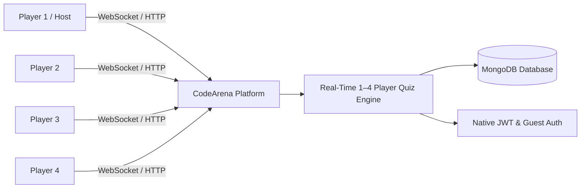
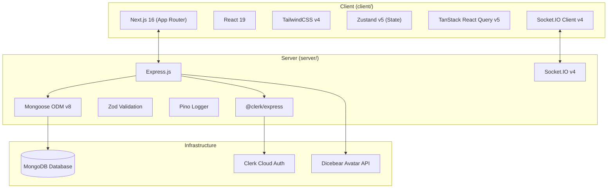

# 00 — Project Overview

## 1. Executive Summary

**CodeArena** is a real-time, competitive multiplayer (1–4 players) technical and general-purpose quiz platform where players challenge each other in live quizzes. Players compete across curated Categories (Programming, Aptitude, General Knowledge) and Subjects (Data Structures, Algorithms, DBMS, OS, Networks, Quantitative Aptitude, Logical Reasoning, Current Affairs, etc.) or Mixed Category pools, with configurable question counts (10, 15, or 20) and category-derived server-authoritative timers.

The platform emphasizes **low-latency state synchronization**, **strict anti-cheat protection**, and **zero-friction entry** through a dual-authentication system supporting registered users via Native JWT (Access + Refresh tokens) and instant cryptographic guest sessions.

---

## 2. Product Evolution History

CodeArena originally began as a prototype competitive coding platform (sandbox execution model). The platform pivoted to address the latency and high server overhead of traditional sandbox code execution by focusing on **rapid, high-intensity technical and general-purpose trivia battles**:

Key milestones achieved:
1. **Transition to MCQ Quiz Platform**: Deprecation and removal of the legacy sandbox compiler pipelines in favor of an optimized, server-authoritative quiz engine (`question/`, `battle/`, `room/`, `category/`).
2. **1–4 Player Dynamic Engine**: Full expansion from 1v1 assumptions to dynamic 1–4 player lobbies, solo mode, synchronized round dispatches, simultaneous answer locks, and 4-tier ranking with tie-breaking.
3. **Category & Subject Hierarchy**: Transition from flat topics to structured `Category → Subject → Questions` with Mixed Category sampling.
4. **Quiz Configuration**: Server-authoritative 10, 15, or 20 question counts with category-derived question timers (30s/60s).
5. **Native JWT Authentication**: Complete elimination of third-party auth (Clerk) in favor of secure native Access Tokens (15m), Refresh Tokens (7d in HttpOnly cookie & DB hash), and cryptographic HMAC guest tokens.

---

## 3. High-Level Feature Matrix

| Feature Domain | Capabilities | User Value |
| :--- | :--- | :--- |
| **Room Management** | 6-character room codes, host privileges, 1–4 player capacity, category/subject/mixed selection, 10/15/20 question selection, player readiness toggles. | Fast, flexible matchmaking with friends or solo practice. |
| **Live Quiz Engine** | Server-authoritative countdowns, category-based question timers (30s/60s), live score calculation (up to 1000 pts), synchronized reveal. | High-stakes competitive experience without client cheating. |
| **Anti-Cheat Protocol** | Server sanitizes questions, hides correct answers and explanations until game finish, validates submission deadlines. | Guaranteed integrity and fair match outcomes. |
| **Rankings & Results** | Real-time quiz rankings (Rank 1–4), podium display, score breakdowns, and tie handling. | Transparent player rankings and progression. |
| **Match History & Review** | Post-match analysis, detailed question breakdown with correct answers and technical explanations. | Clear learning outcomes and knowledge retention. |
| **Dual Authentication** | Native JWT auth (Access + Refresh tokens) alongside instant zero-credential Guest mode. | Zero barrier to entry with full account permanence for regulars. |

---

## 4. Core Technology Stack

### Technology Breakdown
* **Frontend**:
  * **Framework**: Next.js 16.2.10 (React 19.2.4) utilizing the App Router.
  * **Styling**: TailwindCSS v4 with PostCSS.
  * **State Management**: Zustand v5 for client/socket session state; TanStack Query v5 for server state caching.
  * **Real-time Client**: `socket.io-client` v4.8.3.
* **Backend**:
  * **Runtime**: Node.js v20+ with TypeScript v5.5.
  * **HTTP Server**: Express.js v4.19 with custom security headers and centralized error propagation.
  * **Real-Time Gateway**: Socket.IO v4.7 with handshake JWT authentication.
  * **Database & ODM**: MongoDB with Mongoose v8.5.
  * **Validation & Security**: Zod for environment and request schemas; crypto HMAC for guest JWT verification.
* **Third-Party Services**:
  * **Clerk**: Identity management, user directory, and session tokens.
  * **Dicebear**: Procedural SVG avatar generator for guest player accounts.

---

## 5. Document Cross-References
* For detailed user flows and requirements, see [01 — Product Requirements](01-product-requirements.md).
* For high-level system topology and interaction models, see [02 — System Architecture](02-system-architecture.md).
* For complete documentation index, see [Documentation Index](INDEX.md).
