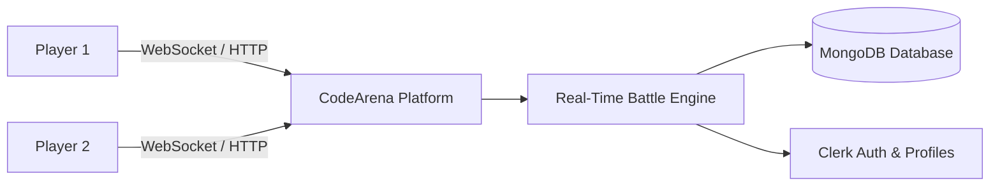
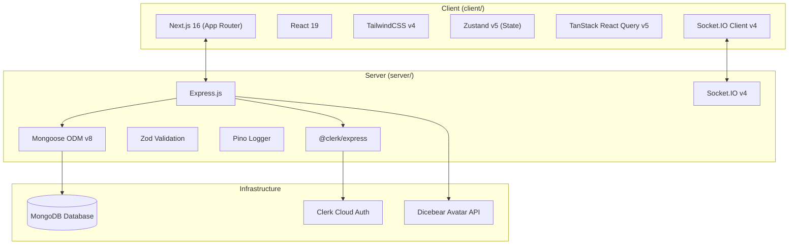

# 00 — Project Overview

## 1. Executive Summary

**CodeArena** is a real-time, competitive 1v1 technical MCQ battle platform where developers challenge each other in live head-to-head computer science and programming trivia duels. Players compete in timed rounds covering Data Structures & Algorithms (DSA), JavaScript, TypeScript, React, Python, Database Management Systems (DBMS), Operating Systems (OS), and Computer Networks.

The platform emphasizes **low-latency state synchronization**, **strict anti-cheat protection**, and **zero-friction entry** through a dual-authentication system supporting both verified Clerk user profiles and instant guest sessions.

---

## 2. Product Evolution History

CodeArena originally began as a prototype competitive coding platform (DSA tracker and sandbox execution model integrating with Judge0). During development, the platform pivoted to address the latency and high server overhead of traditional sandbox code execution by focusing on **rapid, high-intensity technical trivia battles**.

Key milestones achieved:
1. **Transition to MCQ Battles**: Deprecation and removal of the legacy sandbox compiler pipelines (`problem/`, `match/`) in favor of an optimized MCQ engine (`question/`, `battle/`, `room/`).
2. **Anti-Cheat Redesign**: Moving from client-managed state to strict server-orchestrated question dispatch where clients receive only one sanitized question at a time.
3. **Dual-Tier Authentication**: Adding secure, signed guest sessions (`guest_*`) so players can start battling immediately without registration.
4. **Performance & Scalability Optimization**: Transitioning from collection-wide memory aggregations to MongoDB compound indexes, atomic update pipelines, and $O(\log N)$ rank calculation.

---

## 3. High-Level Feature Matrix

| Feature Domain | Capabilities | User Value |
| :--- | :--- | :--- |
| **Room Management** | Custom 6-character room codes, host privileges, topic/difficulty selection, player readiness toggles. | Fast, flexible matchmaking with friends or colleagues. |
| **Live Battle Engine** | Server-authoritative countdowns, 30s per-question timeouts, live score calculation, opponent progress telemetry. | High-stakes competitive experience without client cheating. |
| **Anti-Cheat Protocol** | Server sanitizes questions, hides correct answers and explanations until game finish, validates submission deadlines. | Guaranteed integrity and fair match outcomes. |
| **Leaderboard & Ranks** | Real-time global standings, 1-indexed ranks, multi-tiered tie-breaking (Wins $\rightarrow$ Accuracy $\rightarrow$ Matches $\rightarrow$ Username). | Transparent player rankings and progression. |
| **Match History & Review** | Post-match analysis, detailed question breakdown with correct answers and technical explanations. | Clear learning outcomes and knowledge retention. |
| **Dual Authentication** | Full Clerk integration (OAuth/Email) alongside instant zero-credential Guest mode. | Zero barrier to entry with full account permanence for regulars. |

---

## 4. Core Technology Stack

### Technology Breakdown
* **Frontend**:
  * **Framework**: Next.js 16.2.10 (React 19.2.4) utilizing the App Router.
  * **Styling**: TailwindCSS v4 with PostCSS.
  * **State Management**: Zustand v5 for client/socket session state; TanStack Query v5 for server state caching.
  * **Real-time Client**: `socket.io-client` v4.8.3.
* **Backend**:
  * **Runtime**: Node.js v20+ with TypeScript v5.5.
  * **HTTP Server**: Express.js v4.19 with custom security headers and centralized error propagation.
  * **Real-Time Gateway**: Socket.IO v4.7 with handshake JWT authentication.
  * **Database & ODM**: MongoDB with Mongoose v8.5.
  * **Validation & Security**: Zod for environment and request schemas; crypto HMAC for guest JWT verification.
* **Third-Party Services**:
  * **Clerk**: Identity management, user directory, and session tokens.
  * **Dicebear**: Procedural SVG avatar generator for guest player accounts.

---

## 5. Document Cross-References
* For detailed user flows and requirements, see [01 — Product Requirements](01-product-requirements.md).
* For high-level system topology and interaction models, see [02 — System Architecture](02-system-architecture.md).
* For complete documentation index, see [Documentation Index](INDEX.md).
