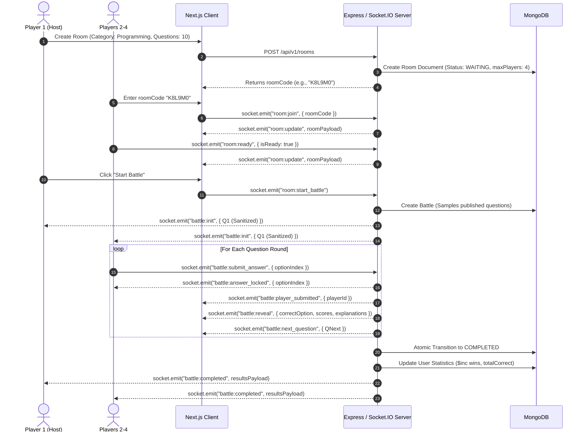

# 01 — Product Requirements

## 1. User Personas

1. **The Skill Builder / Quiz Enthusiast**: Wants fast-paced question drills across Programming, Aptitude, or General Knowledge to test and sharpen their fundamentals.
2. **The Multiplayer Competitor**: Enjoys 1–4 player challenges with friends or peers in private or public lobbies, competing for top placement and score.
3. **The First-Time / Guest Visitor**: Wants to jump straight into a quiz room via an invite code or play solo without completing registration forms or signing in.

---

## 2. Core User Stories & Functional Requirements

### 2.1 Authentication & Profile
* **US-1.1 (Native JWT Authentication)**: Users can sign up and sign in using native email/password credentials with cryptographic PBKDF2-SHA512 password hashing. Access tokens (15m) and secure HttpOnly refresh token cookies (7d) manage sessions.
* **US-1.2 (Cryptographic Guest Access)**: Unregistered visitors can click "Continue as Guest" to immediately receive an HMAC-SHA256 signed guest token with a randomized handle (`Guest XXXXXX`) and avatar, allowing them to battle without registration.
* **US-1.3 (Profile Persistence)**: Registered users retain historical wins, losses, draws, questions answered, and calculated accuracy across sessions.
* **US-1.4 (Guest Role Restrictions)**: Guests are prevented from modifying profile settings (`PATCH /api/v1/users/me`) and are omitted from the public leaderboard.

### 2.2 Room Creation & Lobby
* **US-2.1 (Create Room)**: The host creates a room specifying category (`programming`, `aptitude`, `general-knowledge`, or `mixed`), subject, and question count (`10`, `15`, or `20`).
* **US-2.2 (Invite via Code / PIN)**: The host receives a unique 6-character room code (e.g. `AB12CD`) to share with friends.
* **US-2.3 (Join Room)**: Players can join via `/lobby/[roomCode]` or by entering the code in the dashboard.
* **US-2.4 (Readiness Toggle)**: All non-host players must toggle their status to "Ready" before the host can initiate the match.
* **US-2.5 (Player Capacity)**: Rooms support 1 to 4 players (`maxPlayers: 4`). Attempts to join full rooms are rejected.

### 2.3 Quiz Engine & Real-Time Gameplay
* **US-3.1 (Anti-Cheat Question Delivery)**: Players never receive the full question list upfront. The server dispatches questions one by one (`battle:next_question`).
* **US-3.2 (Authoritative Server Timers)**: Each question has an absolute category-based server deadline (Programming: 30s, Aptitude: 60s, General Knowledge: 30s). Client timers serve strictly as UI representations.
* **US-3.3 (Answer Submission & Reveal)**: Players submit one of 4 options (0–3 index). The server validates if the submission arrived before the deadline, calculates correctness and speed-adjusted points, locks the answer (`battle:answer_locked`), announces submissions to peers (`battle:player_submitted`), and reveals answers at round end (`battle:reveal`).
* **US-3.4 (Multiplayer Telemetry)**: Whenever any player submits an answer or completes a round, real-time telemetry broadcasts live scores and status to all room participants.
* **US-3.5 (Timeout Handling)**: If the deadline passes without an answer, the server records an unanswered timeout (`-1`), awards 0 points, and advances the round.
* **US-3.6 (Atomic Battle Conclusion)**: When all players complete their question queue (or on match completion), the battle transitions to `COMPLETED`, winner/rankings are evaluated, and registered user stats are incremented atomically.

### 2.4 Leaderboard & Match History
* **US-4.1 (Global Leaderboard)**: Players can browse a paginated leaderboard sorted by:
  1. `wins` DESC
  2. `accuracy` DESC
  3. `battlesPlayed` DESC
  4. `username` ASC
* **US-4.2 (User Standing Card)**: Authenticated users immediately see their own global rank and statistics banner above the table.
* **US-4.3 (Match History)**: Players can review past matches, results (VICTORY, DEFEAT, DRAW), opponents/rankings, and view detailed question-by-question explanations.

---

## 3. End-to-End User Flow

---

## 4. Anti-Cheat & Integrity Guarantees

CodeArena enforces strict server-side authority:
1. **No Question Peeking**: Clients receive only the active question without answers or explanations. Future questions and correct answers are never sent over the wire during active rounds.
2. **Timing-Safe Deadlines**: The server tracks authoritative question deadlines based on category duration (Programming: 30s, Aptitude: 60s, GK: 30s). Late submissions are rejected.
3. **Hidden Explanations**: Explanations and answer keys are only revealed during round reveals or queryable via history after the battle has completed.
4. **Idempotent Finalization**: Only the first transition of the battle from `IN_PROGRESS` to `COMPLETED` updates registered player records. Duplicate submissions for the same question by the same player are rejected.

---

## 5. Non-Functional Requirements

* **Latency**: Real-time telemetry events (`battle:player_submitted`, `room:update`) must dispatch within $<50\text{ ms}$ of arrival on the server.
* **Scalability**: Leaderboard and user profile rank queries must execute in $O(\log N)$ time using database compound indexes.
* **Reliability**: Socket reconnections within active battles recover room context and question state via `battle:init` / `battle:reconnect`.
* **Cross-Device Usability**: Fully responsive interface supporting mobile, tablet, and desktop viewports.

---

## 6. Document Cross-References
* For architecture design, see [02 — System Architecture](02-system-architecture.md).
* For battle engine and question sampling specifics, see [08 — Battle Engine](08-battle-engine.md).
* For database schema and index designs, see [05 — Database Architecture](05-database-architecture.md).
