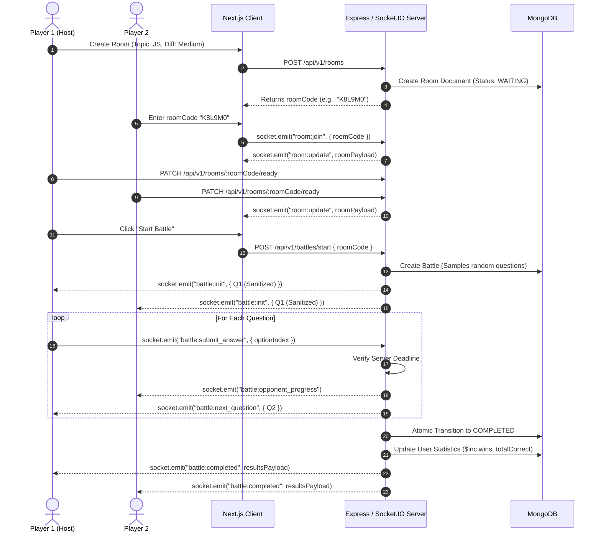

# 01 — Product Requirements

## 1. User Personas

1. **The Job Seeker / Interview Prep Candidate**: Wants fast-paced question drills under realistic time constraints to sharpen technical fundamentals for coding interviews.
2. **The Casual Competitive Developer**: Enjoys 1v1 challenges with friends or colleagues, competing for rank placement on a global leaderboard.
3. **The First-Time / Guest Visitor**: Wants to jump straight into a battle room via an invite link without completing registration forms or signing in.

---

## 2. Core User Stories & Functional Requirements

### 2.1 Authentication & Profile
* **US-1.1 (Clerk Authentication)**: Users can sign up and sign in using Clerk (email/password, Google OAuth).
* **US-1.2 (Guest Login)**: Unregistered visitors can click "Continue as Guest" to immediately receive a randomized handle (`Guest XXXXXX`) and avatar, allowing them to battle without registration.
* **US-1.3 (Profile Persistence)**: Registered users retain historical wins, losses, draws, questions answered, and calculated accuracy across sessions.
* **US-1.4 (Guest Role Restrictions)**: Guests are prevented from modifying profile settings (`PATCH /api/v1/users/me`) and are omitted from the public leaderboard.

### 2.2 Room Creation & Lobby
* **US-2.1 (Create Room)**: The host creates a room specifying topic (`dsa`, `javascript`, `react`, `dbms`, etc.), difficulty (`easy`, `medium`, `hard`, or `random`), and question count.
* **US-2.2 (Invite via Code)**: The host receives a unique 6-character room code (e.g. `AB12CD`) to share with their opponent.
* **US-2.3 (Join Room)**: Opponents can join via `/lobby/[roomCode]` or by entering the code in the dashboard.
* **US-2.4 (Readiness Toggle)**: Both players must toggle their status to "Ready" before the host can initiate the match.
* **US-2.5 (Player Capacity)**: Rooms enforce a strict 2-player capacity. Third-party join attempts are rejected.

### 2.3 Battle Engine & Real-Time Gameplay
* **US-3.1 (Anti-Cheat Question Delivery)**: Players never receive the full question list upfront. The server dispatches questions one by one (`battle:next_question`).
* **US-3.2 (Authoritative Server Timers)**: Each question has an absolute server deadline (default: 30 seconds). Client timers serve strictly as UI representations.
* **US-3.3 (Answer Submission)**: Players submit one of 4 options (0–3 index). The server validates if the submission arrived before the deadline, calculates correctness, updates scores, and returns whether the answer was correct.
* **US-3.4 (Opponent Telemetry)**: Whenever an opponent submits an answer or advances, progress telemetry is broadcast so players see their rival's current question index and score.
* **US-3.5 (Timeout Handling)**: If the deadline passes without an answer, the server records an unanswered timeout (`-1`), logs `isCorrect: false`, and pushes the next question.
* **US-3.6 (Atomic Battle Conclusion)**: When both players complete their question queue, the battle transitions to `COMPLETED`, winner/draw is evaluated, and user stats are incremented once.

### 2.4 Leaderboard & Match History
* **US-4.1 (Global Leaderboard)**: Players can browse a paginated leaderboard sorted by:
  1. `wins` DESC
  2. `accuracy` DESC
  3. `battlesPlayed` DESC
  4. `username` ASC
* **US-4.2 (User Standing Card)**: Authenticated users immediately see their own global rank and statistics banner above the table.
* **US-4.3 (Match History)**: Players can review past matches, results (VICTORY, DEFEAT, DRAW), opponents, and view detailed question-by-question explanations.

---

## 3. End-to-End User Flow

---

## 4. Anti-Cheat & Integrity Guarantees

CodeArena enforces strict server-side authority:
1. **No Question Peeking**: Clients receive only the active question. Future questions and correct answers are never sent over the wire.
2. **Timing-Safe Deadlines**: The server tracks `questionDeadline = now + timePerQuestion * 1000`. Answers arriving past the deadline are rejected as expired.
3. **Hidden Explanations**: Explanations and answer keys are only queryable via `/api/v1/history/:battleId` after the battle has transitioned to `COMPLETED`.
4. **Idempotent Finalization**: Only the first thread that atomically transitions the battle from `IN_PROGRESS` to `COMPLETED` updates player records.

---

## 5. Non-Functional Requirements

* **Latency**: Real-time telemetry events (`battle:opponent_progress`) must dispatch within $<50\text{ ms}$ of arrival on the server.
* **Scalability**: Leaderboard and user profile rank queries must execute in $O(\log N)$ time using database compound indexes.
* **Reliability**: Socket reconnections within active battles must recover room context via `battle:init`.
* **Cross-Device Usability**: Fully responsive interface supporting mobile, tablet, and desktop viewports.

---

## 6. Document Cross-References
* For architecture design, see [02 — System Architecture](02-system-architecture.md).
* For battle engine and question sampling specifics, see [08 — Battle Engine](08-battle-engine.md).
* For database schema and index designs, see [05 — Database Architecture](05-database-architecture.md).
