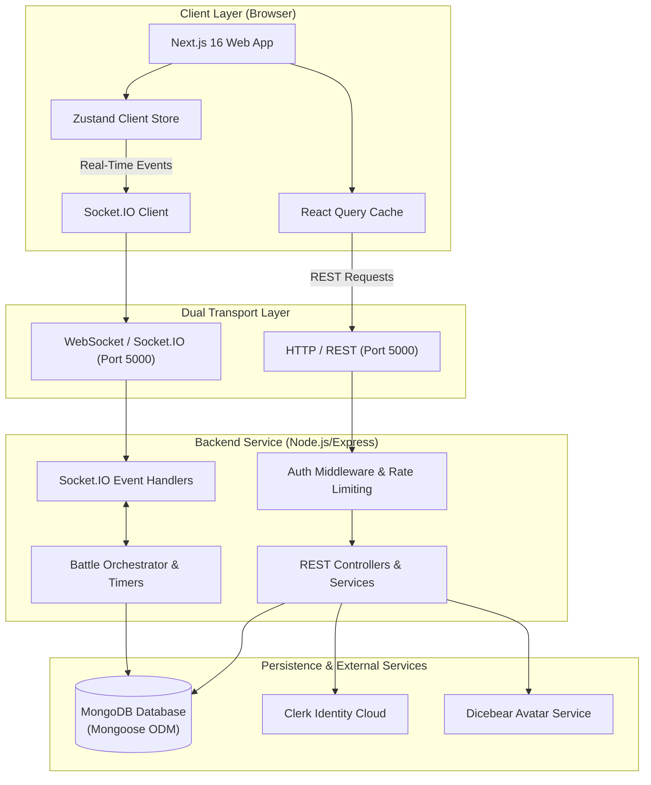
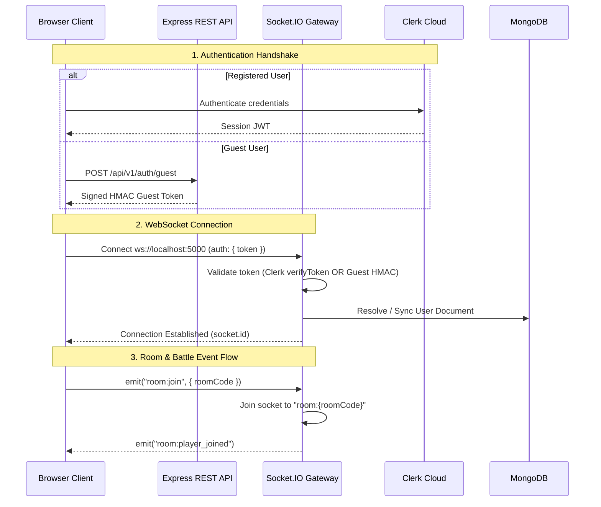

# 02 — System Architecture

## 1. System Topology Overview

CodeArena is designed as a **decoupled client-server system** featuring a modern React/Next.js frontend communicating with a modular TypeScript Express and Socket.IO backend over both HTTP and WebSocket transports.



---

## 2. Dual-Transport Architecture (HTTP vs. WebSocket)

The platform divides responsibilities between two transport layers to maximize responsiveness while maintaining stateless simplicity where appropriate:

### 2.1 HTTP / REST Transport
Used for **idempotent, cacheable, or transactional queries**:
* User profile resolution and authenticated settings updates (`/api/v1/users/me`).
* Paginated global leaderboard browsing with compound database indexes (`/api/v1/leaderboard`).
* Historical match analysis and detailed per-question reviews (`/api/v1/history/:battleId`).
* Public question bank browsing (`/api/v1/questions`).
* Guest session provisioning (`/api/v1/auth/guest`).
* Room creation (`POST /api/v1/rooms`).

### 2.2 WebSocket (Socket.IO) Transport
Used for **low-latency, real-time bidirectional communication**:
* Room lobby synchronization (player join notifications, readiness toggles).
* Live countdown and battle initiation handshakes.
* Question delivery (`battle:init`, `battle:next_question`).
* Opponent telemetry (`battle:opponent_progress`).
* Server question timeout signals.
* Final battle conclusion broadcasting (`battle:completed`).

---

## 3. Communication Protocols & Handshake Lifecycle



---

## 4. Fault Tolerance & Data Consistency

### 4.1 Authoritative Server Clock & Timer Resilience
All question countdowns run as native server-side timers (`setTimeout`) maintained in memory (`Map<string, NodeJS.Timeout>`). If a client experiences network stutter or tab throttling:
* The server deadline timer fires independently.
* The server writes an unanswered entry (`-1`) to MongoDB.
* The server advances the question queue and alerts the room.

### 4.2 Idempotent State Transitions
To prevent double-counting statistics under concurrent socket answer submissions:
* Battle status transitions to `COMPLETED` use a MongoDB conditional write:
  ```typescript
  BattleModel.findOneAndUpdate(
    { _id: battle._id, status: { $ne: BattleStatus.COMPLETED } },
    { $set: { status: BattleStatus.COMPLETED, endedAt: new Date(), ... } }
  )
  ```
* Exactly one process receives the updated document and performs the user statistics increment.

### 4.3 Graceful Connection Recovery
If a user disconnects mid-battle:
1. The server notifies the remaining player via `player:disconnected`.
2. The disconnected user can reconnect; upon sending `battle:join`, the server returns their exact current question and remaining deadline.

---

## 5. Security & Boundary Separation

* **Network Boundary**: Express uses CORS configuration (`CORS_ORIGIN`) and custom security headers (`X-Content-Type-Options: nosniff`, `X-Frame-Options: DENY`, `X-XSS-Protection`).
* **Authentication Boundary**: Routes and sockets require either a valid Clerk session token or an HMAC-signed guest token verified with `GUEST_JWT_SECRET`.
* **Data Boundary**: Questions in active battles are sanitized to strip `correctAnswer` and `explanation`.

---

## 6. Document Cross-References
* For frontend architecture details, see [03 — Frontend Architecture](03-frontend-architecture.md).
* For backend architecture details, see [04 — Backend Architecture](04-backend-architecture.md).
* For real-time socket protocol details, see [07 — Real-Time Socket Architecture](07-realtime-socket-architecture.md).
