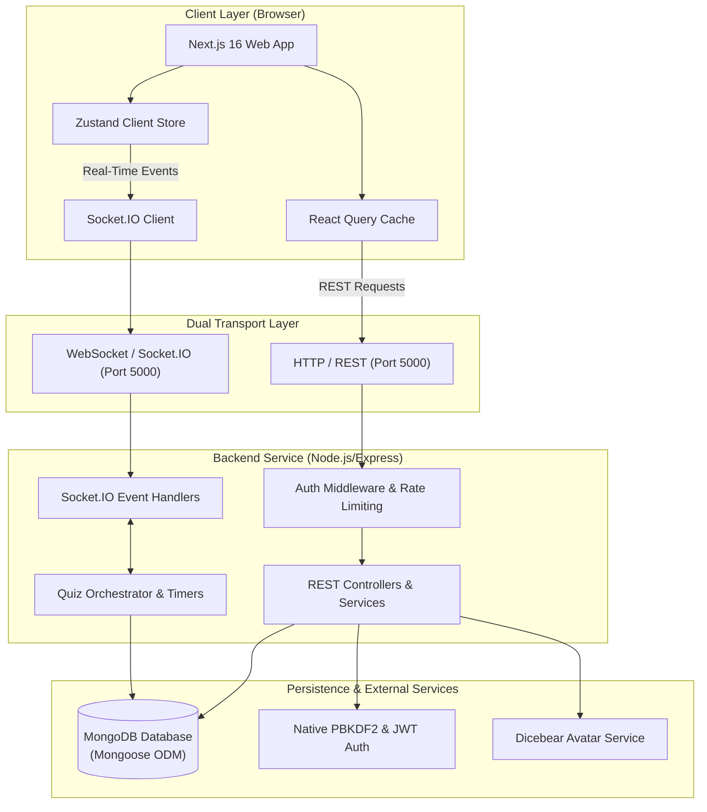
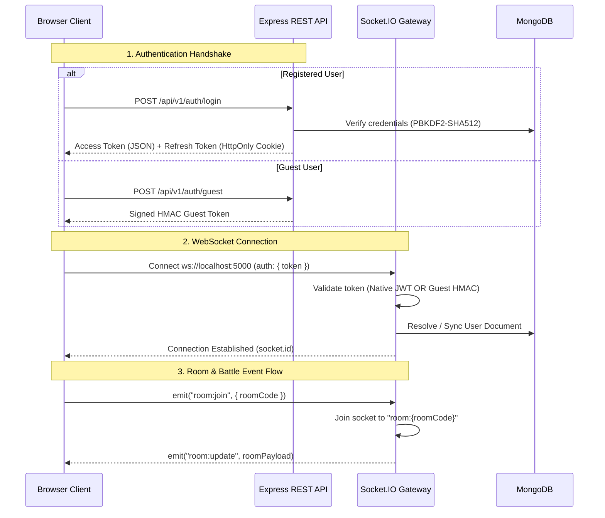

# 02 — System Architecture

## 1. System Topology Overview

CodeArena is designed as a **decoupled client-server system** featuring a modern React/Next.js frontend communicating with a modular TypeScript Express and Socket.IO backend over both HTTP and WebSocket transports.



---

## 2. Dual-Transport Architecture (HTTP vs. WebSocket)

The platform divides responsibilities between two transport layers to maximize responsiveness while maintaining stateless simplicity where appropriate:

### 2.1 HTTP / REST Transport
Used for **idempotent, cacheable, or transactional queries**:
* Native authentication (`/api/v1/auth/register`, `/login`, `/refresh`, `/logout`, `/me`).
* User profile resolution and authenticated settings updates (`/api/v1/users/me`).
* Paginated global leaderboard browsing with compound database indexes (`/api/v1/leaderboard`).
* Historical match analysis and detailed per-question reviews (`/api/v1/history/:battleId` or `/api/v1/matches/:id`).
* Category and subject discovery (`/api/v1/categories`, `/api/v1/categories/:id/subjects`).
* Question bank browsing (`/api/v1/questions`).
* Guest session provisioning (`/api/v1/auth/guest`).
* Room creation (`POST /api/v1/rooms`).

### 2.2 WebSocket (Socket.IO) Transport
Used for **low-latency, real-time bidirectional communication**:
* Room lobby synchronization (player join notifications, readiness toggles, settings updates).
* Live countdown and quiz initiation handshakes (`room:start_battle`, `battle:init`).
* Question delivery (`battle:init`, `battle:next_question`).
* Answer submission & locks (`battle:submit_answer`, `battle:answer_locked`).
* Synchronized round reveal telemetry (`battle:player_submitted`, `battle:reveal`).
* Server question timeout signals.
* Final battle conclusion broadcasting (`battle:completed`).

---

## 3. Communication Protocols & Handshake Lifecycle



---

## 4. Fault Tolerance & Data Consistency

### 4.1 Authoritative Server Clock & Persistent Round Deadlines
All question countdowns and round states are stored directly in MongoDB within the `BattleModel.currentRound` subdocument (`questionIndex`, `startedAt`, `deadline`, `revealExpiresAt`, `submissions`). Instead of fragile in-memory process timers:
* The server computes an absolute timestamp deadline upon round start based on category duration (Programming: 30s, Aptitude: 60s, GK: 30s).
* If all active players submit answers before the deadline, the server executes round reveal immediately.
* A background sweeper running every second (`battleService.sweepActiveBattles`) queries expired deadlines and triggers synchronized reveals (`battle:reveal`) or next round transitions (`battle:next_question`).
* If a player disconnects or encounters lag, reconnect catch-up logic (`checkAndCatchUpBattle`) verifies whether deadlines expired while they were away and catches up their state.
* Unanswered players at the expiration of the deadline are awarded 0 points (`selectedOption: -1`).

### 4.2 Idempotent State Transitions
To prevent double-counting statistics under concurrent socket answer submissions:
* Battle status transitions to `COMPLETED` use a MongoDB conditional write:
  ```typescript
  BattleModel.findOneAndUpdate(
    { _id: battle._id, status: { $ne: BattleStatus.COMPLETED } },
    { $set: { status: BattleStatus.COMPLETED, endedAt: new Date(), ... } }
  )
  ```
* Exactly one process receives the updated document and performs the user statistics increment.

### 4.3 Graceful Connection Recovery
If a user disconnects mid-battle:
1. The server notifies the room participants via `player:disconnected`.
2. The disconnected user can reconnect; upon sending `battle:reconnect` or rejoining, the server returns their current round context, questions, and remaining deadline.

### 4.4 Stale Room & Abandoned Battle Garbage Collection
To prevent orphaned database records and permanently locked 6-character room codes:
1. **Periodic Background GC**: `roomService.startGarbageCollector()` runs every 10 minutes on server startup.
2. **Stale Room Pruning**: Deletes rooms in `WAITING` or `READY` status untouched for $>2\text{ hours}$ via `RoomModel.deleteMany({ status: { $in: ['WAITING', 'READY'] }, updatedAt: { $lte: twoHoursAgo } })`.
3. **Abandoned Battle Pruning**: Automatically cancels `IN_PROGRESS` battles older than 2 hours via `BattleModel.findOneAndUpdate(..., { status: BattleStatus.CANCELLED })`, freeing the associated `roomCode` for reuse.

---

## 5. Security & Boundary Separation

* **Network Boundary**: Express uses CORS configuration (`CORS_ORIGIN`) and custom security headers (`X-Content-Type-Options: nosniff`, `X-Frame-Options: DENY`, `X-XSS-Protection`).
* **Authentication Boundary**: Routes and sockets require either a valid Native JWT access token (`JWT_ACCESS_SECRET`) or an HMAC-signed guest token verified with `GUEST_JWT_SECRET`.
* **Data Boundary**: Questions in active battles are sanitized to strip `correctAnswer` and `explanation`.

---

## 6. Document Cross-References
* For frontend architecture details, see [03 — Frontend Architecture](03-frontend-architecture.md).
* For backend architecture details, see [04 — Backend Architecture](04-backend-architecture.md).
* For real-time socket protocol details, see [07 — Real-Time Socket Architecture](07-realtime-socket-architecture.md).
