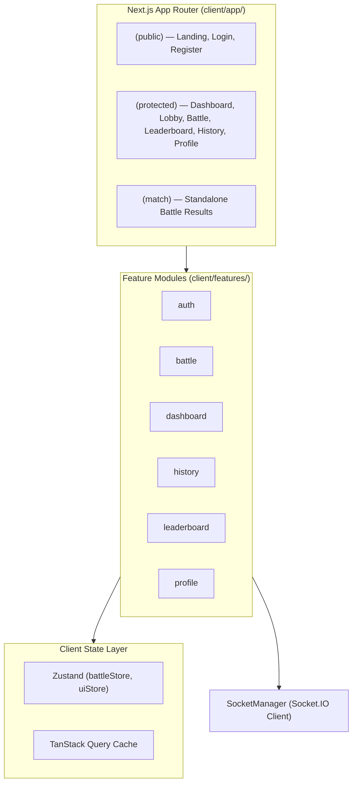

# 03 — Frontend Architecture

## 1. Overview & Framework Choices

The CodeArena client application is built with **Next.js 16 (App Router)** and **React 19**, styled with **TailwindCSS v4**, and backed by **Zustand** and **TanStack React Query v5**.

The client is optimized for sub-second page transitions, reactive real-time 1–4 player quiz interfaces, and clean responsive views across mobile and desktop devices.



---

## 2. Directory Layout & Route Groups

The `client/` codebase is organized around standard Next.js conventions and domain-driven feature modules:

```text
client/
├── app/
│   ├── (match)/
│   │   ├── results/[matchId]/page.tsx      <-- Post-match victory/defeat/rankings screen
│   │   └── layout.tsx
│   ├── (protected)/
│   │   ├── battle/[roomCode]/page.tsx      <-- Real-time 1–4 player quiz arena
│   │   ├── battle/new/page.tsx             <-- Quiz room creation & category config
│   │   ├── dashboard/page.tsx              <-- User dashboard & quick play
│   │   ├── history/page.tsx                <-- Paginated match history
│   │   ├── leaderboard/page.tsx            <-- Global rankings table
│   │   ├── lobby/[roomCode]/page.tsx       <-- Match waiting room & readiness (1–4 players)
│   │   ├── profile/page.tsx                <-- Authenticated profile & stats
│   │   ├── profile/[username]/page.tsx     <-- Public profile view
│   │   └── layout.tsx                      <-- Protected layout with Navbar
│   ├── (public)/
│   │   ├── login/page.tsx                  <-- Native credentials sign-in & Guest button
│   │   ├── register/page.tsx               <-- Native user registration
│   │   ├── page.tsx                        <-- Landing page with hero & CTA
│   │   └── layout.tsx                      <-- Public layout with LandingNav
│   ├── globals.css                         <-- Global Tailwind styles & tokens
│   └── layout.tsx                          <-- Root layout with AppProviders & Google Fonts
├── components/                             <-- Shared and landing UI components
├── features/                               <-- Domain-specific components & hooks
├── hooks/                                  <-- Utility React hooks
├── lib/                                    <-- Singletons (api.ts, socket.ts)
├── store/                                  <-- Zustand stores (battleStore, uiStore)
└── types/                                  <-- TypeScript domain interfaces
```

---

## 3. Route Protection & Middleware

Client-side route access is regulated by [`client/middleware.ts`](file:///h:/Project/code-arena/client/middleware.ts) using standard Next.js `NextResponse` cookies inspection:

```typescript
import { NextResponse, NextRequest } from "next/server";

const PROTECTED_PREFIXES = [
  "/dashboard",
  "/battle",
  "/profile",
  "/settings",
  "/lobby",
  "/leaderboard",
  "/history",
  "/results",
];

const AUTH_PREFIXES = ["/login", "/register"];

export function middleware(req: NextRequest) {
  const { pathname } = req.nextUrl;

  const hasAccessToken = req.cookies.has("codearena_access_token") || req.cookies.has("refreshToken");
  const hasGuestToken = req.cookies.has("codearena_guest_token");
  const isAuthenticated = hasAccessToken || hasGuestToken;

  const isAuthRoute = AUTH_PREFIXES.some((prefix) => pathname.startsWith(prefix));
  const isProtectedRoute = PROTECTED_PREFIXES.some((prefix) => pathname.startsWith(prefix));

  if (isAuthenticated && isAuthRoute) {
    return NextResponse.redirect(new URL("/dashboard", req.url));
  }

  if (isProtectedRoute && !isAuthenticated) {
    const loginUrl = new URL("/login", req.url);
    loginUrl.searchParams.set("redirect", pathname);
    return NextResponse.redirect(loginUrl);
  }

  return NextResponse.next();
}
```

---

## 4. State Management Architecture

The application bifurcates state into **Ephemeral Real-Time State** (Zustand) and **Cached Server State** (TanStack Query):

### 4.1 Zustand Stores (`client/store/`)
1. **`useBattleStore`** ([`battleStore.ts`](file:///h:/Project/code-arena/client/store/battleStore.ts)):
   * **Connection**: `isSocketConnected: boolean`.
   * **Room State**: `roomCode`, `matchId`, `status` (`idle`, `lobby`, `countdown`, `active`, `completed`).
   * **Timers**: Authoritative countdown timers synched to server round deadlines.
   * **Players**: Array of `Player` objects (1–4 players) with readiness, score, submitted status, and rankings.
   * **Active Question Cache**: Sanitized question queue, current round question, locked options, and round reveal states.
2. **`useUiStore`** ([`uiStore.ts`](file:///h:/Project/code-arena/client/store/uiStore.ts)):
   * Manages modal overlays, custom toast triggers, and mobile drawer visibility.

### 4.2 TanStack Query Cache (`client/features/*/hooks/`)
* **`useLeaderboard(page, limit)`**: Fetches and caches paginated leaderboard data (`['leaderboard', page, limit]`).
* **`usePublicProfile(username)`**: Caches public user statistics and recent battle records.
* **`useMatchHistory(page, limit)`**: Caches paginated completed matches.
* **`useCategories()`**: Fetches and caches active question categories and subjects.

---

## 5. Real-Time Socket Manager (`client/lib/socket.ts`)

WebSocket connections are managed through a centralized `SocketManager` singleton:
* **Token Synchronization**: Ensures the socket reconnects automatically with the active bearer token (native JWT access token or HMAC guest token).
* **Lifecycle Methods**: Exposes `.connect(token)`, `.disconnect()`, `.emit(event, payload)`, and `.on(event, callback)`.
* **Auto-Reconnection**: Configured with reconnection attempts and backoff delays to survive temporary network interruptions.

---

## 6. UI Design System & Theming

* **Palette**: Dark-mode-first aesthetic with deep obsidian/zinc backgrounds (`#09090b`), high-contrast foreground typography, and vibrant primary accents (`emerald` / `violet` / `amber`).
* **Micro-Animations**: Progress meters for live multiplayer score tracking, smooth countdown timer radial progress, and pulse indicators on active sockets.
* **Rank Badges**: Distinct visual badges for top-tier players:
  * 🥇 Rank 1: Amber gold badge with soft glowing border.
  * 🥈 Rank 2: Slate silver badge with metallic sheen.
  * 🥉 Rank 3: Bronze copper badge.
  * `#4+`: Clean monospace badges.

---

## 7. Document Cross-References
* For backend APIs consumed by the client, see [09 — API Reference](09-api-reference.md).
* For real-time battle event structures, see [07 — Real-Time Socket Architecture](07-realtime-socket-architecture.md).
* For authentication handshakes, see [06 — Authentication & Security](06-authentication-security.md).
