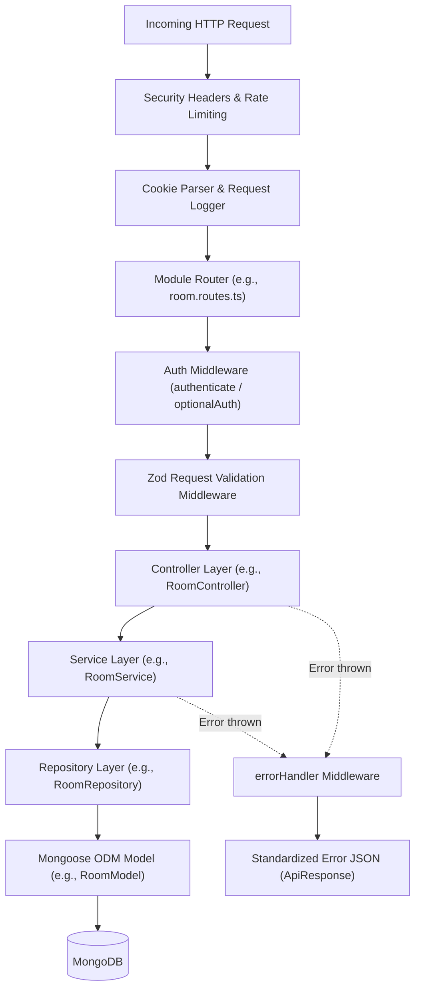

# 04 — Backend Architecture

## 1. Architectural Philosophy: Layered Modular Monolith

The CodeArena backend (`server/`) is structured as a **strictly layered, domain-modular monolith** written in TypeScript. Each business domain (e.g., `auth`, `category`, `user`, `leaderboard`, `battle`, `room`, `question`, `history`) encapsulates its own controllers, services, repositories, and schemas while sharing standardized error handling, validation, and logging utilities.



---

## 2. Server Bootstrapping & Lifecycle (`server/src/server.ts`)

The server entrypoint handles initialization and graceful shutdown:
1. **Database Connection**: Calls `connectDatabase()` to establish a connection to MongoDB with retry logic and error logging.
2. **HTTP & WebSocket Attachment**: Creates a Node.js `http.Server` wrapping the Express `app` and binds the Socket.IO server to the same port.
3. **Socket Gateway Registration**: Registers authentication middleware and event listeners (`roomSocketHandlers`, `battleSocketHandlers`).
4. **Process Signal Handlers**: Listens for `SIGTERM` and `SIGINT`, cleanly terminating socket connections, closing the HTTP listener, and invoking `disconnectDatabase()`.

---

## 3. Express Application Configuration (`server/src/app.ts`)

The Express application registers global middleware and domain routes in a strict order:

```typescript
// 1. Trust proxy for reverse proxies / load balancers
app.set('trust proxy', 1);

// 2. Custom Security Headers
app.use((req, res, next) => {
  res.setHeader('X-Content-Type-Options', 'nosniff');
  res.setHeader('X-Frame-Options', 'DENY');
  res.setHeader('X-XSS-Protection', '1; mode=block');
  if (process.env.NODE_ENV === 'production') {
    res.setHeader('Strict-Transport-Security', 'max-age=31536000; includeSubDomains');
  }
  next();
});

// 3. Global Rate Limiter
app.use(rateLimiter);

// 4. CORS & Cookie Parser
app.use(cors({
  origin: process.env.CORS_ORIGIN && process.env.CORS_ORIGIN !== '*' ? process.env.CORS_ORIGIN : true,
  credentials: true,
}));
app.use(cookieParser());

// 5. Body Parsers & Request Logging
app.use(express.json());
app.use(express.urlencoded({ extended: true }));
app.use(requestLogger);

// 6. Health Checks
app.get('/health', ...);
app.get('/api/v1/health', ...);

// 7. Domain Routes Mounting
app.use('/api/v1/auth', authRoutes);
app.use('/api/v1/categories', categoryRoutes);
app.use('/api/v1/users', userRoutes);
app.use('/api/v1/leaderboard', leaderboardRoutes);
app.use('/api/v1/questions', questionRoutes);
app.use('/api/v1/rooms', roomRoutes);
app.use('/api/v1/battles', battleRoutes);
app.use('/api/v1/matches', battleRoutes); // Compatibility alias
app.use('/api/v1/history', historyRoutes);
app.use('/api', docsRoutes);

// 8. 404 & Centralized Error Handler
app.use(notFoundHandler);
app.use(errorHandler);
```

---

## 4. Backend Module Catalogue (`server/src/modules/`)

| Module | Core Responsibility | Key Files |
| :--- | :--- | :--- |
| **`auth/`** | Native user registration/login, PBKDF2 password verification, JWT access tokens, HttpOnly refresh cookies, and guest HMAC session provisioning. | `auth.routes.ts`, `auth.controller.ts`, `auth.service.ts` |
| **`category/`** | Manages quiz categories (`programming`, `aptitude`, `general-knowledge`), hierarchical subjects, and seed discovery. | `category.routes.ts`, `category.controller.ts`, `category.service.ts`, `category.repository.ts`, `category.model.ts` |
| **`user/`** | User profile retrieval and management, avatar updates, win/loss stats, and rank calculation. | `user.routes.ts`, `user.controller.ts`, `user.service.ts`, `user.repository.ts`, `user.model.ts` |
| **`leaderboard/`** | Paginated global leaderboard browsing indexed by wins, accuracy, and battles played. | `leaderboard.routes.ts`, `leaderboard.controller.ts`, `leaderboard.service.ts` |
| **`question/`** | Maintains MCQ bank, filters by category/subject, sanitizes answers, and seeds question datasets. | `question.routes.ts`, `question.controller.ts`, `question.service.ts`, `question.repository.ts`, `question.model.ts` |
| **`room/`** | Generates unique 6-character room codes, manages 1–4 player lobbies, player readiness, settings updates, and game initiation. | `room.routes.ts`, `room.controller.ts`, `room.service.ts`, `room.repository.ts`, `room.model.ts` |
| **`battle/`** | Real-time quiz battle engine, anti-cheat question dispatch, server timer orchestration, answer verification, synchronized round reveals, and atomic finalization. | `battle.routes.ts`, `battle.controller.ts`, `battle.service.ts`, `battle.repository.ts`, `battle.model.ts` |
| **`history/`** | Queries completed match records from `BattleModel`, per-player scores/ranks, durations, and post-match question explanations. | `history.routes.ts`, `history.controller.ts`, `history.service.ts`, `history.repository.ts` |
| **`docs/`** | Serves OpenAPI 3.0 specification JSON and interactive Swagger UI documentation. | `docs.routes.ts`, `openapi.ts` |

---

## 5. Centralized Error Handling & Response Wrappers

### 5.1 Standardized Error Classes (`server/src/shared/errors/`)
* **`AppError` / `ApiError`**: Custom error classes extending `Error` with HTTP status code and operational error flags.
* **`asyncHandler`**: Higher-order utility wrapping async controller functions to catch promise rejections and forward them to Express `next(error)`.

### 5.2 Global Error Handler (`server/src/middleware/error.middleware.ts`)
* Intercepts unhandled errors, logs error details via Pino, and returns a consistent JSON contract:
  ```json
  {
    "success": false,
    "statusCode": 400,
    "message": "Detailed error message",
    "errors": []
  }
  ```
* In `development` mode, stack traces are attached; in `production`, internal system details are masked.

### 5.3 Standard Success Response (`server/src/shared/utils/api-response.ts`)
* All controllers wrap successful outputs using `ApiResponse`:
  ```json
  {
    "success": true,
    "statusCode": 200,
    "message": "Resource retrieved successfully.",
    "data": { ... }
  }
  ```

---

## 6. Document Cross-References
* For database collections and Mongoose models, see [05 — Database Architecture](05-database-architecture.md).
* For authentication middleware details, see [06 — Authentication & Security](06-authentication-security.md).
* For complete endpoint specifications, see [09 — API Reference](09-api-reference.md).
