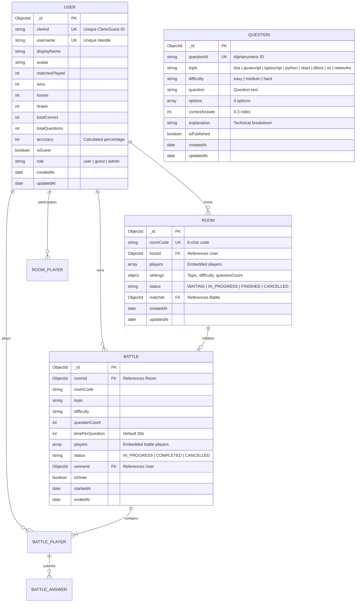

# 05 — Database Architecture

## 1. Overview & Technology

CodeArena uses **MongoDB** managed via the **Mongoose ODM (v8.5)**. The database schema is designed for:
* **High-write real-time updates**: Recording per-question answer telemetry and atomic score updates.
* **Low-latency index-covered reads**: Rapid global leaderboard sorting, user profile rank calculations, and paginated match histories without full-collection memory scans.
* **Anti-cheat data integrity**: Server-side storage of correct answers and explanations isolated from live battle events.

---

## 2. Entity-Relationship (ER) Diagram



---

## 3. Detailed Collection Schemas

### 3.1 `UserModel` (`server/src/modules/user/user.model.ts`)
Stores identity, display preferences, and persistent competition statistics.

```typescript
const UserSchema = new Schema<IUserDocument>(
  {
    clerkId: { type: String, required: true, unique: true, index: true },
    username: { type: String, required: true, unique: true },
    displayName: { type: String, required: true },
    avatar: { type: String, default: '' },
    matchesPlayed: { type: Number, default: 0 },
    wins: { type: Number, default: 0 },
    losses: { type: Number, default: 0 },
    draws: { type: Number, default: 0 },
    totalCorrect: { type: Number, default: 0 },
    totalQuestions: { type: Number, default: 0 },
    accuracy: { type: Number, default: 0 },
    preferredLanguage: { type: String, default: 'javascript' },
    isGuest: { type: Boolean, default: false, index: true },
    role: { type: String, enum: ['user', 'guest', 'admin'], default: 'user' },
  },
  { timestamps: true }
);
```

### 3.2 `RoomModel` (`server/src/modules/room/room.model.ts`)
Manages matchmaking state and player lobby status before game initiation.

```typescript
const RoomSchema = new Schema<IRoomDocument>(
  {
    roomCode: { type: String, required: true, unique: true, index: true },
    hostId: { type: Schema.Types.ObjectId, ref: 'User', required: true },
    players: [{
      userId: { type: Schema.Types.ObjectId, ref: 'User', required: true },
      isHost: { type: Boolean, required: true, default: false },
      isReady: { type: Boolean, required: true, default: false },
    }],
    settings: {
      topic: { type: String, required: true, default: 'random' },
      difficulty: { type: String, required: true, enum: ['Easy', 'Medium', 'Hard', 'random'], default: 'random' },
      duration: { type: Number, required: true, default: 30 },
      questionCount: { type: Number, default: 10 },
    },
    maxPlayers: { type: Number, required: true, default: 2 },
    status: { type: String, required: true, enum: Object.values(RoomStatus), default: RoomStatus.WAITING },
    matchId: { type: Schema.Types.ObjectId, ref: 'Battle', default: null },
  },
  { timestamps: true }
);
```

### 3.3 `QuestionModel` (`server/src/modules/question/question.model.ts`)
Stores the catalog of technical multiple-choice questions.

* **Supported Topics (`QuestionTopic`)**: `dsa`, `javascript`, `typescript`, `python`, `react`, `dbms`, `os`, `networks`
* **Supported Difficulties (`QuestionDifficulty`)**: `easy`, `medium`, `hard`

```typescript
const QuestionSchema = new Schema<IQuestionDocument>(
  {
    questionId: { type: String, required: true, unique: true, index: true },
    topic: { type: String, required: true, enum: Object.values(QuestionTopic), index: true },
    difficulty: { type: String, required: true, enum: Object.values(QuestionDifficulty), index: true },
    question: { type: String, required: true },
    options: {
      type: [String],
      required: true,
      validate: [(val) => Array.isArray(val) && val.length === 4, 'Must have exactly 4 options'],
    },
    correctAnswer: { type: Number, required: true, min: 0, max: 3 },
    explanation: { type: String, required: true },
    isPublished: { type: Boolean, default: true, index: true },
  },
  { timestamps: true }
);
```

### 3.4 `BattleModel` (`server/src/modules/battle/battle.model.ts`)
Records active game telemetry, per-player answer arrays, deadlines, and final outcomes.

```typescript
const BattleSchema = new Schema<IBattleDocument>(
  {
    roomId: { type: Schema.Types.ObjectId, ref: 'Room', required: true },
    roomCode: { type: String, required: true, index: true },
    topic: { type: String, required: true },
    difficulty: { type: String, required: true },
    questionCount: { type: Number, required: true, default: 5 },
    timePerQuestion: { type: Number, required: true, default: 30 },
    players: [{
      userId: { type: Schema.Types.ObjectId, ref: 'User', required: true },
      assignedQuestionIds: { type: [String], default: [] },
      currentQuestionIndex: { type: Number, default: 0 },
      questionDeadline: { type: Date, default: null },
      answers: [{
        questionId: { type: String, required: true },
        selectedOption: { type: Number, required: true },
        isCorrect: { type: Boolean, required: true },
        submittedAt: { type: Date, required: true, default: Date.now },
        timeTakenMs: { type: Number, required: true, default: 0 },
      }],
      score: { type: Number, default: 0 },
      status: { type: String, enum: ['IN_PROGRESS', 'COMPLETED'], default: 'IN_PROGRESS' },
    }],
    status: { type: String, required: true, enum: Object.values(BattleStatus), default: BattleStatus.IN_PROGRESS },
    winnerId: { type: Schema.Types.ObjectId, ref: 'User', default: null },
    isDraw: { type: Boolean, default: false },
    startedAt: { type: Date, required: true, default: Date.now },
    endedAt: { type: Date },
  },
  { timestamps: true, versionKey: false }
);
```

---

## 4. Compound Indexing Strategy

To guarantee scalability without loading entire collections into Node.js memory:

| Collection | Compound Index Keys | Justification & Query Pattern |
| :--- | :--- | :--- |
| **`User`** | `{ isGuest: 1, wins: -1, accuracy: -1, matchesPlayed: -1, username: 1 }` | Powers the paginated global leaderboard and $O(\log N)$ rank calculation (`countDocuments`). |
| **`Battle`** | `{ 'players.userId': 1, status: 1, endedAt: -1 }` | Powers user profile recent matches (`limit(10)`) and match history. |
| **`Battle`** | `{ roomCode: 1, status: 1 }` | Used for instant lookup of active matches by room code. |
| **`Question`** | `{ topic: 1, difficulty: 1, isPublished: 1 }` | Powers random sampling aggregation pipelines during match initiation. |

---

## 5. Atomic Update Pipelines & Data Integrity

### 5.1 Atomic User Statistics Increment (`recordBattleStatsById`)
To prevent read-modify-write race conditions, player statistics are updated using MongoDB's aggregation pipeline inside `updateOne`:

```typescript
await UserModel.updateOne(
  { _id: userId },
  [
    {
      $set: {
        matchesPlayed: { $add: [{ $ifNull: ['$matchesPlayed', 0] }, 1] },
        wins: { $add: [{ $ifNull: ['$wins', 0] }, stats.isWin ? 1 : 0] },
        losses: { $add: [{ $ifNull: ['$losses', 0] }, stats.isLoss ? 1 : 0] },
        draws: { $add: [{ $ifNull: ['$draws', 0] }, stats.isDraw ? 1 : 0] },
        totalCorrect: { $add: [{ $ifNull: ['$totalCorrect', 0] }, stats.correctCount] },
        totalQuestions: { $add: [{ $ifNull: ['$totalQuestions', 0] }, stats.questionCount] },
      },
    },
    {
      $set: {
        accuracy: {
          $cond: [
            { $gt: ['$totalQuestions', 0] },
            { $round: [{ $multiply: [{ $divide: ['$totalCorrect', '$totalQuestions'] }, 100] }, 0] },
            0,
          ],
        },
      },
    },
  ]
);
```
**Benefits**:
* Accuracy is calculated atomically from cumulative totals, never directly incremented.
* Safe against concurrency collisions when both players complete the battle simultaneously.

---

## 6. Document Cross-References
* For battle completion engine details, see [08 — Battle Engine](08-battle-engine.md).
* For API routes interacting with these schemas, see [09 — API Reference](09-api-reference.md).
* For testing data integrity and reconciliation, see [12 — Testing Guide](12-testing-guide.md).
