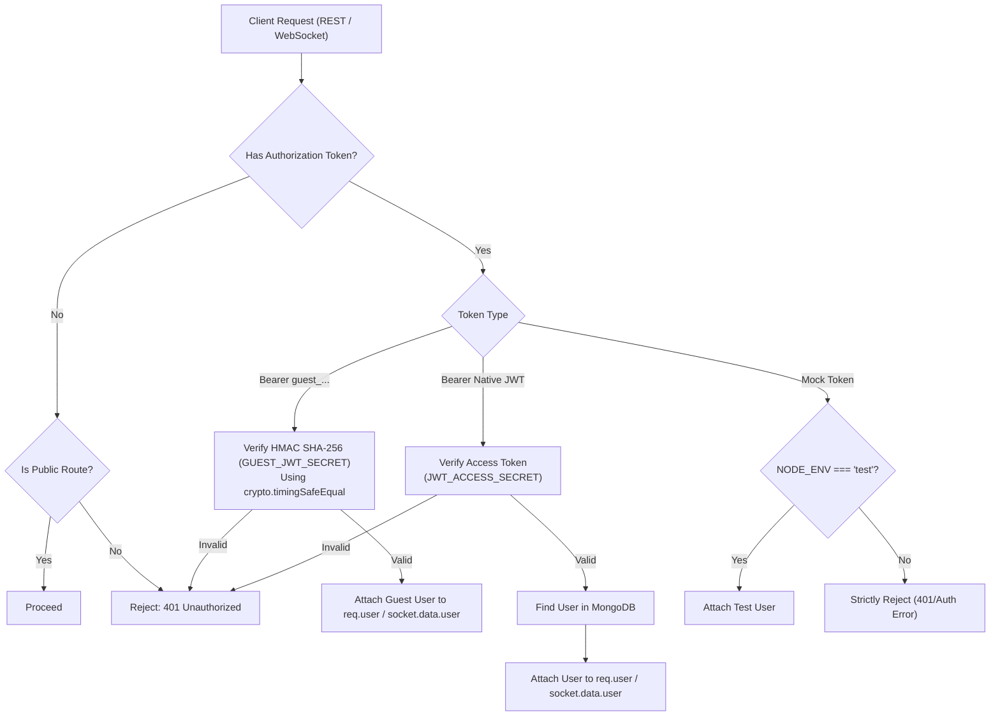

# 06 — Authentication & Security

## 1. Dual-Authentication Architecture Overview

CodeArena implements a **hybrid authentication model** designed to balance security with zero-friction user acquisition:
1. **Native JWT Authentication**: Full account identity with email/username and bcrypt password hashing. Delivers an Access Token (15m expiry) and Refresh Token (7-day expiry in an HttpOnly cookie and hashed in the database).
2. **Secure Guest Authentication**: Zero-login, session-based access powered by backend-signed, timing-safe HMAC SHA-256 JWTs.

---

## 2. Native JWT Authentication Flow

### 2.1 Registration & Login (`server/src/modules/auth/auth.service.ts`)
1. **Registration** (`POST /api/v1/auth/register`):
   - Validates `email`, `username`, `password`, and optional `displayName`.
   - Hashes password using `bcryptjs` with 10 salt rounds.
   - Creates a new `UserModel` document with `role: 'user'` and `isGuest: false`.
2. **Login** (`POST /api/v1/auth/login`):
   - Supports logging in via either `email` or `username`.
   - Verifies password hash using `bcryptjs.compare`.
   - Generates an Access Token (15 min) and Refresh Token (7 days).
   - Hashes the Refresh Token and stores it in `UserModel.refreshTokenHash`.
   - Sets the Refresh Token in a secure `HttpOnly`, `SameSite=Lax` cookie (`refreshToken`).
   - Returns the Access Token and user payload.

### 2.2 Token Refresh & Logout
1. **Token Refresh** (`POST /api/v1/auth/refresh`):
   - Reads Refresh Token from cookie (or request body).
   - Verifies signature against `JWT_REFRESH_SECRET`.
   - Looks up user and verifies token against `refreshTokenHash`.
   - Issues a fresh Access Token.
2. **Logout** (`POST /api/v1/auth/logout`):
   - Clears `refreshTokenHash` from the database.
   - Clears the `refreshToken` cookie.

---

## 3. Guest Authentication Implementation

### 3.1 Session Creation (`POST /api/v1/auth/guest`)
When an unauthenticated user enters the arena as a guest:
1. The client calls `POST /api/v1/auth/guest` with an optional display handle.
2. The server generates a unique `guestId` (e.g. `guest_a1b2c3d4...`) and random handle (`Guest 40A9F2`).
3. An avatar URL is generated via the Dicebear bottts API: `https://api.dicebear.com/7.x/bottts/svg?seed=${username}`.
4. A guest `UserModel` record is created with `isGuest: true` and `role: 'guest'`.
5. The server issues a custom signed JWT valid for 24 hours.

### 3.2 Timing-Safe Token Verification
Tokens are verified against `GUEST_JWT_SECRET` using Node.js `crypto.timingSafeEqual` to prevent timing attacks.

---

## 4. REST Middleware Pipeline (`server/src/middleware/auth.middleware.ts`)

The `authenticate` middleware regulates access to private REST routes:
1. **Checks Native Bearer Token**: Parses `Authorization: Bearer <token>` and verifies via `verifyJwt(token, env.JWT_ACCESS_SECRET)`.
2. **Checks Guest Bearer Token**: If native verification fails or token has `guest_` prefix, verifies via `authService.verifyGuestToken(token)`.
3. **Strict Test Environment Bypass**: Allows `mock_test_token_*` **only** if `env.NODE_ENV === 'test'`. In `development` and `production`, mock tokens are strictly rejected.
4. **Attaches User**: Queries the user document from MongoDB and attaches it to `req.user`.

---

## 5. Socket.IO Authentication Gateway (`server/src/sockets/socket.ts`)

WebSocket connections pass authentication during the handshake:
* Clients provide tokens in `socket.handshake.auth.token` or `socket.handshake.headers.authorization`.
* The middleware validates the token (Native JWT or Guest HMAC).
* Authenticated user metadata is attached directly to `socket.data.user`.
* Missing, expired, or tampered tokens result in an immediate connection termination with an `Authentication error`.

---

## 6. Role-Based Access Control (RBAC) & Restrictions

| Role | Permissions | Restrictions |
| :--- | :--- | :--- |
| **`user`** (Registered) | Host rooms, join rooms, participate in battles, update profile settings, appear on global leaderboard. | Standard rate limits apply. |
| **`guest`** (Temporary) | Host rooms, join rooms, participate in battles, view match history. | **Forbidden from modifying profile settings** (`PATCH /api/v1/users/me` returns 403). **Excluded from public global leaderboard**. |
| **`admin`** | User management, question publishing, full administrative capabilities. | Reserved for future platform administration. |

---

## 7. Security Headers & Defense-in-Depth

The Express application registers defense-in-depth HTTP headers in [`app.ts`](file:///h:/Project/code-arena/server/src/app.ts):
* `X-Content-Type-Options: nosniff`: Prevents MIME-type sniffing.
* `X-Frame-Options: DENY`: Protects against clickjacking.
* `X-XSS-Protection: 1; mode=block`: Activates browser XSS filtering.
* `Strict-Transport-Security`: Enforced in production (`max-age=31536000; includeSubDomains`).
* **Rate Limiting**: Protects all API endpoints against brute-force and denial-of-service attempts.

---

## 8. Document Cross-References
* For real-time socket authentication details, see [07 — Real-Time Socket Architecture](07-realtime-socket-architecture.md).
* For security verification and regression test suites, see [12 — Testing Guide](12-testing-guide.md).
* For environment variables and secrets configuration, see [10 — Environment Configuration](10-environment-configuration.md).
