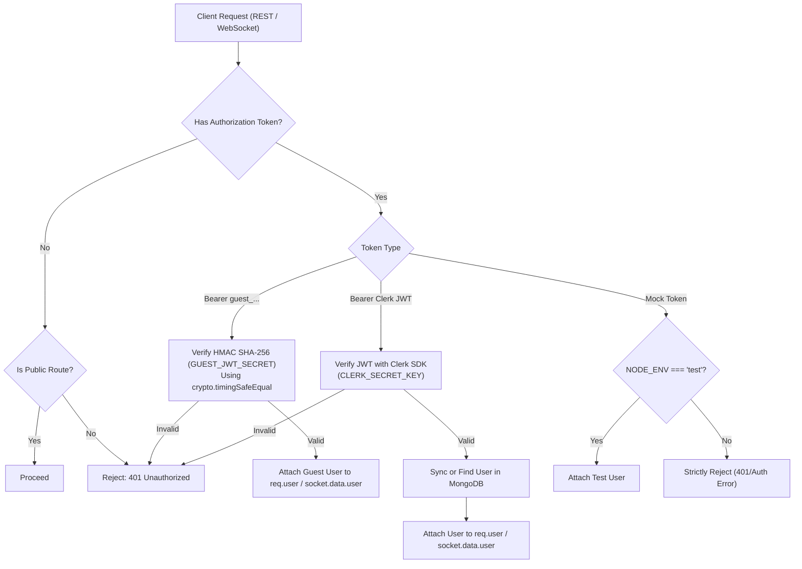

# 06 — Authentication & Security

## 1. Dual-Authentication Architecture Overview

CodeArena implements a **hybrid authentication model** designed to balance security with zero-friction user acquisition:
1. **Clerk Cloud Authentication**: Full account identity, social OAuth providers (Google, GitHub), email/password accounts, and persistent user identities.
2. **Secure Guest Authentication**: Zero-login, session-based access powered by backend-signed, timing-safe HMAC SHA-256 JWTs.



---

## 2. Guest Authentication Implementation

### 2.1 Session Creation (`server/src/modules/auth/auth.service.ts`)
When an unauthenticated user enters the arena as a guest:
1. The client calls `POST /api/v1/auth/guest` with an optional display handle.
2. The server generates a unique `guestId` (e.g. `guest_a1b2c3d4...`) and random handle (`Guest 40A9F2`).
3. An avatar URL is generated via the Dicebear bottts API: `https://api.dicebear.com/7.x/bottts/svg?seed=${username}`.
4. A guest `UserModel` record is created with `isGuest: true` and `role: 'guest'`.
5. The server issues a custom signed JWT valid for 24 hours.

### 2.2 Timing-Safe Token Verification
Tokens are verified against `GUEST_JWT_SECRET` using Node.js `crypto.timingSafeEqual` to prevent timing attacks:

```typescript
const [headerB64, payloadB64, signature] = token.split('.');
const expectedSignature = crypto
  .createHmac('sha256', env.GUEST_JWT_SECRET)
  .update(`${headerB64}.${payloadB64}`)
  .digest('base64url');

const sigBuffer = Buffer.from(signature);
const expectedBuffer = Buffer.from(expectedSignature);

if (sigBuffer.length !== expectedBuffer.length || !crypto.timingSafeEqual(sigBuffer, expectedBuffer)) {
  return null; // Tampered or invalid signature
}
```

---

## 3. REST Middleware Pipeline (`server/src/middleware/auth.middleware.ts`)

The `authenticate` middleware regulates access to private REST routes:
1. **Checks Clerk Session**: Reads `req.auth?.userId` populated by `@clerk/express`.
2. **Checks Guest Bearer Token**: If Clerk is absent, parses `Authorization: Bearer <token>` and verifies via `authService.verifyGuestToken(token)`.
3. **Strict Test Environment Bypass**: Allows `mock_test_token_*` **only** if `env.NODE_ENV === 'test'`. In `development` and `production`, mock tokens are strictly rejected to eliminate backdoor vulnerabilities.
4. **Attaches User**: Queries/syncs the database user via `userService.getOrCreateUser(clerkId)` and attaches the document to `req.user`.

---

## 4. Socket.IO Authentication Gateway (`server/src/sockets/socket.ts`)

WebSocket connections must pass authentication during the handshake:
* Clients provide tokens in `socket.handshake.auth.token` or `socket.handshake.headers.authorization`.
* The middleware validates the token (Guest HMAC or Clerk `verifyToken`).
* Authenticated user metadata is attached directly to `socket.data.user`.
* Missing, expired, or tampered tokens result in an immediate connection termination with an `Authentication error`.

---

## 5. Role-Based Access Control (RBAC) & Restrictions

| Role | Permissions | Restrictions |
| :--- | :--- | :--- |
| **`user`** (Registered) | Host rooms, join rooms, participate in battles, update profile settings, appear on global leaderboard. | Standard rate limits apply. |
| **`guest`** (Temporary) | Host rooms, join rooms, participate in battles, view match history. | **Forbidden from modifying profile settings** (`PATCH /api/v1/users/me` returns 403). **Excluded from public global leaderboard**. |
| **`admin`** | User management, question publishing, full administrative capabilities. | Reserved for future platform administration. |

---

## 6. Security Headers & Defense-in-Depth

The Express application registers defense-in-depth HTTP headers in [`app.ts`](file:///h:/Project/code-arena/server/src/app.ts):
* `X-Content-Type-Options: nosniff`: Prevents MIME-type sniffing.
* `X-Frame-Options: DENY`: Protects against clickjacking.
* `X-XSS-Protection: 1; mode=block`: Activates browser XSS filtering.
* `Strict-Transport-Security`: Enforced in production (`max-age=31536000; includeSubDomains`).
* **Rate Limiting**: Protects all API endpoints against brute-force and denial-of-service attempts.

---

## 7. Document Cross-References
* For real-time socket authentication details, see [07 — Real-Time Socket Architecture](07-realtime-socket-architecture.md).
* For security verification and regression test suites, see [12 — Testing Guide](12-testing-guide.md).
* For environment variables and secrets configuration, see [10 — Environment Configuration](10-environment-configuration.md).
