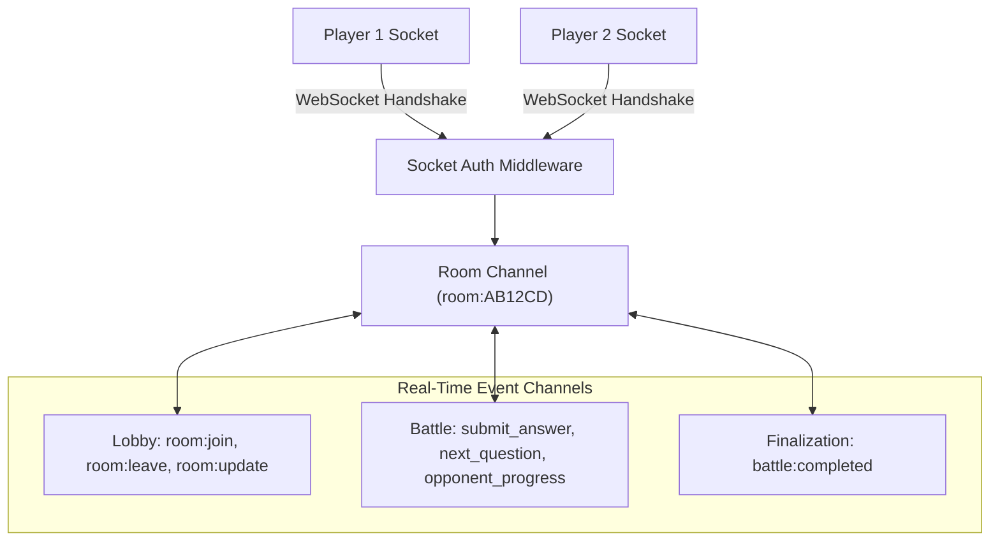
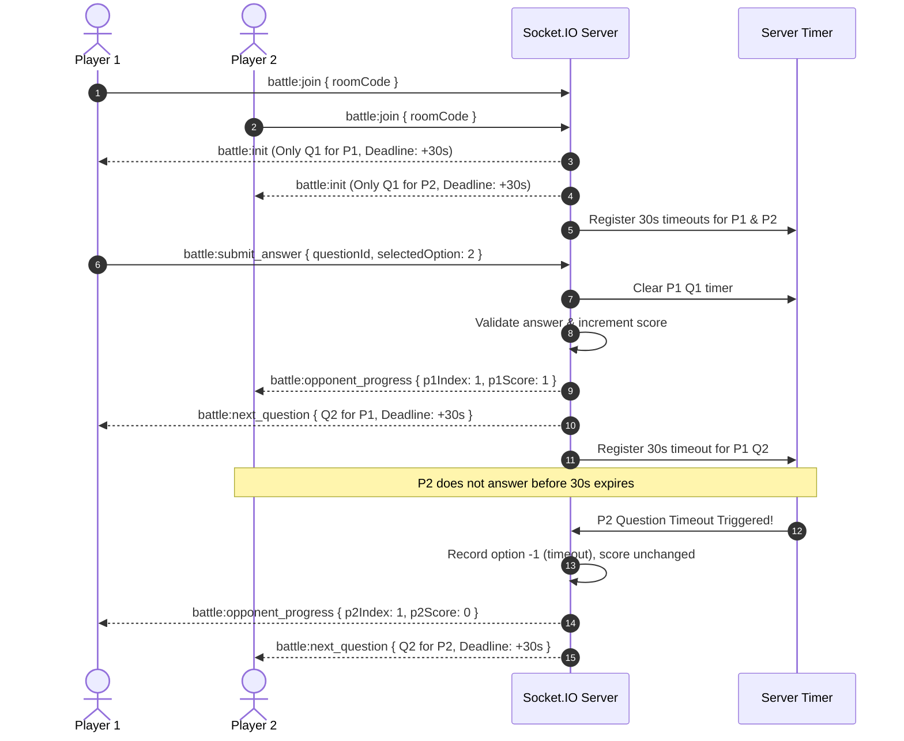

# 07 — Real-Time Socket Architecture

## 1. Socket.IO Gateway Overview

CodeArena uses **Socket.IO (v4.7)** for low-latency, event-driven communication between players and the server. The WebSocket gateway shares the underlying HTTP port (5000), using room-based channels (`room:${roomCode}`) to partition game telemetry.

---

## 2. Handshake & Connection Lifecycle (`server/src/sockets/socket.ts`)

Every incoming connection is validated before the socket connection is granted:
1. **Extraction**: The server reads the token from `socket.handshake.auth.token` or the `Authorization` header.
2. **Verification**: Checks for a backend-signed Guest HMAC token or verifies Clerk credentials.
3. **Context Injection**: Successful validation binds the database user record to `socket.data.user`.
4. **Lifecycle Hooks**: Sockets subscribe to connection drop handlers (`disconnect`), alerting opponents via `player:disconnected`.

---

## 3. Room Management Events (`server/src/sockets/room.socket.ts`)

Rooms act as waiting lobbies where players assemble, configure settings, and confirm readiness.

> [!NOTE]
> **Dual-Transport Pattern**: Toggling player readiness and initiating battle creation are explicitly handled over REST HTTP (`PATCH /api/v1/rooms/:roomCode/ready` and `POST /api/v1/battles/start`) to guarantee strict transaction safety and database validation. Upon completion, the backend broadcasts real-time socket events (`room:update` and `battle:init`) to all connected sockets in the room channel.

### 3.1 Inbound Events (Client $\rightarrow$ Server)
| Event | Payload | Description |
| :--- | :--- | :--- |
| **`room:join`** | `{ roomCode: string }` | Player requests to join a room channel. Validates 2-player capacity, joins the socket room channel, and pushes state. |
| **`room:leave`** | `{ roomCode: string }` | Gracefully removes player from the socket channel and updates database room membership. |

### 3.2 Outbound Events (Server $\rightarrow$ Client)
| Event | Payload | Description |
| :--- | :--- | :--- |
| **`room:update`** | `RoomSocketPayload` | Emitted to `room:${roomCode}` whenever room settings, membership, readiness, or status (`WAITING`, `READY`, `IN_PROGRESS`) changes. |
| **`player:connected`** | `{ userId: string }` | Broadcast to other room members when a player joins the room. |
| **`player:disconnected`** | `{ userId: string }` | Broadcast to other room members when a player socket disconnects (starts 15s grace timer). |
| **`player:reconnected`** | `{ userId: string }` | Broadcast to other room members when a player re-establishes their socket connection. |
| **`error`** | `{ success: false, message: string }` | Emitted directly to the calling socket when an operation fails. |

---

## 4. Battle Execution Events (`server/src/sockets/battle.socket.ts`)

Once a battle starts, all game interaction routes through dedicated battle handlers.

### 4.1 Inbound Events (Client $\rightarrow$ Server)
| Event | Payload | Description |
| :--- | :--- | :--- |
| **`battle:submit_answer`** | `{ roomCode: string, questionId: string, selectedOption: number }` | Submits player answer (0–3 index). Server checks deadline, updates score, advances question, and triggers next timer. |
| **`battle:reconnect`** | `{ roomCode: string }` | Re-subscribes a reconnecting client to the battle room channel and re-emits active/completed battle state. |

### 4.2 Outbound Events (Server $\rightarrow$ Client)
| Event | Payload | Description |
| :--- | :--- | :--- |
| **`battle:init`** | `IBattleInitPayload` | Dispatched to each player containing match metadata and **only their current sanitized question**. |
| **`battle:next_question`** | `IBattleNextQuestionPayload` | Dispatched to a player with their next sanitized question, new deadline, and current score. |
| **`battle:opponent_progress`** | `IBattleOpponentProgressPayload` | Broadcast to the room when a rival answers, updating their question index and score. |
| **`battle:completed`** | `IBattleResultsPayload` | Broadcast to both players when the match ends, containing final scores, winner, and answer logs. |
| **`player:reconnected`** | `{ userId: string }` | Broadcast to opponent when a player successfully reconnects to the active battle. |
| **`error`** | `{ success: false, message: string }` | Emitted directly to the calling socket on battle submission or lifecycle errors. |

---

## 5. Event Flow Sequence: Active Battle

---

## 6. Document Cross-References
* For battle engine scoring rules and atomic finalization, see [08 — Battle Engine](08-battle-engine.md).
* For authentication and token validation in sockets, see [06 — Authentication & Security](06-authentication-security.md).
* For frontend socket client integration, see [03 — Frontend Architecture](03-frontend-architecture.md).
