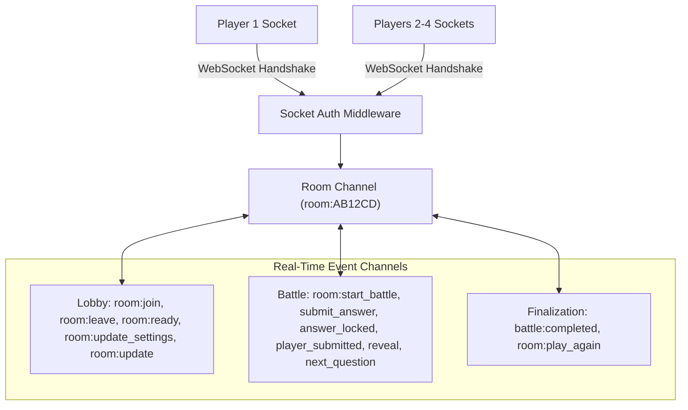
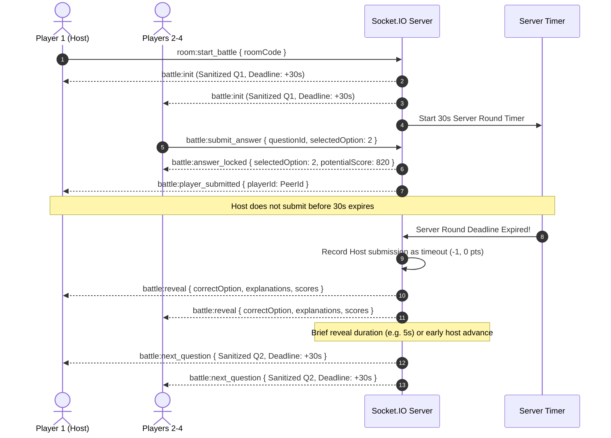

# 07 — Real-Time Socket Architecture

## 1. Socket.IO Gateway Overview

CodeArena uses **Socket.IO (v4.7)** for low-latency, event-driven communication between players and the server. The WebSocket gateway shares the underlying HTTP port (5000), using room-based channels (`room:${roomCode}`) to partition game telemetry for 1–4 players.

---

## 2. Handshake & Connection Lifecycle (`server/src/sockets/socket.ts`)

Every incoming connection is validated before the socket connection is granted:
1. **Extraction**: The server reads the token from `socket.handshake.auth.token` or the `Authorization` header.
2. **Verification**: Validates Native JWT Access Token (`JWT_ACCESS_SECRET`) or timing-safe backend-signed Guest HMAC token (`GUEST_JWT_SECRET`).
3. **Context Injection**: Successful validation binds the database user record to `socket.data.user`.
4. **Lifecycle Hooks**: Sockets subscribe to connection drop handlers (`disconnect`), updating readiness and alerting room peers via `player:disconnected`.

---

## 3. Room Management Events (`server/src/sockets/room.socket.ts`)

Rooms act as lobbies where 1–4 players assemble, configure quiz settings, and toggle readiness.

### 3.1 Inbound Events (Client $\rightarrow$ Server)
| Event | Payload | Description |
| :--- | :--- | :--- |
| **`room:join`** | `{ roomCode: string }` | Player requests to join a room channel. Validates up to 4-player capacity, joins the socket room channel, and pushes state. |
| **`room:leave`** | `{ roomCode: string }` | Gracefully removes player from the socket channel and updates database room membership. |
| **`room:ready`** | `{ roomCode: string, isReady: boolean }` | Toggles player readiness. Broadcasts updated room state. |
| **`room:update_settings`** | `{ roomCode: string, settings: Partial<IRoomSettings> }` | Host updates category, subject, mixed mode, question count, or difficulty. |
| **`room:play_again`** | `{ roomCode: string }` | Player initiates a rematch room with matching settings. |

### 3.2 Outbound Events (Server $\rightarrow$ Client)
| Event | Payload | Description |
| :--- | :--- | :--- |
| **`room:update`** | `RoomSocketPayload` | Emitted to `room:${roomCode}` whenever room settings, membership, readiness, or status (`WAITING`, `READY`, `IN_PROGRESS`) changes. |
| **`room:play_again_created`** | `{ newRoomCode: string }` | Emitted to player with newly created rematch room code. |
| **`player:connected`** | `{ userId: string }` | Broadcast to other room members when a player joins the room. |
| **`player:disconnected`** | `{ userId: string }` | Broadcast to other room members when a player socket disconnects. |
| **`player:reconnected`** | `{ userId: string }` | Broadcast to other room members when a player re-establishes their socket connection. |
| **`error`** | `{ success: false, message: string }` | Emitted directly to the calling socket when an operation fails. |

---

## 4. Quiz Battle Execution Events (`server/src/sockets/battle.socket.ts`)

Once a battle starts, gameplay routes through synchronized round events.

### 4.1 Inbound Events (Client $\rightarrow$ Server)
| Event | Payload | Description |
| :--- | :--- | :--- |
| **`room:start_battle`** | `{ roomCode: string }` | Host initiates the quiz battle. Server initializes battle, starts round timer, and dispatches `battle:init`. |
| **`battle:submit_answer`** | `{ roomCode: string, questionId: string, selectedOption: number }` | Submits player answer (0–3 index). Server locks answer, records submission, checks if all answered, or awaits round timeout. |
| **`battle:advance_round`** | `{ roomCode: string }` | Host manually advances to next round early during the reveal phase. |
| **`battle:reconnect`** | `{ roomCode: string }` | Re-subscribes a reconnecting client to the battle room channel and re-emits active round/completed battle state. |

### 4.2 Outbound Events (Server $\rightarrow$ Client)
| Event | Payload | Description |
| :--- | :--- | :--- |
| **`battle:init`** | `IBattleInitPayload` | Dispatched to each player containing match metadata, round index, and **only their current sanitized question**. |
| **`battle:answer_locked`** | `{ selectedOption, potentialScore, timeTakenMs }` | Acknowledges receipt of answer to the submitting player with frozen speed-adjusted score. |
| **`battle:player_submitted`** | `{ playerId: string }` | Broadcast to other room participants indicating that a player has submitted their answer. |
| **`battle:reveal`** | `IBattleRevealPayload` | Broadcast to all players at the end of each round revealing correct option, explanations, and current scores. |
| **`battle:next_question`** | `IBattleNextQuestionPayload` | Dispatched to players when a new round starts, containing sanitized next question, round index, and deadline. |
| **`battle:completed`** | `IBattleResultsPayload` | Broadcast to all room players when the quiz completes, containing final scores, ranks, winner, and question logs. |
| **`player:reconnected`** | `{ userId: string }` | Broadcast to room when a player successfully reconnects to active battle. |
| **`error`** | `{ success: false, message: string }` | Emitted directly to calling socket on error. |

---

## 5. Event Flow Sequence: Synchronized Multiplayer Round

---

## 6. Document Cross-References
* For battle engine scoring rules and atomic finalization, see [08 — Battle Engine](08-battle-engine.md).
* For authentication and token validation in sockets, see [06 — Authentication & Security](06-authentication-security.md).
* For frontend socket client integration, see [03 — Frontend Architecture](03-frontend-architecture.md).
