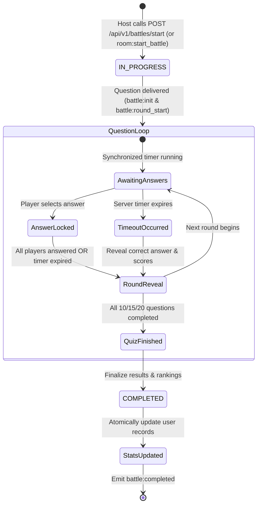

# 08 — Multiplayer Quiz Engine

## 1. Overview & Core Responsibilities

The **Quiz & Battle Engine** ([`server/src/modules/battle/battle.service.ts`](file:///h:/Project/code-arena/server/src/modules/battle/battle.service.ts)) is the central orchestrator responsible for fair, anti-cheat, low-latency 1–4 player competitive trivia quizzes.

Its responsibilities include:
1. **Dynamic Question Selection**: Sampling non-overlapping, balanced questions across Categories, Subjects, and Mixed pools.
2. **Synchronized Round Flow**: Dispatches identical questions to all 1–4 players simultaneously.
3. **Anti-Cheat Enforcement**: Sanitizing questions and managing server-side deadlines.
4. **Category-Based Timers**: Managing per-question timeouts (Programming: 30s, Aptitude: 60s, GK: 30s) independently of client clocks.
5. **Server-Authoritative Scoring**: Evaluating submitted answers with a speed-and-accuracy scoring model (up to 1000 points per question).
6. **Synchronized Reveal & Rankings**: Revealing correct answers simultaneously across all players and calculating dynamic Rank 1–4 podium standings with tie-handling.
7. **Idempotent Atomic Finalization**: Concluding matches and updating player statistics safely.

---

## 2. Question Sampling & Hierarchy Algorithm

When a quiz is created, the engine selects questions based on room configuration:
1. **Specific Subject Mode**: Samples questions directly matching `categoryId` and `subjectId`.
2. **Mixed Category Mode**: Samples randomly across all active subjects within the selected `categoryId`.
3. **Question Count**: Validates availability for configured length: 10, 15, or 20 questions.
4. **Fallback Tier**: If question pool is insufficient, pulls from broader category questions to ensure complete quiz delivery.

---

## 3. Category-Based Server Timers

To eliminate client-side clock tampering and match subject complexity:
* **Programming**: 30 seconds per question.
* **Aptitude**: 60 seconds per question.
* **General Knowledge**: 30 seconds per question.
* When each round starts, the server records an absolute deadline:
  `roundDeadline = new Date(Date.now() + timePerQuestion * 1000);`
* If all connected players submit answers before expiry, the round concludes early and triggers reveal.
* If the timer expires before all players submit, unanswered players are assigned `selectedOption: -1` and awarded 0 points.

---

## 4. Answer Evaluation & Live Scoring

Upon receiving `battle:submit_answer`:
1. **Deadline Check**: Compares submission time against server authoritative deadline.
2. **Duplicate Check**: Prevents players from modifying an already locked answer.
3. **Scoring Formula**:
   - Correct answer: Base score (500 pts) + Speed bonus (up to 500 pts based on elapsed time ratio). Maximum 1000 points.
   - Incorrect or Unanswered: 0 points.
4. **State Advancement**: Broadcasts `battle:player_submitted` progress to all players in the room.

---

## 5. Synchronized Reveal & Dynamic Rankings

At the end of each round:
1. The server broadcasts `battle:reveal` containing:
   - Correct option index.
   - Detailed technical explanation.
   - Points earned by each player in the round.
   - Updated cumulative scores and intermediate rankings.
2. At the conclusion of the final round, the server broadcasts `battle:completed`:
   - Final scores for all 1–4 players.
   - 1-indexed rankings (Rank 1, 2, 3, 4) with support for tied ranks.
   - Accuracy percentages and answer breakdown.

---

## 6. Anti-Cheat Guarantees Summary

| Mechanism | Enforcement Point | Cheating Vector Prevented |
| :--- | :--- | :--- |
| **Question Sanitization** | `questionService.sanitizeQuestion` | Memory scraping / DevTools inspection of correct answers and explanations. |
| **Per-Round Delivery** | `battle:round_start` socket event | Scripting answers ahead of time. |
| **Server Timers** | Node.js timers in `battle.service.ts` | Pausing local browser execution or tampering with client system clocks. |
| **Atomic Completion** | MongoDB conditional `$ne: COMPLETED` | Socket replay attacks to duplicate win statistics. |

---

## 7. Document Cross-References
* For database schema details of battles and players, see [05 — Database Architecture](05-database-architecture.md).
* For Socket.IO event payloads and telemetry, see [07 — Real-Time Socket Architecture](07-realtime-socket-architecture.md).
* For testing concurrent finalization idempotency, see [12 — Testing Guide](12-testing-guide.md).
