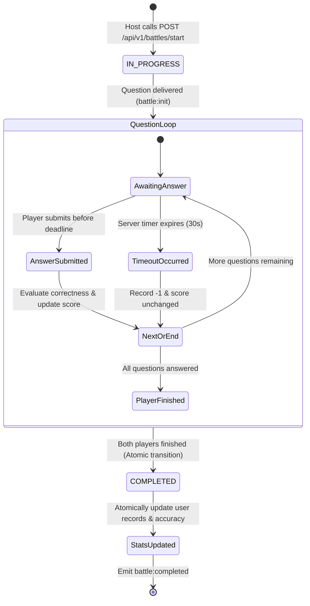

# 08 — Battle Engine

## 1. Overview & Core Responsibilities

The **Battle Engine** ([`server/src/modules/battle/battle.service.ts`](file:///h:/Project/code-arena/server/src/modules/battle/battle.service.ts)) is the central orchestrator responsible for fair, anti-cheat, low-latency 1v1 technical trivia battles.

Its responsibilities include:
1. **Dynamic Question Selection**: Sampling non-overlapping, balanced questions across topics and difficulties.
2. **Anti-Cheat Enforcement**: Sanitizing questions and managing server-side deadlines.
3. **Timer Orchestration**: Managing per-question timeouts independently of client clocks.
4. **Scoring & Telemetry**: Evaluating submitted answers and calculating live scores.
5. **Idempotent Atomic Finalization**: Concluding matches and updating player statistics safely.



---

## 2. Question Sampling & Fallback Algorithm

When a battle is created, the engine selects questions based on room settings (`topic`, `difficulty`, `questionCount`):
1. **Primary Sample**: Uses MongoDB `$sample` aggregation to select `questionCount * 2` random published questions matching the exact topic and difficulty.
2. **Fallback Tier 1 (Difficulty Relaxation)**: If the pool has insufficient questions, samples from the same topic across **any difficulty**.
3. **Fallback Tier 2 (Topic Relaxation)**: If still insufficient, samples from the entire published question bank.
4. **Partitioning**: Slices the sampled array into two non-overlapping arrays (`p1Questions`, `p2Questions`), guaranteeing players receive distinct question sequences.

---

## 3. Server-Side Timer Management

To eliminate client-side clock tampering:
* When a question is dispatched, the server records an absolute deadline:
  `player.questionDeadline = new Date(Date.now() + battle.timePerQuestion * 1000);`
* An in-memory timer is registered:
  ```typescript
  this.setQuestionTimeout(battleId, userId, questionIndex, timeoutMs, io, roomCode);
  ```
* If the player submits an answer before expiry, the active timer is cleared (`clearQuestionTimeout`).
* If the timer fires before an answer is submitted, `handleQuestionTimeout` executes:
  - Appends an answer object with `selectedOption: -1` and `isCorrect: false`.
  - Advances `currentQuestionIndex`.
  - Dispatches `battle:opponent_progress` to the rival and `battle:next_question` to the player.

---

## 4. Answer Evaluation & Live Scoring

Upon receiving `battle:submit_answer`:
1. **Deadline Check**: Compares `now` against `player.questionDeadline`.
2. **Correctness Evaluation**: Queries the question document from MongoDB, compares `selectedOption === doc.correctAnswer`.
3. **Score Increment**: If correct, increments `player.score += 1`.
4. **Answer History**: Pushes `{ questionId, selectedOption, isCorrect, submittedAt, timeTakenMs }` to `player.answers`.
5. **State Advancement**: Increments `player.currentQuestionIndex += 1`.

---

## 5. Idempotent Atomic Battle Finalization

When both players reach `status: 'COMPLETED'`, `finalizeBattle` executes:

### 5.1 Atomic Conditional Transition
```typescript
const transitionedBattle = await BattleModel.findOneAndUpdate(
  {
    _id: battle._id,
    status: { $ne: BattleStatus.COMPLETED },
  },
  {
    $set: {
      status: BattleStatus.COMPLETED,
      winnerId,
      isDraw,
      endedAt: new Date(),
      players: battle.players,
    },
  },
  { new: true }
);

if (!transitionedBattle) {
  // Concurrency race lost: Already completed by concurrent handler.
  const existing = await this.repository.findById(battle._id.toString());
  return this.formatResultsPayload(existing || battle);
}
```

### 5.2 Atomic Player Statistics Updates (`recordBattleStatsById`)
Both players' user documents are updated atomically using an aggregation update pipeline:
* `matchesPlayed += 1`
* `wins`, `losses`, or `draws` incremented according to the match result.
* `totalCorrect += player.correctCount`
* `totalQuestions += battle.questionCount`
* `accuracy` recalculated: `Math.round((totalCorrect / totalQuestions) * 100)`.

---

## 6. Anti-Cheat Guarantees Summary

| Mechanism | Enforcement Point | Cheating Vector Prevented |
| :--- | :--- | :--- |
| **Question Sanitization** | `questionService.sanitizeQuestion` | Memory scraping / DevTools inspection of correct answers and explanations. |
| **Per-Question Delivery** | `battle:next_question` socket event | Scripting answers ahead of time. |
| **Server Timers** | `setTimeout` in `battle.service.ts` | Pausing local browser execution or tampering with client system clocks. |
| **Atomic Completion** | MongoDB conditional `$ne: COMPLETED` | Socket replay attacks to duplicate win statistics. |

---

## 7. Document Cross-References
* For database schema details of battles and players, see [05 — Database Architecture](05-database-architecture.md).
* For Socket.IO event payloads and telemetry, see [07 — Real-Time Socket Architecture](07-realtime-socket-architecture.md).
* For testing concurrent finalization idempotency, see [12 — Testing Guide](12-testing-guide.md).
