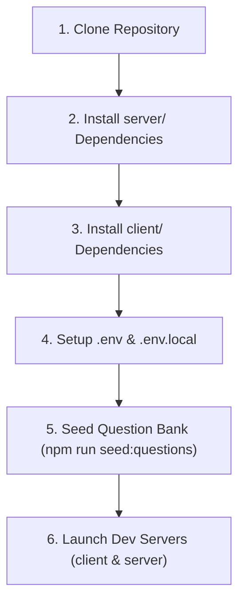

# 11 — Development Guide

## 1. Prerequisites & Tooling

To run and develop CodeArena locally, ensure your environment meets the following specifications:
* **Node.js**: `v20.0.0` or higher.
* **npm**: `v10.0.0` or higher.
* **MongoDB**: A running instance (local on `mongodb://127.0.0.1:27017` or MongoDB Atlas URI).
* **Clerk Account**: Free tier developer account at [clerk.com](https://clerk.com) for authentication keys.

---

## 2. Initial Setup Workflow



### Step 1: Clone Repository
```bash
git clone https://github.com/harshverma-25/DSA-Tracker.git code-arena
cd code-arena
```

### Step 2: Install Dependencies
Install dependencies separately in both workspace folders:
```bash
# Install Server dependencies
cd server
npm install

# Install Client dependencies
cd ../client
npm install
```

### Step 3: Configure Environment Variables
Set up environment files based on the templates:
```bash
# In server/
cp .env.example .env

# In client/
cp .env.example .env.local
```
*(Populate your Clerk API keys in both files. See [10 — Environment Configuration](10-environment-configuration.md) for variable definitions).*

### Step 4: Seed Question Bank
Ingest the curated questions into MongoDB:
```bash
cd server
npm run seed:questions
```
This loads questions across DSA, JavaScript, DBMS, Operating Systems, and Computer Networks.

---

## 3. Running Development Servers

### 3.1 Backend Server (`server/`)
```bash
cd server
npm run dev
```
* **Command**: `tsx watch src/server.ts`
* **Port**: `http://localhost:5000`
* **Features**: Automatic TypeScript transpilation, hot-reloading on file change, and pretty-printed Pino logs.
* **API Documentation**: [http://localhost:5000/api/docs](http://localhost:5000/api/docs)

### 3.2 Frontend Application (`client/`)
In a separate terminal:
```bash
cd client
npm run dev
```
* **Command**: `next dev`
* **Port**: `http://localhost:3000`
* **Features**: Fast Refresh, React 19 development mode.

---

## 4. Common Developer Workflows

### 4.1 Adding Questions to the Question Bank
1. Open or add JSON definitions in [`server/src/scripts/questions/`](file:///h:/Project/code-arena/server/src/scripts/questions/).
2. Adhere to the question schema:
   ```json
   {
     "questionId": "js_025",
     "topic": "javascript",
     "difficulty": "medium",
     "question": "What is the output of typeof NaN in JavaScript?",
     "options": ["\"number\"", "\"NaN\"", "\"undefined\"", "\"object\""],
     "correctAnswer": 0,
     "explanation": "In JavaScript, NaN is a numeric value representing Not-a-Number, so typeof NaN returns 'number'.",
     "isPublished": true
   }
   ```
3. Re-run `npm run seed:questions` to upsert the changes without duplicating existing entries.

### 4.2 Creating a New Server Feature Module
When adding a new domain to `server/src/modules/`:
1. Define types in `[domain].types.ts`.
2. Define Mongoose schema in `[domain].model.ts`.
3. Implement data access in `[domain].repository.ts`.
4. Implement business logic in `[domain].service.ts`.
5. Implement HTTP handlers in `[domain].controller.ts`.
6. Define Zod validation schemas in `[domain].validation.ts`.
7. Mount endpoints in `[domain].routes.ts` and attach to [`server/src/app.ts`](file:///h:/Project/code-arena/server/src/app.ts).

### 4.3 User Statistics Reconciliation
When diagnosing or rectifying out-of-sync player statistics (`wins`, `losses`, `draws`, `totalCorrect`, `totalQuestions`, `accuracy`):
1. **Dry-Run Inspection** (Inspects completed battle logs and reports discrepancies without writing to database):
   ```bash
   cd server
   npm run reconcile:dry-run
   # Direct command: tsx src/scripts/reconcile-user-stats.ts
   ```
2. **Apply Reconciliation** (Atomically commits recalculated statistics to `UserModel` documents):
   ```bash
   cd server
   npm run reconcile:apply
   # Direct command: tsx src/scripts/reconcile-user-stats.ts --apply
   ```

### 4.4 Type-Checking & Verification
Always verify clean compilation before committing changes:
```bash
# In server/
npm run build

# In client/
npm run build
```

---

## 5. Document Cross-References
* For testing suites and commands, see [12 — Testing Guide](12-testing-guide.md).
* For coding conventions and naming guidelines, see [14 — Coding Standards](14-coding-standards.md).
* For environment variables reference, see [10 — Environment Configuration](10-environment-configuration.md).
