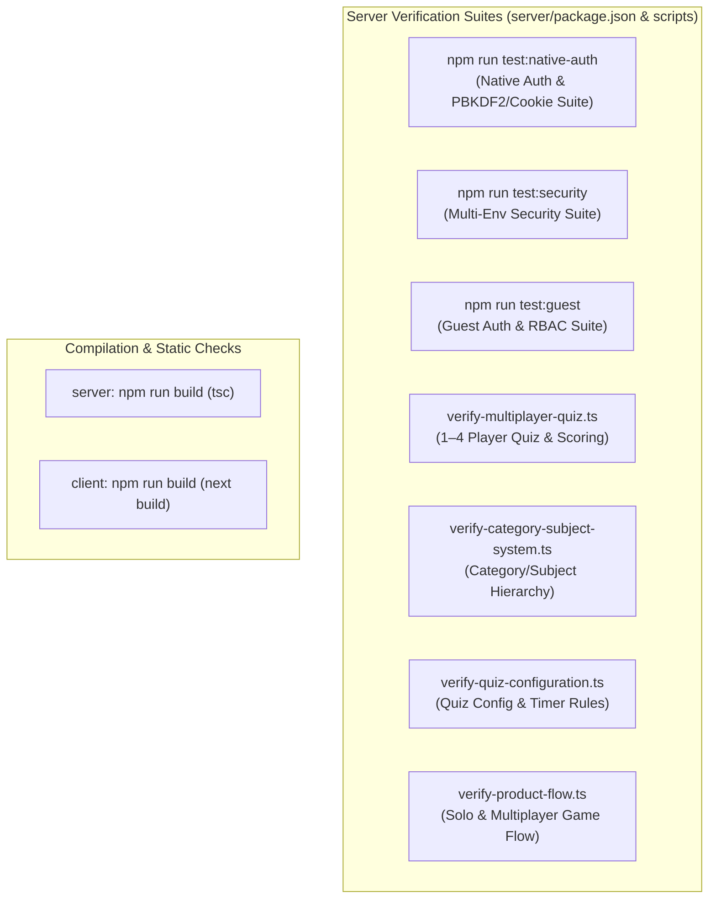

# 12 — Testing Guide

## 1. Testing Philosophy & Test Layering

CodeArena uses an **executable test suite and verification script architecture** located in `server/src/scripts/` and `client/test-*.ts`. Tests are designed to validate real runtime behavior against MongoDB and Socket.IO without relying on brittle synthetic mocks.



---

## 2. Server Test Suites (`server/`)

### 2.1 Native Authentication Suite
Validates PBKDF2 password hashing, JWT access tokens, HttpOnly refresh cookies, token refresh rotation, and logout.
```bash
cd server
npm run test:native-auth
```
* **Script**: [`server/src/scripts/verify-native-auth.ts`](file:///h:/Project/code-arena/server/src/scripts/verify-native-auth.ts)
* **What It Tests**:
  * User registration and PBKDF2-SHA512 password hashing.
  * Credential verification and timing-safe equality.
  * Access token and refresh token generation.
  * HttpOnly cookie dispatch and token refresh cycles.
  * User session invalidation upon logout.

### 2.2 Multi-Environment Security Suite
Verifies that authentication middleware strictly rejects invalid or backdoor tokens across environments.
```bash
cd server
npm run test:security
```
* **Script**: [`server/src/scripts/verify-env-security.ts`](file:///h:/Project/code-arena/server/src/scripts/verify-env-security.ts)
* **What It Tests**:
  * Rejection of missing/invalid tokens on REST and Socket.IO.
  * Acceptance of mock test tokens strictly when `NODE_ENV === 'test'`.
  * **Strict rejection of mock tokens** when `NODE_ENV === 'development'` and `NODE_ENV === 'production'`.

### 2.3 Secure Guest Authentication Suite
Validates the guest session lifecycle, cryptographic token verification, and permission limits.
```bash
cd server
npm run test:guest
```
* **Script**: [`server/src/scripts/verify-guest-auth.ts`](file:///h:/Project/code-arena/server/src/scripts/verify-guest-auth.ts)
* **What It Tests**:
  * Guest session generation with custom or default handles.
  * Timing-safe HMAC SHA-256 signature verification.
  * Immediate rejection of expired, tampered, or garbage tokens.
  * REST `authenticate` middleware resolving guest users.
  * **Permissions barrier**: Guests attempting `PATCH /api/v1/users/me` are blocked with 403 Forbidden.
  * **Leaderboard isolation**: Verified that guests never appear on the public leaderboard.
  * Socket.IO handshake authentication using guest tokens.

### 2.4 Multiplayer Quiz Engine Verification
Validates 1–4 player room creation, readiness, synchronized question rounds, speed-adjusted scoring, reveals, and podium rankings.
```bash
cd server
npx tsx src/scripts/verify-multiplayer-quiz.ts
```
* **Script**: [`server/src/scripts/verify-multiplayer-quiz.ts`](file:///h:/Project/code-arena/server/src/scripts/verify-multiplayer-quiz.ts)
* **What It Tests**:
  * 1–4 player capacity enforcement.
  * Real-time readiness toggling.
  * Synchronized round delivery (`battle:init`, `battle:next_question`).
  * Speed scoring formula: $\max(100, \text{round}(1000 - \text{elapsedSeconds} \times 30))$.
  * Round reveal payloads with explanations and live scoreboards.
  * Atomic battle conclusion and podium rankings.

### 2.5 Category & Subject System Verification
Validates the category hierarchy, subject relationships, question tagging, and mixed mode selection.
```bash
cd server
npx tsx src/scripts/verify-category-subject-system.ts
```
* **Script**: [`server/src/scripts/verify-category-subject-system.ts`](file:///h:/Project/code-arena/server/src/scripts/verify-category-subject-system.ts)

### 2.6 Quiz Configuration Verification
Validates that question count options (10, 15, 20) and category-based timers (Programming: 30s, Aptitude: 60s, GK: 30s) match centralized definitions.
```bash
cd server
npx tsx src/scripts/verify-quiz-configuration.ts
```
* **Script**: [`server/src/scripts/verify-quiz-configuration.ts`](file:///h:/Project/code-arena/server/src/scripts/verify-quiz-configuration.ts)

### 2.7 Stale Room & Abandoned Battle Garbage Collection Verification
Validates that rooms in `WAITING` or `READY` status older than 2 hours are pruned, abandoned battles are marked `CANCELLED`, room codes are immediately freed for reuse, and active/completed entities are safely preserved.
```bash
cd server
npx tsx src/scripts/verify-stale-garbage-collection.ts
```
* **Script**: [`server/src/scripts/verify-stale-garbage-collection.ts`](file:///h:/Project/code-arena/server/src/scripts/verify-stale-garbage-collection.ts)

---

## 3. Data Integrity & Reconciliation Tools

### 3.1 Non-Destructive Dry-Run Inspection
Compares all registered users' persistent counters against historical completed battles without writing any database modifications.
```bash
cd server
npm run reconcile:dry-run
```
* **Output**: Displays a comparative table showing current vs. calculated matches, wins, losses, draws, and cumulative accuracy.

### 3.2 Applying Reconciled Counters
Applies calculated statistics strictly to out-of-sync user documents.
```bash
cd server
npm run reconcile:apply
```

---

## 4. Client Integration Tests (`client/`)

Standalone integration scripts simulating browser clients communicating with the backend over WebSockets and HTTP:
```bash
cd client
npx tsx test-complete-game.ts
npx tsx test-step6-leaderboard-profile.ts
npx tsx test-step7-comprehensive.ts
```

---

## 5. Pre-Commit Verification Checklist

Before opening pull requests or committing code:
```bash
# 1. Type-check backend
cd server && npm run build

# 2. Run core test suites
npm run test:native-auth
npx tsx src/scripts/verify-multiplayer-quiz.ts
npx tsx src/scripts/verify-category-subject-system.ts
npx tsx src/scripts/verify-quiz-configuration.ts

# 3. Type-check frontend
cd ../client && npm run build
```

---

## 6. Document Cross-References
* For security architecture and token designs, see [06 — Authentication & Security](06-authentication-security.md).
* For battle engine finalization logic, see [08 — Battle Engine](08-battle-engine.md).
* For coding rules and standards, see [14 — Coding Standards](14-coding-standards.md).
