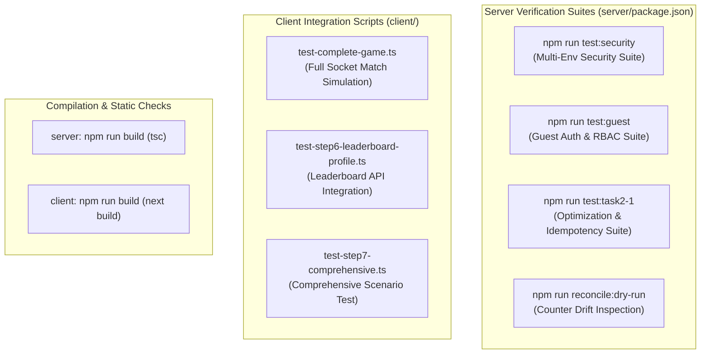

# 12 — Testing Guide

## 1. Testing Philosophy & Test Layering

CodeArena uses an **executable test suite and verification script architecture** located in `server/src/scripts/` and `client/test-*.ts`. Tests are designed to validate real runtime behavior against MongoDB and Socket.IO without relying on brittle synthetic mocks.



---

## 2. Server Test Suites (`server/`)

### 2.1 Multi-Environment Security Suite
Verifies that authentication middleware strictly rejects invalid or backdoor tokens across environments.
```bash
cd server
npm run test:security
```
* **Script**: [`server/src/scripts/verify-env-security.ts`](file:///h:/Project/code-arena/server/src/scripts/verify-env-security.ts)
* **What It Tests**:
  * Rejection of missing/invalid tokens on REST and Socket.IO.
  * Acceptance of mock test tokens strictly when `NODE_ENV === 'test'`.
  * **Strict rejection of mock tokens** when `NODE_ENV === 'development'` and `NODE_ENV === 'production'`.
  * Successful validation and attachment of legitimate Clerk user tokens.

### 2.2 Secure Guest Authentication Suite
Validates the guest session lifecycle, cryptographic token verification, and permission limits.
```bash
cd server
npm run test:guest
```
* **Script**: [`server/src/scripts/verify-guest-auth.ts`](file:///h:/Project/code-arena/server/src/scripts/verify-guest-auth.ts)
* **What It Tests**:
  * Guest session generation with custom or default handles.
  * Timing-safe HMAC SHA-256 signature verification.
  * Immediate rejection of expired, tampered, or garbage tokens.
  * REST `authenticate` middleware resolving guest users.
  * **Permissions barrier**: Guests attempting `PATCH /api/v1/users/me` are blocked with 403 Forbidden.
  * **Leaderboard isolation**: Verified that guests never appear on the public leaderboard.
  * Socket.IO handshake authentication using guest tokens.

### 2.3 Task 2.1 Optimization & Idempotency Suite
Validates database query optimization, compound index performance, tie-breaking rules, and battle completion safety.
```bash
cd server
npm run test:task2-1
```
* **Script**: [`server/src/scripts/verify-task2-1.ts`](file:///h:/Project/code-arena/server/src/scripts/verify-task2-1.ts)
* **What It Tests**:
  * **Leaderboard Pagination**: Page limits, total document counts, and 1-indexed ranks.
  * **Guest Exclusion**: Asserts guests are excluded and `calculateUserRank` returns 0.
  * **Deterministic 4-Tier Tie-Breaking**: Creates test users and validates sorting by:
    1. `wins` DESC
    2. `accuracy` DESC
    3. `matchesPlayed` DESC
    4. `username` ASC
  * **Zero-Match Users**: Validates users with 0 battles retrieve valid profiles without errors.
  * **Concurrent Battle Finalization**: Executes 5 simultaneous `finalizeBattle` invocations against the same battle document; confirms user statistics are incremented **exactly once**.
  * **Cumulative Accuracy**: Confirms accuracy is computed from cumulative correct answers, not incremented by percentage.

---

## 3. Data Integrity & Reconciliation Tools

### 3.1 Non-Destructive Dry-Run Inspection
Compares all registered users' persistent counters against historical completed battles without writing any database modifications.
```bash
cd server
npm run reconcile:dry-run
```
* **Output**: Displays a comparative table showing current vs. calculated matches, wins, losses, draws, and cumulative accuracy.

### 3.2 Applying Reconciled Counters
Applies calculated statistics strictly to out-of-sync user documents.
```bash
cd server
npm run reconcile:apply
```
* **Safety**: Only modifies the 7 statistical counter fields (`matchesPlayed`, `wins`, `losses`, `draws`, `totalCorrect`, `totalQuestions`, `accuracy`); never touches user credentials, display names, or avatars.

---

## 4. Client Integration Tests (`client/`)

The client package includes standalone integration scripts simulating browser clients communicating with the backend over WebSockets and HTTP:

```bash
cd client

# 1. Full 1v1 game flow simulation (lobby, answer submission, results)
npx tsx test-complete-game.ts

# 2. Leaderboard and player profile integration check
npx tsx test-step6-leaderboard-profile.ts

# 3. Comprehensive multi-player scenario test
npx tsx test-step7-comprehensive.ts
```

---

## 5. Pre-Commit Verification Checklist

Before opening pull requests or deploying:
1. `cd server && npm run build` (Must compile with 0 TypeScript errors).
2. `cd server && npm run test:security` (Security verification must pass).
3. `cd server && npm run test:guest` (10/10 guest auth tests must pass).
4. `cd server && npm run test:task2-1` (All optimization and idempotency checks must pass).
5. `cd client && npm run build` (Next.js build must succeed).

---

## 6. Document Cross-References
* For security architecture and token designs, see [06 — Authentication & Security](06-authentication-security.md).
* For battle engine finalization logic, see [08 — Battle Engine](08-battle-engine.md).
* For coding rules and standards, see [14 — Coding Standards](14-coding-standards.md).
