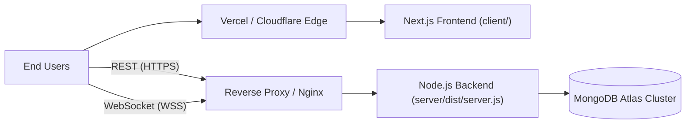

# 13 — Deployment Guide

## 1. Production Architecture Overview

In production, CodeArena operates as a **decoupled web application and API service**:
* **Frontend**: Next.js 16 application hosted on Vercel, AWS Amplify, or a Node.js runtime.
* **Backend**: Express + Socket.IO server running on a Node.js environment (Render, Railway, AWS ECS, or DigitalOcean Droplet).
* **Database**: MongoDB Atlas replica set with automated backups, monitoring, and compound index management.
* **Auth**: Native PBKDF2/JWT service with HttpOnly refresh cookies and HMAC-SHA256 guest sessions.



---

## 2. Production Build Workflows

### 2.1 Backend Build (`server/`)
The backend compiles TypeScript to JavaScript in the `server/dist/` directory:
```bash
cd server
npm ci --only=production=false
npm run build
npm prune --production
```
* **Production Start**:
  ```bash
  NODE_ENV=production node dist/server.js
  ```

### 2.2 Frontend Build (`client/`)
```bash
cd client
npm ci
npm run build
```
* **Production Start**:
  ```bash
  npm run start
  ```

---

## 3. Reverse Proxy & WebSocket Configuration (Nginx)

When deploying behind Nginx or an Application Load Balancer, WebSocket upgrade headers must be explicitly forwarded:

```nginx
server {
    listen 443 ssl http2;
    server_name api.codearena.dev;

    ssl_certificate /etc/letsencrypt/live/api.codearena.dev/fullchain.pem;
    ssl_certificate_key /etc/letsencrypt/live/api.codearena.dev/privkey.pem;

    # REST API & Socket.IO traffic
    location / {
        proxy_pass http://127.0.0.1:5000;
        proxy_http_version 1.1;

        # WebSocket Upgrade Headers
        proxy_set_header Upgrade $http_upgrade;
        proxy_set_header Connection "upgrade";

        proxy_set_header Host $host;
        proxy_set_header X-Real-IP $remote_addr;
        proxy_set_header X-Forwarded-For $proxy_add_x_forwarded_for;
        proxy_set_header X-Forwarded-Proto $scheme;

        # WebSocket timeouts
        proxy_read_timeout 86400s;
        proxy_send_timeout 86400s;
    }
}
```

---

## 4. Production Environment Checklist

Before declaring production ready:
1. **`NODE_ENV=production`**: Ensures stack traces are omitted from API error responses and development backdoor tokens are disabled.
2. **`JWT_ACCESS_SECRET` & `JWT_REFRESH_SECRET`**: Set to high-entropy 64-character random strings.
3. **`GUEST_JWT_SECRET`**: Set to a cryptographically secure, high-entropy 64-character random string.
4. **`CORS_ORIGIN`**: Explicitly set to the frontend production domain (e.g. `https://codearena.dev`), never `*`.
5. **Database Indexes**: Verify compound indexes exist for leaderboard, questions, and categories.
6. **Category & Question Seeding**: Ensure categories (`npx tsx src/scripts/seed-categories.ts`) and questions (`npm run seed:questions`) are seeded.

---

## 5. Health Monitoring & Diagnostics

Configure your infrastructure load balancer to ping the health check endpoint:
* **Endpoint**: `GET /api/v1/health`
* **Healthy Status (HTTP 200)**:
  ```json
  {
    "success": true,
    "statusCode": 200,
    "message": "Health status retrieved successfully.",
    "data": {
      "status": "OK",
      "database": "connected",
      "uptime": 86400,
      "environment": "production",
      "version": "1.0.0"
    }
  }
  ```
* **Degraded Status (HTTP 503)**: Returned if the MongoDB connection drops (`database !== 'connected'`).

---

## 6. Graceful Shutdown & Process Signals

The backend handles `SIGTERM` and `SIGINT` signals:
```typescript
const gracefulShutdown = async (signal: string) => {
  logger.info(`Received ${signal}. Starting graceful shutdown...`);
  io.close(); // Disconnects all active sockets cleanly
  server.close(async () => {
    await disconnectDatabase(); // Drains and closes Mongoose connections
    process.exit(0);
  });
};
```
This ensures in-flight database writes complete before the container terminates.

---

## 7. Document Cross-References
* For configuration variables reference, see [10 — Environment Configuration](10-environment-configuration.md).
* For testing suites to run before deployment, see [12 — Testing Guide](12-testing-guide.md).
* For known technical debt and operational risks, see [15 — Known Issues & Technical Debt](15-known-issues-and-technical-debt.md).
