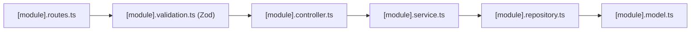

# 14 — Coding Standards

## 1. Core Principles

CodeArena enforces strict standards to preserve code maintainability, prevent regressions, and ensure deterministic runtime behavior across both frontend and backend codebases.

---

## 2. TypeScript & Language Conventions

### 2.1 Server ESM Module Import Extensions
The backend uses **Node.js ECMAScript Modules (ESM)**. All local relative imports **must explicitly include the `.js` file extension**, even when writing in `.ts` files:
```typescript
// ✅ CORRECT (Explicit .js extension for ESM)
import { UserModel } from './user.model.js';
import { AppError } from '../../shared/errors/api-error.js';

// ❌ INCORRECT (Will fail at runtime in Node.js ESM)
import { UserModel } from './user.model';
```

### 2.2 Strict Type Definitions
* Avoid `any`. If a polymorphic type is necessary, use `unknown` and perform type narrowing.
* Centralize domain models and event payloads in `[module].types.ts` files.

---

## 3. Backend Architectural Conventions



### 3.1 Layer Responsibilities & Strict Isolation
1. **Routes (`*.routes.ts`)**: Define endpoints, attach validation middleware, and route to controller methods. Never write business logic here.
2. **Controllers (`*.controller.ts`)**: Parse request parameters, invoke services, and format outputs using `ApiResponse`. Never query Mongoose models directly.
3. **Services (`*.service.ts`)**: House business logic, rule evaluations, scoring, anti-cheat sanitization, and transaction orchestration.
4. **Repositories (`*.repository.ts`)**: Encapsulate all database queries, projections, sorting, and Mongoose operations.
5. **Models (`*.model.ts`)**: Define Mongoose schemas, field validators, and compound indexes.

### 3.2 Response & Error Handling Standards
* **Success Output**: All controller responses must return an `ApiResponse` instance:
  ```typescript
  res.status(200).json(
    new ApiResponse(200, resultData, 'Resource retrieved successfully.')
  );
  ```
* **Error Throwing**: Never manually write `res.status(500).json(...)` inside controllers or services. Always throw an operational error:
  ```typescript
  throw new AppError('User not found', 404);
  ```
* **Async Wrapping**: Every Express route handler must be wrapped in `asyncHandler`:
  ```typescript
  router.get('/me', asyncHandler((req, res) => userController.getMe(req, res)));
  ```

---

## 4. Frontend Component & State Conventions

### 4.1 Feature-Driven Directory Structure
Component and hook files must reside within their respective domain directory in [`client/features/`](file:///h:/Project/code-arena/client/features/):
```text
client/features/[feature]/
├── components/   <-- Presentation and container components
├── hooks/        <-- TanStack Query hooks and feature logic
└── types/        <-- Feature-specific interfaces
```

### 4.2 Server vs. Client Components
* Default to **React Server Components (RSC)** where possible.
* Use `'use client'` strictly when utilizing hooks (`useState`, `useEffect`, `useRouter`), accessing Zustand stores, or subscribing to Socket.IO events.

### 4.3 State Management Division
* **TanStack React Query**: Used for all asynchronous server data fetching, caching, and invalidation (`leaderboard`, `profile`, `matchHistory`).
* **Zustand**: Used strictly for transient, high-frequency client state (active socket connection status, live countdown timers, and active room metadata).

---

## 5. Socket.IO Event Naming Standards

Socket events follow a strict namespaced format: `<domain>:<action>`
```typescript
// ✅ Standard Namespaced Events
'room:join'
'room:leave'
'room:ready'
'room:update_settings'
'room:play_again'
'room:start_battle'
'room:update'
'player:connected'
'player:disconnected'
'player:reconnected'
'battle:init'
'battle:submit_answer'
'battle:answer_locked'
'battle:player_submitted'
'battle:reveal'
'battle:next_question'
'battle:completed'
'battle:reconnect'
```
* **Payload Typing**: Event payloads must implement the typed interfaces declared in [`battle.types.ts`](file:///h:/Project/code-arena/server/src/modules/battle/battle.types.ts) and [`room.types.ts`](file:///h:/Project/code-arena/server/src/modules/room/room.types.ts).

---

## 6. Document Cross-References
* For development setup and run commands, see [11 — Development Guide](11-development-guide.md).
* For testing patterns and verification scripts, see [12 — Testing Guide](12-testing-guide.md).
* For system architecture overview, see [02 — System Architecture](02-system-architecture.md).
