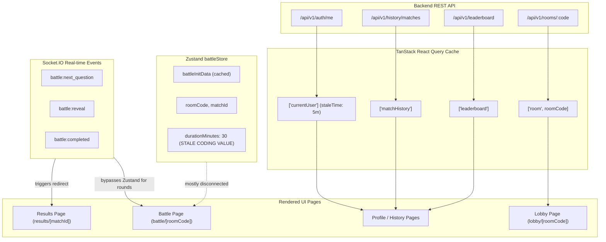
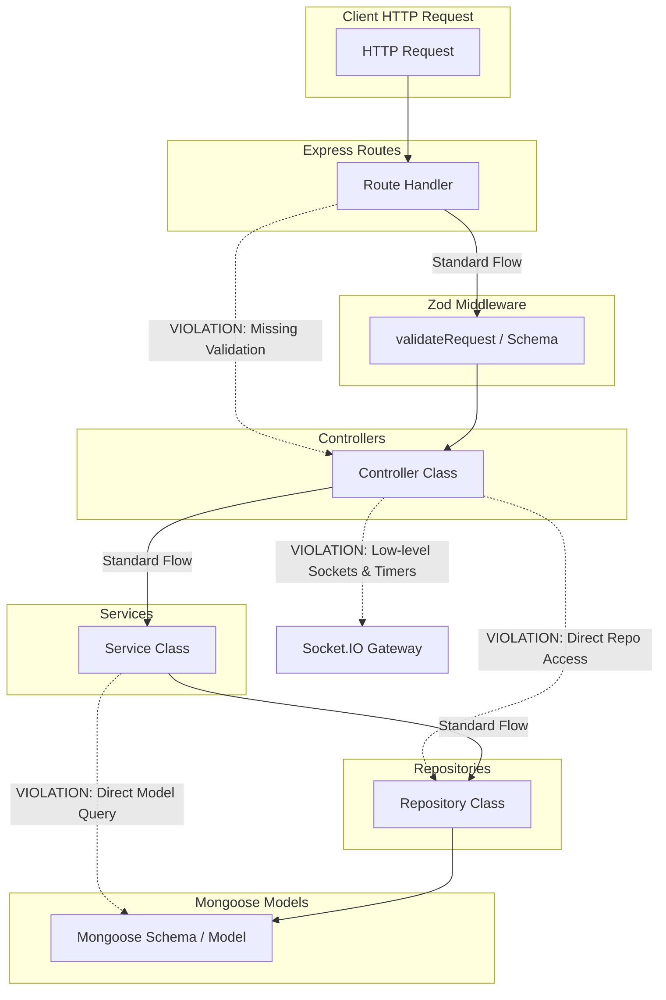
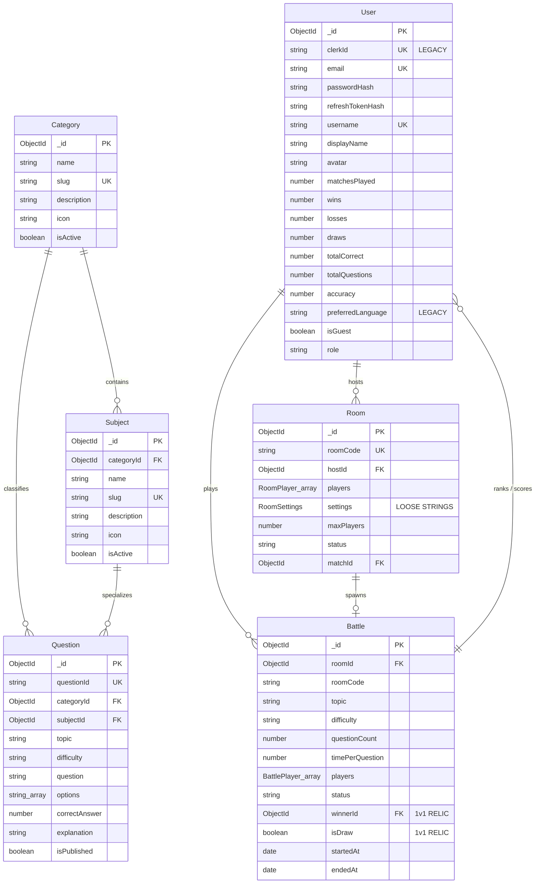
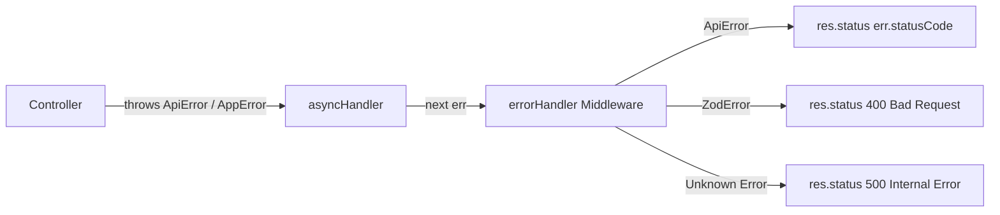
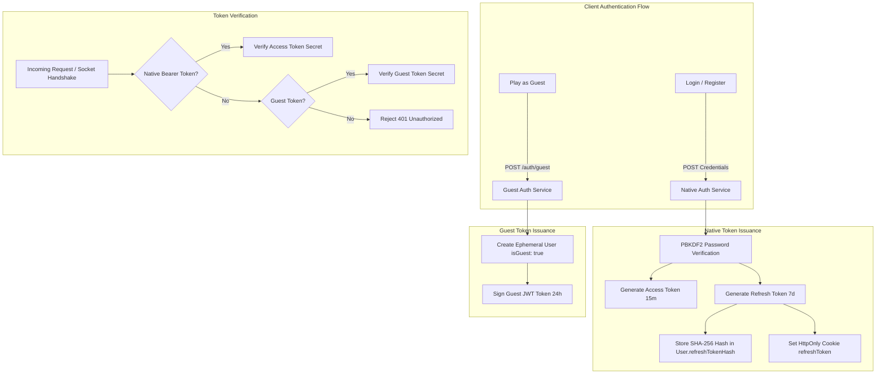
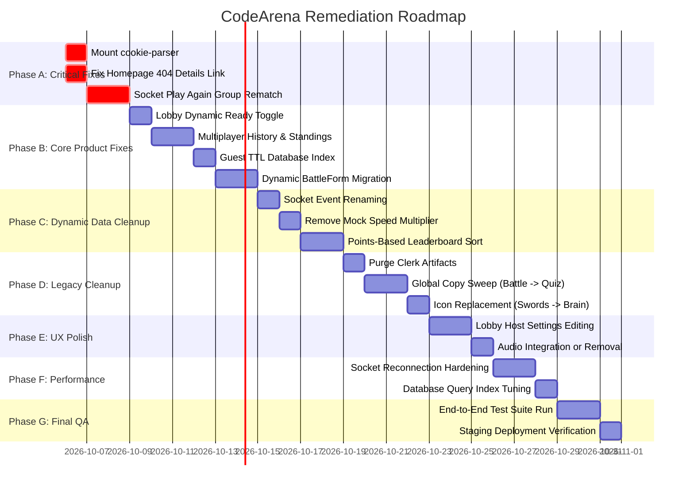

# Project Forensic Audit

**Audit Date:** October 2026  
**Auditor:** Antigravity Forensic Engineering  
**Scope:** Full Repository Forensic Audit — Architecture, Product Direction, Routes, Models, Sockets, Auth, and Documentation  
**Audit Mode:** READ-ONLY Forensic Inspection (No source code modified)  
**Master Report Target:** `docs/PROJECT_FORENSIC_AUDIT.md`

---

## Audit Status

| Audit Category | Status | Notes |
| :--- | :---: | :--- |
| **Product Direction & Scope** | ⚠️ **Severe Divergence** | The project is in a half-migrated state between an old 1v1 competitive coding battle platform ("CodeArena") and a new multi-category quiz platform ("QUIZLY"). |
| **Question Bank & Content** | 🔴 **Critical Failure** | Only 18 total questions exist in seed data, strictly in 3 programming subjects (DSA: 6, DBMS: 6, JS: 6). Aptitude has 0 questions; General Knowledge has 0 questions. Quizzes of 10/15/20 questions for any single subject crash with 400 errors. |
| **Game Modes (Solo vs Multiplayer)** | 🔴 **Broken / Missing** | Solo mode does not exist as a dedicated flow. It is implemented only as a 1-player multiplayer room that routes users through the multiplayer waiting room lobby (`/lobby/[roomCode]`). |
| **Frontend Architecture & Design System** | ⚠️ **Split Personality** | The frontend suffers from two completely conflicting visual designs, layouts, and brand identities ("CodeArena" dark theme vs "QUIZLY" light cream theme). |
| **Authentication Architecture** | ⚠️ **Partially Broken** | HttpOnly refresh token cookie flow is non-functional because Express does not register `cookie-parser`, and client `apiRequest` omits `credentials: 'include'`. Node native PBKDF2 is used instead of documented bcrypt. |
| **Backend Architecture & Sockets** | 🟡 **Partially Modernized** | Dynamic 1–4 player room engine and synchronized round reveals are implemented, but 1v1 assumptions remain hardcoded in player statistics, match history, and profile records. In-memory round timers prevent horizontal scaling. |
| **Database & Models** | 🟡 **Schema Inconsistency** | `BattleModel` fails to store `categoryId`, `subjectId`, or `isMixedCategory`. `history.model.ts` is an empty stub (`// TODO: Implement`). Legacy Clerk fields (`clerkId`) and coding fields (`preferredLanguage`) persist in schemas. |
| **Documentation Integrity** | 🔴 **High Inaccuracy** | Root `README.md`, `CODEBASE_AUDIT.md`, and several files in `docs/` contain contradictory, obsolete specifications (Judge0 sandbox, Clerk auth, bcrypt, 2-player capacity limit). |

---

## 1. Product Direction

### Intended Target Product
The target vision is a **modern, general-purpose quiz platform** serving college students, developers, interview candidates, and casual trivia players across three main categories:
1. **Programming** (10 subjects: DSA, DBMS, OS, CN, OOP, JavaScript, TypeScript, Python, React, Pseudocode)
2. **Aptitude** (4 subjects: Logical Reasoning, Quantitative Aptitude, Verbal Ability, Data Interpretation)
3. **General Knowledge** (5 subjects: History, Geography, Science, Current Affairs, General Trivia)

With two distinct play modes:
- **Solo Mode**: Homepage $\rightarrow$ Configure quiz $\rightarrow$ Play immediately $\rightarrow$ Results & Review $\rightarrow$ Play Again.
- **Multiplayer Mode**: Homepage $\rightarrow$ Configure $\rightarrow$ Create Room $\rightarrow$ PIN/Link $\rightarrow$ 1–4 players $\rightarrow$ Host starts $\rightarrow$ Synchronized quiz $\rightarrow$ Rankings/Results $\rightarrow$ Play Again.

### Actual Implemented Reality
The active implementation is **not yet a general-purpose quiz platform**. In reality, it is an **incomplete hybrid**:
1. **Content Reality**: Out of 19 subjects across 3 categories, **only 3 subjects exist in seed data** (DSA, DBMS, JavaScript), with only 6 questions each (18 questions total). The other 16 subjects have **zero questions**. Both Aptitude and General Knowledge categories are completely empty shells. Any attempt to start a quiz in Aptitude, General Knowledge, or with $\ge 10$ questions in any individual subject immediately fails with an unhandled 400 error from `validateAndResolveCategorySettings`.
2. **Game Mode Reality**: There is **no dedicated Solo Mode**. Clicking any quiz card on the homepage executes `POST /api/v1/rooms` and forces the player into `/lobby/[roomCode]` (the multiplayer waiting room), where the user must manually click "Start Battle" in a room designed for 4 players.
3. **Identity Split ("CodeArena" vs "QUIZLY")**:
   - The Home page, Lobby, Battle arena, and Results screens show the name **"QUIZLY"** with a light cream/emerald theme (`#fff8f0` background, `#317a63` green accents).
   - The Dashboard, Profile, History, Leaderboard, and Navbar screens show the name **"CodeArena"** with a dark, high-contrast theme (`#0b0f19` background, `#1e293b` borders, swords/shields icons, and navigation labeled "Arena").
4. **Copy & Terminology Residue**: UI copy still refers to "competitive coding statistics", "MCQ coding battles", "challenging your opponent", and "reviewing code solutions".

---

## 2. Actual Architecture

### 2.1 Frontend Architecture
* **Framework**: Next.js 16.2.10 (App Router), React 19.2.4, TypeScript 5.
* **Styling**: Tailwind CSS v4 with `@tailwindcss/postcss`. No CSS modules; styles rely on utility classes and custom color variables.
* **State Management**:
  - `zustand` (v5.0.14): `useBattleStore` stores transient room state, but retains obsolete legacy variables (`durationMinutes: 30`, hardcoded `difficulty: "EASY" | "MEDIUM" | "HARD"`).
  - `@tanstack/react-query` (v5.101.4): Manages server cache for user profile, history, leaderboard, and room state.
* **Component Organization**:
  - Route groups: `client/app/(public)`, `client/app/(protected)`, `client/app/(match)`.
  - Feature slices in `client/features/`: `auth`, `battle`, `dashboard`, `history`, `leaderboard`, `profile`.
  - UI primitives in `client/components/ui/` (`button`, `card`, `input`).
  - Shared components in `client/components/shared/` (`Navbar`, `AuthErrorState`, `AuthLoadingState`).
* **Dual Design System Flaw**:
  - Layout `client/app/(protected)/layout.tsx` conditionally hides `Navbar` on `/lobby` and `/battle`, but leaves `/dashboard`, `/history`, `/leaderboard`, and `/profile` with the old dark `Navbar` and dark styling.
  - Page `client/app/(match)/results/[matchId]/page.tsx` uses an isolated `MatchLayout` with the light cream palette (`#fff8f0`), creating a jarring visual transition when clicking "Dashboard".

### 2.2 Backend Architecture
* **Runtime & Framework**: Node.js v20+, Express 4.19.2, TypeScript 5.5.3 (executed via `tsx watch` in development).
* **Architectural Style**: Layered Monolith:
  $$\text{Routes} \longrightarrow \text{Zod Validation} \longrightarrow \text{Controllers} \longrightarrow \text{Services} \longrightarrow \text{Repositories} \longrightarrow \text{Mongoose Models}$$
* **Modules**:
  - `auth`: Native user registration, login, token refresh, guest session generation.
  - `category`: Category & subject hierarchical queries, question counts.
  - `question`: MCQ question retrieval, sampling, and seeding.
  - `room`: Room creation, joining, readiness, settings modification.
  - `battle`: Synchronized round engine, server deadlines, point scoring, battle finalization.
  - `history`: Match history and post-battle participant breakdown (queries `BattleModel`).
  - `user`: User profile, statistics, rank calculation, global leaderboard.
  - `docs`: Swagger UI and OpenAPI 3.0 specification endpoint (`/api/docs`).

### 2.3 Database Architecture
* **Engine**: MongoDB with Mongoose 8.5.1.
* **Collections**:
  1. `users`: Stores registered users and guest accounts.
  2. `categories`: High-level categories (`programming`, `aptitude`, `general-knowledge`).
  3. `subjects`: Categorized subjects referencing `categoryId`.
  4. `questions`: Published questions with 4 options, `correctAnswer` index (0–3), `explanation`, and `categoryId`/`subjectId` references.
  5. `rooms`: Active and finished game rooms with 6-character room codes.
  6. `battles`: Active and completed battle rounds, participant scores, and answers.
  7. *`history`*: **No collection exists.** `history.model.ts` is an empty file containing `// TODO: Implement`.

### 2.4 Socket Architecture
* **Library**: Socket.IO 4.7.5.
* **Connection Lifecycle**:
  - Handshake authentication via `socketAuthMiddleware`: Validates Bearer token from headers or `socket.handshake.auth.token`. Supports Native Access Tokens, Guest JWTs, and test tokens.
  - Namespaces: Single default namespace `/`.
  - Room channels: Structured as `room:${roomCode}`.
* **Event Flow**:
  1. `room:join` $\rightarrow$ Sockets join `room:${roomCode}`, broadcasts `room:update` and `player:connected`.
  2. `room:ready` $\rightarrow$ Toggles player ready status, broadcasts `room:update`.
  3. `room:start_battle` $\rightarrow$ Initiates battle, dispatches personalized `battle:init` (only Question 1 text; no answers). Sets server deadline timer.
  4. `battle:submit_answer` $\rightarrow$ Validates submission time against server clock, records score, broadcasts `battle:player_submitted` (telemetry only).
  5. *All players submitted or timer expires* $\rightarrow$ Server executes `battle:reveal` broadcasting correct answer, explanation, round scores, and starts 5-second reveal countdown.
  6. `battle:next_question` $\rightarrow$ Synchronously advances all connected clients to the next round.
  7. *Final question ends* $\rightarrow$ Executes `battle:completed` with final scores and rankings.
* **State Limitation**: Active round state (`activeRounds`) and timeout handles (`activeTimers`) are stored in **Node.js process memory**. If the server restarts or scales horizontally to multiple containers, all active quizzes crash or desynchronize.

### 2.5 Authentication Architecture
* **Registered Users**:
  - Access Token: 15-minute expiry, signed via custom HMAC-SHA256 in `server/src/shared/utils/jwt.ts`.
  - Refresh Token: 7-day expiry, stored hashed in `UserModel.refreshTokenHash`.
  - Password Hashing: PBKDF2 via `crypto.pbkdf2Sync` (100,000 iterations, SHA-512) in `crypto-auth.ts`. **Not bcrypt**, despite what documentation claims.
* **Guest Users**:
  - Ephemeral user document created in MongoDB (`isGuest: true`, `role: 'guest'`).
  - Signed HMAC-SHA256 Guest JWT token (`GUEST_JWT_SECRET`), valid for 24 hours.
* **Session Persistence Breakdown**:
  - The backend sets an `HttpOnly` cookie for `refreshToken`.
  - However, `app.ts` does **not** register `cookie-parser`. Express cannot parse `req.cookies`.
  - The frontend `apiRequest` helper in `client/lib/api.ts` does **not** set `credentials: 'include'`.
  - As a result, cross-origin refresh token cookies are never transmitted by fetch, and token refresh via cookies fails. The client relies entirely on `localStorage` for access tokens.

---

## 3. Frontend Route Inventory

| Path | Purpose | Active / Unused | Legacy / New | Layout / Theme | Problems & Audit Findings |
| :--- | :--- | :---: | :---: | :---: | :--- |
| `/` | Landing page, category carousel, quiz cards, join by PIN | **Active** | **New** (Stitch) | Public / Cream (`#fff8f0`) | Branded "QUIZLY". Clicking any card creates a multiplayer room; has no Solo flow. Joining PIN requires login or guest modal. |
| `/login` | User login (email/username + password) | **Active** | **New** (Native) | Public / Dark-Neutral | Works, but redirects to `/dashboard` which has the old dark "CodeArena" design. |
| `/register` | User account registration | **Active** | **New** (Native) | Public / Dark-Neutral | Works, redirects to `/dashboard`. |
| `/dashboard` | User home hub, stats overview, quick actions | **Active** | **Legacy** | Protected / Dark (`#0b0f19`) | Branded "CodeArena". "Create Battle" modal opens `BattleForm` with 10 hardcoded CS topics; lacks Categories/Subjects. |
| `/lobby/[roomCode]` | 1–4 player pre-game waiting room | **Active** | **New** (Stitch) | Protected / Cream (`#fff8f0`) | Branded "QUIZLY". Solo players are forced here. Settings cannot be edited from this screen. |
| `/battle/[roomCode]` | Real-time synchronized quiz arena | **Active** | **New** (Stitch) | Protected / Cream (`#fff8f0`) | Branded "QUIZLY". Audio toggle is cosmetic. Redirects to `/results/[matchId]` on game over. |
| `/battle/new` | Standalone room creation page | **Active** | **Legacy** | Protected / Dark (`#0b0f19`) | Branded "CodeArena". Hardcoded to 1v1 battle copy: "Set up a live 1v1 battle room... invite your challenger". Uses old `BattleForm`. |
| `/results/[matchId]` | Post-match podium, rankings & question review | **Active** | **New** (Stitch) | Match / Cream (`#fff8f0`) | Branded "QUIZLY". "Play Again" creates a new room for the clicking player only, stranding other players. |
| `/history` | Historical match logs table | **Active** | **Legacy** | Protected / Dark (`#0b0f19`) | Branded "CodeArena". Hardcoded to 1v1 display (`vs opponent`, `userScore - oppScore`). Calls battles "MCQ coding battles". |
| `/leaderboard` | Global user rankings table | **Active** | **Legacy** | Protected / Dark (`#0b0f19`) | Branded "CodeArena". Shows wins/losses/draws instead of quiz-centric metrics. Rank 1/2/3 medals. |
| `/profile` | Current user profile stats & display name edit | **Active** | **Legacy** | Protected / Dark (`#0b0f19`) | Branded "CodeArena". Text says "Monitor your competitive coding statistics". Displays 1v1 battle win rates. |
| `/profile/[username]` | Public profile for another user | **Active** | **Legacy** | Protected / Dark (`#0b0f19`) | Branded "CodeArena". 1v1 match history format. Blocked behind authentication middleware even though it should be public. |

---

## 4. Backend API Inventory

| Method & Path | Controller Handler | Purpose | Auth Required | Active / Unused | Problems & Audit Findings |
| :--- | :--- | :--- | :---: | :---: | :--- |
| `POST /api/v1/auth/register` | `authController.register` | Register native account | None | Active | Documentation claims bcrypt; actually uses PBKDF2. Sets HttpOnly cookie that Express cannot parse. |
| `POST /api/v1/auth/login` | `authController.login` | Authenticate with password | None | Active | Sets HttpOnly cookie that Express cannot parse without `cookie-parser`. |
| `POST /api/v1/auth/refresh` | `authController.refresh` | Refresh access token | None | Active | `req.cookies?.refreshToken` is undefined because `cookie-parser` is missing. Works only if token is passed in body. |
| `POST /api/v1/auth/logout` | `authController.logout` | Invalidate refresh token | Optional | Active | Clears cookie and database hash. |
| `GET /api/v1/auth/me` | `authController.getMe` | Current user identity | Required | Active | Returns user or guest payload. |
| `POST /api/v1/auth/guest` | `authController.createGuest` | Issue signed guest JWT | None (Rate-limited) | Active | Rate limiter is in-memory. Injects legacy `clerkId: guestId` and `preferredLanguage: 'javascript'`. |
| `GET /api/v1/categories` | `categoryController.getCategories` | List active categories + counts | None | Active | Counts reflect only published questions matching `isMixedCategory: true`. |
| `GET /api/v1/categories/:id/subjects`| `categoryController.getSubjects` | List subjects for category + counts | None | Active | Returns subjects and question counts. |
| `GET /api/v1/questions` | `questionController.getQuestions` | Paginated questions list | Required | Active | **Controller bug**: Does not extract `categoryId` or `subjectId` from `req.query`. `question.validation.ts` schema rejects them. |
| `GET /api/v1/questions/:id` | `questionController.getQuestionById` | Get single question | Required | Active | Strips `correctAnswer` and `explanation`. |
| `POST /api/v1/rooms` | `roomController.createRoom` | Create room (1–4 players) | Required | Active | Validates question counts; fails with 400 if database has fewer questions than requested. |
| `POST /api/v1/rooms/join` | `roomController.joinRoom` | Join room via 6-char code | Required | Active | Enforces max 4 players. |
| `GET /api/v1/rooms/:roomCode` | `roomController.getRoom` | Get room status and players | Required | Active | Returns room details. |
| `PATCH /api/v1/rooms/:roomCode/settings` | `roomController.updateSettings` | Host updates room settings | Required | Active | **Schema bug**: `updateSettingsSchema` does not allow `categoryId`, `subjectId`, or `isMixedCategory`. |
| `PATCH /api/v1/rooms/:roomCode/ready` | `roomController.updateReadyStatus` | Player toggles ready status | Required | Active | Updates readiness. |
| `POST /api/v1/rooms/:roomCode/leave` | `roomController.leaveRoom` | Leave active room | Required | Active | Reassigns host or deletes room if empty. |
| `DELETE /api/v1/rooms/:roomCode` | `roomController.deleteRoom` | Host deletes room | Required | Active | Deleting room causes subsequent `/api/v1/history/battles/:id` to lose category/subject context. |
| `POST /api/v1/battles/start` | `battleController.startBattle` | Host starts battle | Required | Active | Samples questions, initializes in-memory round state, transitions room to `IN_PROGRESS`. |
| `POST /api/v1/matches/start` | `battleController.startBattle` | Start battle (legacy alias) | Required | **Legacy Alias** | Identical handler mounted on `/matches` for old compatibility. |
| `GET /api/v1/history` | `historyController.getMatchHistory` | Paginated battle history | Required | Active | **Bug**: Transforms matches into 1v1 shape (`userScore` vs `opponentScore`), ignoring 3rd/4th players. |
| `GET /api/v1/history/battles/:id` | `historyController.getBattleResults`| Completed battle review | Required | Active | Returns full answer key and explanations. Only accessible by participants. |
| `GET /api/v1/history/:id` | `historyController.getBattleResults`| Results review (legacy alias) | Required | **Legacy Alias** | Alias for `/history/battles/:id`. |
| `GET /api/v1/users/me` | `userController.getMe` | Current user document | Required | Active | Returns database user document. |
| `GET /api/v1/users/profile/me` | `userController.getMyProfile` | Current user stats & rank | Required | Active | Returns stats and recent matches. |
| `GET /api/v1/users/profile/:username`| `userController.getByUsername` | Public profile by username | Required | Active | **Bug**: Protected by `authenticate` middleware. Guests and unauthenticated users cannot view public profiles. |
| `GET /api/v1/users/:username` | `userController.getByUsername` | Profile by username (alias) | Required | **Legacy Alias** | Alias for `/profile/:username`. |
| `PATCH /api/v1/users/me` | `userController.updateMe` | Update displayName/avatar | Required | Active | Guests forbidden from updating. |
| `GET /api/v1/leaderboard` | `userController.getLeaderboard` | Global leaderboard | Required | Active | **Bug**: Protected by `authenticate` middleware; unauthenticated visitors cannot view rankings. |
| `GET /api/v1/users` | `userController.getLeaderboard` | Leaderboard (alias) | Required | **Legacy Alias** | Alias mounted on `userRoutes`. |
| `GET /health` | Inline handler | Basic health check | None | Active | Returns status, uptime, environment. |
| `GET /api/v1/health` | Inline handler | API health check | None | Active | Same as `/health`. |
| `GET /api/docs` | Inline HTML | Swagger UI documentation | None | Active | Renders dark-themed Swagger UI. |
| `GET /api/swagger.json` | Inline JSON | OpenAPI 3.0 spec | None | Active | Returns raw OpenAPI JSON. |

---

## 5. Database/Model Inventory

### 5.1 `UserModel` (`server/src/modules/user/user.model.ts`)
* **Collection**: `users`
* **Fields**:
  - `clerkId` (String, unique, sparse, indexed) — **Legacy Clerk artifact**.
  - `email` (String, unique, sparse, lowercase, trim).
  - `passwordHash` (String, `select: false`) — PBKDF2 hash.
  - `refreshTokenHash` (String, `select: false`) — SHA-256 hash.
  - `username` (String, required, unique, trim).
  - `displayName` (String, required, trim).
  - `avatar` (String, default: `""`).
  - `matchesPlayed` (Number, default: 0) — **Legacy 1v1 battle naming**.
  - `wins` (Number, default: 0) — **Legacy 1v1 battle naming**.
  - `losses` (Number, default: 0) — **Legacy 1v1 battle naming**.
  - `draws` (Number, default: 0) — **Legacy 1v1 battle naming**.
  - `totalCorrect` (Number, default: 0).
  - `totalQuestions` (Number, default: 0).
  - `accuracy` (Number, default: 0).
  - `preferredLanguage` (String, default: `'javascript'`) — **Legacy coding sandbox artifact**.
  - `isGuest` (Boolean, default: false, indexed).
  - `role` (Enum: `['user', 'guest', 'admin']`, default: `'user'`).
* **Indexes**:
  - `{ isGuest: 1, wins: -1, accuracy: -1, matchesPlayed: -1, username: 1 }` (Leaderboard sorting).

### 5.2 `CategoryModel` & `SubjectModel` (`server/src/modules/category/category.model.ts`)
* **Collections**: `categories`, `subjects`
* **Category Schema**:
  - `name` (String, required), `slug` (String, required, unique, indexed), `description` (String), `icon` (String), `isActive` (Boolean, default: true, indexed).
* **Subject Schema**:
  - `categoryId` (ObjectId ref `'Category'`, required, indexed), `name` (String, required), `slug` (String, required, unique, indexed), `description` (String), `icon` (String), `isActive` (Boolean, default: true).
* **Indexes**:
  - Subject: `{ categoryId: 1, isActive: 1 }`.

### 5.3 `QuestionModel` (`server/src/modules/question/question.model.ts`)
* **Collection**: `questions`
* **Fields**:
  - `questionId` (String, required, unique, indexed).
  - `categoryId` (ObjectId ref `'Category'`, indexed).
  - `subjectId` (ObjectId ref `'Subject'`, indexed).
  - `topic` (String, indexed) — **Legacy topic field**.
  - `difficulty` (Enum: `'easy'`, `'medium'`, `'hard'`, required, indexed).
  - `question` (String, required).
  - `options` (Array of 4 Strings, required).
  - `correctAnswer` (Number, 0–3, required).
  - `explanation` (String, required).
  - `isPublished` (Boolean, default: true, indexed).
* **Indexes**:
  - `{ categoryId: 1, subjectId: 1, isPublished: 1 }`
  - `{ categoryId: 1, isPublished: 1 }`
  - `{ topic: 1, difficulty: 1, isPublished: 1 }`

### 5.4 `RoomModel` (`server/src/modules/room/room.model.ts`)
* **Collection**: `rooms`
* **Fields**:
  - `roomCode` (String, required, unique, indexed).
  - `hostId` (ObjectId ref `'User'`, required, indexed).
  - `players`: Array of `{ userId: ObjectId, isHost: Boolean, isReady: Boolean }`.
  - `settings`:
    - `categoryId` (String, default: null).
    - `subjectId` (String, default: null).
    - `isMixedCategory` (Boolean, default: false).
    - `topic` (String, default: `'random'`).
    - `difficulty` (String, default: `'random'`).
    - `duration` (Number, default: 30) — **Legacy coding battle duration (in minutes)**.
    - `questionCount` (Number, default: 10).
    - `timeLimit` (Number, default: 30) — Per-question timer in seconds.
  - `maxPlayers` (Number, default: 4).
  - `status` (Enum: `WAITING`, `IN_PROGRESS`, `FINISHED`, `CANCELLED`).
  - `matchId` (ObjectId ref `'Battle'`, default: null) — **Legacy match naming**.

### 5.5 `BattleModel` (`server/src/modules/battle/battle.model.ts`)
* **Collection**: `battles`
* **Fields**:
  - `roomId` (ObjectId ref `'Room'`, required, indexed).
  - `roomCode` (String, required, indexed).
  - `topic` (String, required) — Stores raw topic or subject name.
  - `difficulty` (String, required).
  - `questionCount` (Number, default: 5).
  - `timePerQuestion` (Number, default: 30).
  - `players`: Array of:
    - `userId` (ObjectId ref `'User'`).
    - `assignedQuestionIds` (Array of Strings).
    - `currentQuestionIndex` (Number, default: 0).
    - `questionDeadline` (Date).
    - `answers`: Array of `{ questionId, selectedOption, isCorrect, submittedAt, timeTakenMs }`.
    - `score` (Number, default: 0).
    - `status` (Enum: `IN_PROGRESS`, `COMPLETED`).
  - `status` (Enum: `WAITING`, `IN_PROGRESS`, `COMPLETED`, `CANCELLED`, indexed).
  - `winnerId` (ObjectId ref `'User'`, default: null) — **Assumes a single winner**.
  - `isDraw` (Boolean, default: false).
  - `startedAt` (Date, default: Date.now).
  - `endedAt` (Date).
* **Missing Fields**:
  - **`categoryId`**, **`subjectId`**, and **`isMixedCategory`** are completely missing from `BattleSchema`.

### 5.6 `HistoryModel` (`server/src/modules/history/history.model.ts`)
* **Status**: **Dead Stub**. File contains only `// TODO: Implement`.
* **Impact**: No standalone history records are stored; `HistoryService` computes history on the fly by querying `BattleModel`.

---

## 6. Major Architecture Problems

### ARCH-01: Question Bank Near-Empty — Quizzes Crash on Launch
* **Severity**: **Critical (P0)**
* **Location**: `server/src/scripts/questions/`, `server/src/modules/room/room.service.ts:81`
* **Problem**: Only 18 questions exist in the entire database, limited to DSA (6), DBMS (6), and JavaScript (6).
* **Evidence**:
  - `ls server/src/scripts/questions` contains only `dbms.json`, `dsa.json`, `javascript.json`.
  - `Aptitude` has 0 questions. `General Knowledge` has 0 questions. 7 of 10 `Programming` subjects have 0 questions.
  - In `room.service.ts`:
    ```ts
    if (matchingCount < questionCount) {
      throw new ApiError(400, `Not enough published questions available for requested question count (${matchingCount} available, ${questionCount} requested)`);
    }
    ```
* **Impact**: Starting a quiz with 10 questions for JavaScript, DSA, or DBMS immediately crashes with a 400 error. Starting any quiz in Aptitude or General Knowledge immediately crashes with a 400 error.
* **Recommended Future Fix**: Seed at least 30 questions per subject across all 19 subjects (DSA, DBMS, OS, CN, OOP, JS, TS, Python, React, Pseudocode, Logical Reasoning, Quantitative Aptitude, Verbal Ability, Data Interpretation, History, Geography, Science, Current Affairs, General Trivia).

---

### ARCH-02: Solo Mode Is Completely Missing — Forces Multiplayer Lobby
* **Severity**: **High (P1)**
* **Location**: `client/app/(public)/page.tsx:215-247`, `client/app/(protected)/lobby/[roomCode]/page.tsx`
* **Problem**: There is no dedicated Solo quiz gameplay flow.
* **Evidence**: In `client/app/(public)/page.tsx`:
  ```ts
  const res = await api.post("/rooms", { categoryId, subjectId, isMixedCategory, questionCount });
  router.push(`/lobby/${res.data.roomCode}`);
  ```
  The user is routed to the multiplayer waiting room with invite codes, player slots, and ready buttons.
* **Impact**: Users wanting to practice or play alone cannot do so cleanly. They must create a room and start a multiplayer match against themselves.
* **Recommended Future Fix**: Introduce a dedicated Solo quiz route (e.g. `/quiz/play`) that bypasses room codes, socket lobbies, and waiting rooms, managing local question state directly or through a lightweight solo session endpoint.

---

### ARCH-03: Split UI Branding & Visual Identity ("CodeArena" vs "QUIZLY")
* **Severity**: **High (P1)**
* **Location**: `client/app/`, `client/components/shared/Navbar.tsx`, `client/features/dashboard/`
* **Problem**: Two conflicting UI design systems and product names co-exist in the client.
* **Evidence**:
  - Home (`/`), Lobby (`/lobby`), Battle (`/battle`), and Results (`/results`) display the brand **"QUIZLY"** using a light cream background (`#fff8f0`), emerald buttons (`#317a63`), and Stitch design tokens.
  - Navbar (`Navbar.tsx`), Dashboard (`/dashboard`), History (`/history`), Leaderboard (`/leaderboard`), and Profile (`/profile`) display the brand **"CodeArena"** using a dark theme (`#0b0f19`), dark cards (`#0f172a`), and swords/shields icons.
  - Navigating from Results (`/results/...`) back to Dashboard (`/dashboard`) violently switches the application from light cream to dark mode.
* **Impact**: Destroys user trust, feels like two unfinished apps patched together, and violates product direction.
* **Recommended Future Fix**: Standardize the entire frontend on a single unified design system and brand identity across all routes, navbars, and modals.

---

### ARCH-04: Non-Functional HttpOnly Refresh Token Flow
* **Severity**: **High (P1)**
* **Location**: `server/src/app.ts`, `server/src/modules/auth/auth.controller.ts:54`, `client/lib/api.ts:18`
* **Problem**: The backend attempts to read `req.cookies?.refreshToken`, but Express cannot parse cookies because `cookie-parser` is neither installed nor mounted in `app.ts`. Furthermore, client `apiRequest` omits `credentials: 'include'`.
* **Evidence**:
  - `server/package.json` dependencies list: `cors`, `dotenv`, `express`, `mongoose`, `pino`, `socket.io`, `zod`. `cookie-parser` is missing.
  - `server/src/app.ts` has no `app.use(cookieParser())`.
  - `client/lib/api.ts:18`: `fetch(`${API_URL}${path}`, { ...options, headers })` lacks `credentials: 'include'`.
* **Impact**: Silent authentication refresh via HttpOnly cookies is completely broken. If the in-memory/localStorage access token expires after 15 minutes, users are unexpectedly kicked out to login.
* **Recommended Future Fix**: Install `cookie-parser` on the backend, register `app.use(cookieParser())` in `app.ts`, and add `credentials: 'include'` to `client/lib/api.ts`.

---

### ARCH-05: BattleModel Missing Category, Subject & Mixed Metadata
* **Severity**: **Medium (P2)**
* **Location**: `server/src/modules/battle/battle.model.ts`, `server/src/modules/history/history.service.ts:269-307`
* **Problem**: `BattleModel` does not persist `categoryId`, `subjectId`, or `isMixedCategory`. It only stores a string `topic`.
* **Evidence**:
  - `BattleSchema` in `battle.model.ts` has fields: `topic`, `difficulty`, `questionCount`, `timePerQuestion`. No category fields.
  - In `history.service.ts:269`:
    ```ts
    const room = await roomRepository.findByRoomCode(battle.roomCode);
    return {
      ...
      categoryId: room?.settings?.categoryId,
      subjectId: room?.settings?.subjectId,
      isMixedCategory: room?.settings?.isMixedCategory,
    };
    ```
* **Impact**: If a room is deleted via `DELETE /rooms/:roomCode` or garbage collected after match completion, `room` is null. Historical match reviews and results pages permanently lose category/subject context.
* **Recommended Future Fix**: Add `categoryId`, `subjectId`, and `isMixedCategory` directly to `BattleSchema` and populate them at battle creation in `battleService.startBattle`.

---

### ARCH-06: 1v1 Battle Logic Hardcoded in History, Profile & User Stats
* **Severity**: **Medium (P2)**
* **Location**: `server/src/modules/history/history.service.ts:44-47`, `server/src/modules/user/user.service.ts:239-251`, `server/src/modules/battle/battle.service.ts:704-706`
* **Problem**: The backend forces multiplayer matches into a 1v1 binary shape (`userScore` vs `opponentScore`, `isWin` vs `isLoss`).
* **Evidence**:
  - In `history.service.ts`:
    ```ts
    const oppPlayer = battle.players.find((p: any) => pUId !== userId) || null;
    ```
    In a 3 or 4 player quiz, `oppPlayer` is arbitrarily assigned to the first other player. Players 3 and 4 are discarded from the history summary.
  - In `battle.service.ts:705`:
    ```ts
    isLoss: !isDraw && winnerIdStr !== null && winnerIdStr !== pUId,
    ```
    In a 4-player game, 2nd, 3rd, and 4th place are all recorded as a `loss` (`isLoss: true`).
  - In `MatchHistoryTable.tsx:210`:
    ```tsx
    Score: {match.userScore ?? 0} - {match.opponentScore ?? 0}
    ```
* **Impact**: Multi-player game history displays incorrect data, fails to represent ranks 2, 3, and 4, and penalizes players with binary win/loss stats unsuitable for multi-player trivia.
* **Recommended Future Fix**: Store full player placement rankings (`rank: 1..4`) on `BattleModel` and update user statistics to track quiz placements (1st, 2nd, 3rd, 4th, podium finishes, average score) rather than binary 1v1 win/loss.

---

### ARCH-07: In-Memory Round State & Non-Distributed Timers
* **Severity**: **Medium (P2)**
* **Location**: `server/src/modules/battle/battle.service.ts:44-45`
* **Problem**: Active round data (`activeRounds`) and question timeouts (`activeTimers`) are stored in local Node.js process memory maps.
* **Evidence**:
  ```ts
  private activeTimers = new Map<string, NodeJS.Timeout>();
  private activeRounds = new Map<string, IActiveRoundState>();
  ```
* **Impact**:
  - Server restarts abort all in-progress matches immediately.
  - Horizontal scaling across multiple server instances is impossible without a centralized cache/queue (e.g. Redis).
* **Recommended Future Fix**: Offload round state and timer coordination to Redis or a shared state layer when scaling beyond a single instance.

---

### ARCH-08: Host Cannot Update Category/Subject via Settings Endpoint
* **Severity**: **Medium (P2)**
* **Location**: `server/src/modules/room/room.validation.ts:59-81`, `client/features/battle/components/BattleSettings.tsx`
* **Problem**: The `updateSettingsSchema` in `room.validation.ts` allows updating `topic`, `difficulty`, `duration`, and `questionCount`, but **omits `categoryId`, `subjectId`, and `isMixedCategory`**.
* **Evidence**:
  - `updateSettingsSchema` has no fields for `categoryId` or `subjectId`.
  - `BattleSettings.tsx` in the frontend hardcodes 10 old computer science topics and cannot display or change the room's category or subject.
* **Impact**: Once a room is created, the host cannot change the category or subject in the waiting room lobby.
* **Recommended Future Fix**: Update `updateSettingsSchema` and `roomService.updateSettings` to accept and re-validate category and subject changes, and update the lobby UI to allow changing them.

---

### ARCH-09: Question Filtering API Ignores Category & Subject
* **Severity**: **Medium (P2)**
* **Location**: `server/src/modules/question/question.controller.ts:10`, `server/src/modules/question/question.validation.ts:5-16`
* **Problem**: `GET /api/v1/questions` controller does not extract `categoryId` or `subjectId` from query parameters, and Zod validator strips them.
* **Evidence**:
  - In `question.controller.ts`:
    ```ts
    const { topic, difficulty, page, limit } = req.query as any;
    const result = await questionService.getQuestions({ topic, difficulty, page, limit });
    ```
  - In `question.validation.ts`:
    ```ts
    export const listQuestionsSchema = z.object({
      query: z.object({
        topic: z.string().optional(),
        difficulty: z.enum(['easy', 'medium', 'hard', 'all']).optional(),
        page: z.string().optional().transform(...),
        limit: z.string().optional().transform(...),
      }),
    });
    ```
* **Impact**: Clients cannot query questions by category or subject via the REST API, even though `QuestionRepository` and `QuestionService` have internal logic to support it.
* **Recommended Future Fix**: Add `categoryId`, `subjectId`, and `isMixedCategory` to `listQuestionsSchema` and forward them to `questionService.getQuestions`.

---

### ARCH-10: Public Profiles and Leaderboard Require Authentication
* **Severity**: **Low-to-Medium (P3)**
* **Location**: `server/src/modules/user/user.routes.ts:18`, `client/middleware.ts:9-11`
* **Problem**: Public endpoints like `GET /api/v1/leaderboard` and `GET /api/v1/users/profile/:username` are globally protected by `authenticate` middleware.
* **Evidence**:
  - In `user.routes.ts:18`:
    ```ts
    router.use(asyncHandler(authenticate));
    ```
  - In `client/middleware.ts`:
    `PROTECTED_PREFIXES` includes `/leaderboard` and `/profile`. Unauthenticated visitors are redirected to `/login`.
* **Impact**: Anonymous or guest visitors cannot browse the global leaderboard or view a player's public profile without logging in.
* **Recommended Future Fix**: Change `authenticate` to `optionalAuthenticate` for leaderboard and public profile routes, allowing public read access.

---

## 7. Legacy Architecture

| Legacy Item | Location | Type | Current Status | Impact & Recommendation |
| :--- | :--- | :--- | :--- | :--- |
| **`clerkId` Field** | `UserModel`, `User` interface, `auth.service.ts:319`, `socket.ts:62` | Unnecessary Legacy | Active in DB & Auth | Leftover from Clerk removal. Should be removed or renamed to a generic `legacyExternalId` during migration. |
| **`clerkTheme.ts` File** | `client/features/auth/clerkTheme.ts` | Dead Code | Unused | Dead file (164 bytes) with Clerk modal color definitions. Can be deleted safely. |
| **`preferredLanguage` Field** | `UserModel`, `User` interface, `auth.service.ts:333` | Obsolete Coding Concept | Active in DB | Leftover from coding battle platform (`default: 'javascript'`). Quiz players do not have a preferred coding language. Remove. |
| **`duration` (in minutes)** | `RoomModel`, `RoomSettings`, `BattleForm.tsx`, `battleStore.ts` | Obsolete Coding Concept | Active in DB & Forms | Leftover from 30-minute coding challenges. MCQ quizzes use per-question timers (30s/60s). Remove `duration` in minutes. |
| **Hardcoded CS Topics Enum** | `QuestionTopic` enum (`question.types.ts`), `BattleForm.tsx:9`, `BattleSettings.tsx:9` | Obsolete CS Focus | Active in Types & UI | Hardcodes DSA, DBMS, OS, CN, OOP, Java, CPP, JS, SQL. Ignores Aptitude, GK, and modern subjects. Replace with dynamic DB categories. |
| **`POST /api/v1/matches/start`** | `server/src/app.ts:95`, `battle.routes.ts` | Legitimate Compatibility | Active Alias | Duplicate mount of `battleRoutes` under `/matches`. Harmless for backward compatibility, but redundant. |
| **`GET /api/v1/history/:battleId`** | `server/src/modules/history/history.routes.ts:28` | Legitimate Compatibility | Active Alias | Duplicate alias of `/history/battles/:battleId`. Harmless. |
| **`GET /api/v1/leaderboard` vs `/users`** | `server/src/app.ts:90-91` | Legitimate Compatibility | Active Alias | Duplicate mount of `userRoutes` on `/leaderboard` and `/users`. |
| **`mock_test_token_` Auth Bypass** | `auth.middleware.ts:40`, `socket.ts:61`, `client/test-*.ts` | Test Infrastructure | Active in Test Env | Bypasses auth strictly when `NODE_ENV === 'test'`. Legitimate test hook, but client root scripts clutter repository. |
| **Root `README.md`** | `README.md` | Dead Documentation | Outdated | Mentions Judge0 sandbox execution, multi-language compilers, and Clerk. Needs complete rewrite. |

---

## 8. Product Direction Problems

### 1. Missing Content Foundation
A quiz platform lives and dies by its question repository. CodeArena currently has **18 questions total**, none in Aptitude and none in General Knowledge. Even within Programming, 7 of 10 subjects have 0 questions. A user cannot experience the product as a general-purpose quiz application in its current state.

### 2. Missing Core Game Modes
The user specification defines two distinct entry points:
- **Solo**: Direct practice without rooms or lobbies.
- **Multiplayer**: Room-based, 1–4 players with host controls.
Currently, only the Multiplayer path exists, and Solo players are forced through the multiplayer waiting room.

### 3. Schizophrenic Visual Identity
The application lacks a singular design voice:
- New users land on a polished cream-and-emerald quiz product called **QUIZLY**.
- The moment they navigate to the dashboard, leaderboard, profile, or history, they are dropped into a pitch-black, sword-themed coding arena called **CodeArena**.
This creates confusion about what the product is.

### 4. 1v1 Battle Mechanics Applied to 4-Player Quiz
The platform supports 4 players in the lobby and round engine, but:
- Statistics still record `wins`, `losses`, `draws`. In a 4-player trivia game, "2nd place" is not a loss, and "draw" rarely applies across 4 players.
- Historical match views format matches as `Player A vs Player B` with `userScore - opponentScore`.
- The ranking and review system must be quiz-centric (podium positions, accuracy percentage, average response speed, points leaderboard) rather than 1v1 combat-centric.

---

## 9. Documentation vs Code Problems

| Document | Stated in Documentation | Actual Code Reality | Severity |
| :--- | :--- | :--- | :---: |
| `README.md` | Judge0 sandbox execution, C++/Java compilers, Clerk authentication | Pure MCQ quiz engine, native JWT/guest auth, no Judge0 | **High** |
| `docs/01-product-requirements.md` | User authentication via Clerk (`US-1.1`); Rooms enforce strict 2-player capacity (`US-2.5`) | Native JWT/Guest auth (Clerk removed); Rooms support 1–4 players | **High** |
| `docs/06-authentication-security.md` | Hashes passwords using `bcryptjs` with 10 salt rounds | Uses Node.js `crypto.pbkdf2Sync` (SHA-512). `bcryptjs` is not installed | **Medium** |
| `docs/06-authentication-security.md` | Socket.IO auth utilizing Clerk JWT verification | Custom Native JWT and timing-safe HMAC guest verification | **Medium** |
| `docs/01-product-requirements.md` | Individual question progression (`battle:opponent_progress`) | Synchronized round reveals (`battle:reveal`) with uniform progression | **Medium** |
| `CODEBASE_AUDIT.md` | Lists `server/src/modules/problem/` and `server/src/modules/match/` | Directories do not exist in active codebase | **Medium** |
| `docs/05-database-architecture.md` | Mentions `HistoryModel` collection | `history.model.ts` is an empty stub file | **Low** |

---

## 10. Initial Priority List

| ID | Severity | Location | Problem Summary | Recommended Future Fix |
| :--- | :---: | :--- | :--- | :--- |
| **PR-01** | **Critical (P0)** | `server/src/scripts/questions/` | **Question Bank Void**: Only 18 questions exist in 3 programming subjects. Aptitude (0 Qs) and GK (0 Qs) crash on launch. | Author and seed at least 30 verified questions per subject across all 19 subjects (minimum 570 questions). |
| **PR-02** | **Critical (P0)** | `client/app/(public)/page.tsx`, `client/app/(protected)/` | **Solo Mode Non-Existent**: Homepage cards force single players into `/lobby/[roomCode]` multiplayer waiting room. | Implement a dedicated Solo quiz flow that starts immediately and plays without lobby or room code overhead. |
| **PR-03** | **High (P1)** | `client/app/`, `client/components/shared/Navbar.tsx` | **Branding & Theme Split**: "CodeArena" dark theme vs "QUIZLY" cream theme creates disjointed experience. | Unify the entire client on a single product brand identity and design system across all pages and navbars. |
| **PR-04** | **High (P1)** | `server/src/app.ts`, `client/lib/api.ts` | **Broken Refresh Token Cookie**: Missing `cookie-parser` on Express and missing `credentials: 'include'` on fetch breaks auth refresh. | Add `cookie-parser` middleware to Express and configure `credentials: 'include'` on client API requests. |
| **PR-05** | **High (P1)** | `client/features/battle/components/BattleForm.tsx`, `BattleSettings.tsx` | **Hardcoded Obsolete CS Topics in UI**: Creation forms and settings menus only show 10 old CS topics; categories are absent. | Rewrite `BattleForm` and `BattleSettings` to load categories and subjects dynamically from `/api/v1/categories`. |
| **PR-06** | **Medium (P2)** | `server/src/modules/battle/battle.model.ts`, `history.service.ts` | **Battle Schema Lacks Category/Subject**: `BattleModel` loses category context if room is deleted. | Add `categoryId`, `subjectId`, and `isMixedCategory` directly to `BattleSchema`. |
| **PR-07** | **Medium (P2)** | `server/src/modules/history/history.service.ts`, `MatchHistoryTable.tsx` | **1v1 Formatting for Multiplayer Matches**: History discards players 3 and 4, forcing matches into `user vs opponent`. | Refactor history and profile recent matches to display full multi-player rank summaries (1st–4th place). |
| **PR-08** | **Medium (P2)** | `server/src/modules/room/room.validation.ts:59-81` | **Room Settings Schema Omits Categories**: Hosts cannot update category or subject in waiting rooms. | Add `categoryId`, `subjectId`, and `isMixedCategory` to `updateSettingsSchema`. |
| **PR-09** | **Medium (P2)** | `server/src/modules/question/question.controller.ts`, `validation.ts` | **Question Query Controller Ignores Category Params**: `GET /api/v1/questions` strips category query parameters. | Expose `categoryId`, `subjectId`, and `isMixedCategory` in `listQuestionsSchema` and controller. |
| **PR-10** | **Medium (P2)** | `server/src/modules/user/user.model.ts`, `user.types.ts` | **Legacy Coding Fields in User Schema**: `preferredLanguage: 'javascript'` and `clerkId` linger in user documents. | Deprecate and safely remove `preferredLanguage` and `clerkId` fields from database schema. |
| **PR-11** | **Medium (P2)** | `README.md`, `docs/01-product-requirements.md`, `06-authentication-security.md` | **Documentation Inaccuracies**: Docs describe Judge0, Clerk, bcrypt, and strict 2-player capacity. | Update all documentation files to accurately reflect native JWT, PBKDF2, 1–4 player quiz engine, and current APIs. |
| **PR-12** | **Low (P3)** | `server/src/modules/user/user.routes.ts`, `client/middleware.ts` | **Public Leaderboard & Profiles Locked**: Unauthenticated visitors cannot view rankings or public profiles. | Use `optionalAuthenticate` on public user/leaderboard endpoints and adjust Next.js middleware rules. |
| **PR-13** | **Low (P3)** | `client/features/auth/clerkTheme.ts`, `client/test-*.ts` | **Dead Files & Root Test Scripts**: `clerkTheme.ts` is unused; test scripts clutter `client/` root. | Delete `clerkTheme.ts` and organize client test scripts into a dedicated testing directory. |

---

## Audit Metadata & Coverage

### Files Inspected
- **Root**: `package.json`, `README.md`, `CODEBASE_AUDIT.md`, `AGENTS.md`
- **Documentation**: `docs/INDEX.md`, `docs/00-project-overview.md`, `docs/01-product-requirements.md`, `docs/02-system-architecture.md`, `docs/03-frontend-architecture.md`, `docs/04-backend-architecture.md`, `docs/05-database-architecture.md`, `docs/06-authentication-security.md`, `docs/07-realtime-socket-architecture.md`, `docs/08-battle-engine.md`, `docs/09-api-reference.md`, `docs/10-environment-configuration.md`, `docs/11-development-guide.md`, `docs/12-testing-guide.md`, `docs/13-deployment-guide.md`, `docs/14-coding-standards.md`, `docs/15-known-issues-and-technical-debt.md`
- **Server**:
  - `server/package.json`, `server/src/app.ts`, `server/src/server.ts`, `server/src/config/env.ts`
  - `server/src/middleware/auth.middleware.ts`, `error.middleware.ts`, `rate-limiter.middleware.ts`, `validate.middleware.ts`
  - `server/src/modules/auth/` (`auth.controller.ts`, `auth.routes.ts`, `auth.service.ts`, `auth.validator.ts`, `auth.types.ts`)
  - `server/src/modules/category/` (`category.model.ts`, `category.routes.ts`, `category.service.ts`, `category.repository.ts`, `category.controller.ts`)
  - `server/src/modules/question/` (`question.model.ts`, `question.routes.ts`, `question.service.ts`, `question.repository.ts`, `question.controller.ts`, `question.validation.ts`, `question.types.ts`)
  - `server/src/modules/room/` (`room.model.ts`, `room.routes.ts`, `room.service.ts`, `room.repository.ts`, `room.controller.ts`, `room.validation.ts`, `room.types.ts`)
  - `server/src/modules/battle/` (`battle.model.ts`, `battle.routes.ts`, `battle.service.ts`, `battle.repository.ts`, `battle.controller.ts`, `battle.types.ts`)
  - `server/src/modules/history/` (`history.model.ts`, `history.routes.ts`, `history.service.ts`, `history.repository.ts`, `history.controller.ts`, `history.validator.ts`, `history.types.ts`)
  - `server/src/modules/user/` (`user.model.ts`, `user.routes.ts`, `user.service.ts`, `user.repository.ts`, `user.controller.ts`, `user.validation.ts`, `user.types.ts`)
  - `server/src/modules/docs/` (`docs.routes.ts`, `openapi.ts`)
  - `server/src/sockets/` (`socket.ts`, `room.socket.ts`, `battle.socket.ts`)
  - `server/src/shared/utils/` (`crypto-auth.ts`, `jwt.ts`, `api-response.ts`, `async-handler.ts`)
  - `server/src/shared/config/quiz-config.ts`
  - `server/src/scripts/` (`seed-categories.ts`, `seed-questions.ts`, `questions/dsa.json`, `questions/dbms.json`, `questions/javascript.json`)
- **Client**:
  - `client/package.json`, `client/middleware.ts`, `client/lib/api.ts`, `client/lib/socket.ts`, `client/types/index.ts`
  - `client/app/layout.tsx`, `client/app/globals.css`
  - `client/app/(public)/page.tsx`, `client/app/(public)/layout.tsx`
  - `client/app/(public)/components/InteractiveBattlePreview.tsx`
  - `client/app/(protected)/layout.tsx`
  - `client/app/(protected)/dashboard/page.tsx`
  - `client/app/(protected)/lobby/[roomCode]/page.tsx`
  - `client/app/(protected)/battle/[roomCode]/page.tsx`
  - `client/app/(protected)/battle/new/page.tsx`
  - `client/app/(protected)/history/page.tsx`
  - `client/app/(protected)/leaderboard/page.tsx`
  - `client/app/(protected)/profile/page.tsx`, `profile/[username]/page.tsx`
  - `client/app/(match)/layout.tsx`, `client/app/(match)/results/[matchId]/page.tsx`
  - `client/store/battleStore.ts`, `client/store/uiStore.ts`
  - `client/components/shared/Navbar.tsx`
  - `client/features/auth/` (`nativeAuth.ts`, `guestAuth.ts`, `clerkTheme.ts`, `components/PlayAsGuestModal.tsx`, `hooks/useCurrentUser.ts`)
  - `client/features/battle/` (`components/BattleForm.tsx`, `BattleSettings.tsx`, `hooks/useLiveBattle.ts`, `hooks/useLobbySocket.ts`, `hooks/useBattleMutations.ts`, `hooks/useBattleResult.ts`, `hooks/useRoom.ts`)
  - `client/features/dashboard/components/` (`QuickActions.tsx`, `CreateBattleModal.tsx`, `JoinBattleModal.tsx`, `RecentBattles.tsx`, `StatsOverview.tsx`)
  - `client/features/history/components/MatchHistoryTable.tsx`
  - `client/features/leaderboard/components/LeaderboardTable.tsx`
  - `client/features/profile/components/ProfileStats.tsx`
  - `client/test-complete-game.ts`, `client/test-flow.ts`, `client/test-timeout.ts`

### Areas Inspected
- Authentication pipelines (native JWT, password hashing, guest tokens, cookies, Edge middleware).
- REST API routing, Zod input validation schemas, and controller dispatch.
- WebSocket lifecycle (connection, auth, room channel join/leave, synchronized round ticks, answers, reveals, completions).
- MongoDB models, schemas, indexes, and aggregation pipelines.
- Quiz configuration (question counts, category timer maps, tie-break rankings).
- Question seeding data files and database migration scripts.
- Frontend App Router hierarchy, layouts, styling themes, and Zustand state synchronization.
- Documentation consistency across `docs/` and root markdown files.

### Areas That Require Further Audit in Part 2
1. **Socket Reliability Under Network Drop / Latency**: Verification of re-connection edge cases when a player's socket disconnects and reconnects mid-round or during the 5-second reveal window.
2. **Database Query Performance & Index Benchmarking**: Analysis of MongoDB explain plans on `QuestionModel.aggregate([{ $match }, { $sample }])` under high concurrent load.
3. **End-to-End Client Rendering Performance**: Audit of hydration warnings, re-render counts during 100ms timer ticks in `useLiveBattle`, and Tailwind CSS v4 bundle size optimization.
4. **Multiplayer Play-Again Protocol**: Architectural design for a synchronized "Play Again" voting / room recycling protocol that keeps all 4 players together rather than spawning isolated single-player rooms.

---

# Audit 2 — Frontend & UI

## Executive Summary

Audit 2 conducts a forensic examination of the CodeArena frontend repository (`client/`). The frontend codebase exhibits severe architectural drift, massive component rot, and disjointed user experience paradigms resulting from an incomplete transition from a 1v1 competitive coding platform to a 1–4 player real-time multiplayer quiz engine.

### Critical Frontend Architectural Insights:
1. **The "Two Products" Visual & Thematic Schizophrenia**:
   - The public landing page (`/`) presents **QUIZLY**, a modern, cream-and-emerald quiz product designed for academic and trivia learning.
   - The protected application shell (`/dashboard`, `/lobby`, `/battle`, `/history`, `/leaderboard`, `/profile`) presents **CodeArena**, a pitch-black, neon-accented, sword-themed competitive battle platform.
   - Text prompts across the dashboard, profile, and history repeatedly refer to "competitive coding statistics", "code solutions", "1v1 duels", and "challengers", directly contradicting the platform's quiz purpose.
2. **Massive Component Rot in `features/battle`**:
   - **13 out of 14 components** in `client/features/battle/components/` are **completely dead and unreferenced** (~1,650 lines of dead code). They were abandoned when monolithic inline page components were created for `/lobby/[roomCode]`, `/battle/[roomCode]`, and `/results/[matchId]`.
3. **Broken Core Interactions**:
   - In the multiplayer lobby, player readiness badges are hardcoded to display `READY` statically. There is no toggle button, and the socket event `room:ready` is never emitted.
   - The homepage contains a direct navigation link to `/history/battles/${item._id}`, which throws an immediate **Next.js 404** because the route does not exist.
   - The post-match "Play Again" button only generates a room for the single player clicking it, stranding the other 3 players in the finished match.
4. **Hardcoded Bypasses of Dynamic Systems**:
   - Room creation (`BattleForm.tsx`) and lobby settings (`BattleSettings.tsx`) hardcode 10 legacy Computer Science topics (`DSA`, `DBMS`, `OS`, `CN`, `OOP`, etc.) in static arrays, completely ignoring the backend's dynamic Category $\rightarrow$ Subject architecture (`/api/v1/categories`).
   - The battle speed multiplier is hardcoded to a static text string: `1.0x`.
   - The sound toggle button flips an internal state that plays no sound because no audio assets or Web Audio API hooks exist.

---

## 1. Hardcoded Data

This section identifies application domain data that is hardcoded inside UI components rather than being driven by API endpoints, database schemas, or server-authoritative configuration.

| ID | Location | Hardcoded Value | Intended Dynamic Source | Classification |
| :--- | :--- | :--- | :--- | :--- |
| **FE-HC-01** | `client/features/battle/components/BattleForm.tsx:9-20`, `BattleSettings.tsx:9-20` | `TOPICS = ['DSA', 'DBMS', 'JavaScript', 'OS', 'CN', 'OOP', 'Java', 'CPP', 'SQL', 'random']` | `GET /api/v1/categories` & `/api/v1/subjects` | **PROBLEMATIC HARDCODED DATA** |
| **FE-HC-02** | `client/features/battle/components/BattleForm.tsx:29`, `BattleSettings.tsx:29` | `QUESTION_COUNTS = [10, 15, 20]` | Server Quiz Configuration (`quiz-config.ts:ALLOWED_QUESTION_COUNTS`) | **CONFIGURATION** |
| **FE-HC-03** | `client/features/battle/components/BattleForm.tsx:48`, `BattleSettings.tsx:60`, `battleStore.ts:55,78` | `duration: 30` (in minutes) | Obsolete legacy coding battle duration. MCQ quizzes use per-question timers (30s/60s). | **PROBLEMATIC HARDCODED DATA** |
| **FE-HC-04** | `client/app/(protected)/battle/[roomCode]/page.tsx:240` | `<span className="...">1.0x</span>` | Real-time score multiplier calculated by server based on remaining seconds. | **FAKE DATA** |
| **FE-HC-05** | `client/app/(protected)/lobby/[roomCode]/page.tsx:530` | `<span className="...">READY</span>` | Dynamic player ready state (`player.isReady`) from `room.socket.ts`. | **FAKE DATA** |
| **FE-HC-06** | `client/app/(protected)/lobby/[roomCode]/page.tsx:75-81` | 4 Slot Color Themes (`indigo`, `rose`, `amber`, `emerald`) & Icons (`Crown`, `Swords`, `Shield`, `Zap`) | Legitimate visual assignment for player slots 1–4. | **LEGITIMATE UI CONSTANT** |
| **FE-HC-07** | `client/app/(protected)/battle/[roomCode]/page.tsx:22`, `results/[matchId]/page.tsx:32` | `OPTION_LETTERS = ['A', 'B', 'C', 'D']` | Standard 4-option MCQ index labels. | **LEGITIMATE UI CONSTANT** |
| **FE-HC-08** | `ProfileStats.tsx:127`, `Navbar.tsx:127`, `lobby/[roomCode]/page.tsx:507` | `https://api.dicebear.com/7.x/bottts/svg?seed=...` | Fallback avatar generator when user has no uploaded avatar. | **STATIC CONTENT** |

---

### Detailed Hardcoded Data Issues

#### FE-HC-01: Obsolete Computer Science Topics Hardcoded in Forms & Settings
* **Severity**: **High (P1)**
* **File**: `client/features/battle/components/BattleForm.tsx:9-20`, `client/features/battle/components/BattleSettings.tsx:9-20`
* **Component/Function**: `TOPICS` constant array
* **Problem**: Room creation and settings components hardcode 10 engineering subjects and completely ignore the backend's Category $\rightarrow$ Subject database architecture.
* **Evidence**:
  ```tsx
  const TOPICS = [
    { value: "random", label: "Any Topic (Random Mix)" },
    { value: "DSA", label: "Data Structures & Algorithms (DSA)" },
    { value: "DBMS", label: "Database Management Systems (DBMS)" },
    { value: "JavaScript", label: "JavaScript & Web Technologies" },
    { value: "OS", label: "Operating Systems (OS)" },
    { value: "CN", label: "Computer Networks (CN)" },
    { value: "OOP", label: "Object-Oriented Programming (OOP)" },
    { value: "Java", label: "Java Core" },
    { value: "CPP", label: "C++ Programming" },
    { value: "SQL", label: "SQL & Relational Databases" },
  ];
  ```
* **Impact**: Users cannot select Aptitude or General Knowledge categories or their subjects when creating or configuring rooms. The frontend remains locked to legacy computer science topics.
* **Recommended Future Fix**: Query `GET /api/v1/categories` and `GET /api/v1/subjects` using TanStack Query. Render category selection tabs with cascading subject selectors and mixed category toggles.

---

#### FE-HC-03: Hardcoded 30-Minute Duration for MCQ Quizzes
* **Severity**: **High (P1)**
* **File**: `client/features/battle/components/BattleForm.tsx:48`, `client/features/battle/components/BattleSettings.tsx:60`, `client/store/battleStore.ts:55`
* **Component/Function**: `handleSubmit`, `handleUpdate`, `useBattleStore`
* **Problem**: The frontend passes `duration: 30` (minutes) to the backend when creating rooms and initializes Zustand state with `durationMinutes: 30`.
* **Evidence**:
  ```tsx
  const room = await createRoom.mutateAsync({
    topic,
    difficulty,
    duration: 30,
    questionCount,
  });
  ```
* **Impact**: `duration: 30` is an obsolete relic from when CodeArena was a 30-minute coding competition. In an MCQ quiz, rounds are governed strictly by per-question timers (30s or 60s). Passing 30 minutes confuses users and pollutes the database with meaningless values.
* **Recommended Future Fix**: Remove `duration` from the room creation payload and Zustand store. Replace with dynamic round timer information derived from the category.

---

#### FE-HC-04: Static "1.0x" Speed Multiplier in Battle Screen
* **Severity**: **Medium (P2)**
* **File**: `client/app/(protected)/battle/[roomCode]/page.tsx:240`
* **Component/Function**: Header HUD section
* **Problem**: The battle interface displays a speed multiplier badge that is hardcoded to `1.0x` and never changes based on response speed.
* **Evidence**:
  ```tsx
  <div className="flex items-center gap-1.5 px-2.5 py-1 rounded-lg border border-border/80 bg-background/60 text-xs font-mono">
    <Zap className="h-3.5 w-3.5 text-amber-400" />
    <span className="text-muted-foreground hidden sm:inline">Speed Multiplier:</span>
    <span className="font-bold text-amber-400">1.0x</span>
  </div>
  ```
* **Impact**: Misleads players into believing there is an active speed multiplier mechanic updating in real-time, when it is purely decorative static text.
* **Recommended Future Fix**: Calculate the live score multiplier dynamically based on remaining question time: `multiplier = Math.max(1.0, (timeRemaining / totalTime) * 1.5).toFixed(1)`.

---

#### FE-HC-05: Hardcoded "READY" Status on All Players in Lobby
* **Severity**: **High (P1)**
* **File**: `client/app/(protected)/lobby/[roomCode]/page.tsx:530`
* **Component/Function**: Player slot card
* **Problem**: The lobby displays a static badge declaring every connected player is `READY`, regardless of their actual readiness state.
* **Evidence**:
  ```tsx
  <div className="flex items-center gap-1.5">
    <span className="inline-flex items-center gap-1 rounded-full bg-emerald-500/10 border border-emerald-500/30 px-2 py-0.5 text-[10px] font-bold text-emerald-400 font-mono">
      <CheckCircle2 className="h-3 w-3" />
      READY
    </span>
  </div>
  ```
* **Impact**: Non-host players have no way to signal whether they are actually ready or away. The host cannot tell who is ready to begin.
* **Recommended Future Fix**: Bind the badge to `player.isReady`. Display `WAITING` (amber) if false, and provide non-host players with an interactive "Toggle Ready" button that emits the `room:ready` socket event.

---

## 2. Mock / Fake Data

This section identifies dummy data, simulated mock states, and unpersisted placeholder interactions.

| ID | Location | Feature / Component | Mock Artifact | Severity |
| :--- | :--- | :--- | :--- | :---: |
| **FE-MK-01** | `client/app/(public)/components/InteractiveBattlePreview.tsx:11-40` | `InteractiveBattlePreview` | Hardcoded mock questions array with fake timer countdown | **Medium (P2)** |
| **FE-MK-02** | `client/app/(public)/page.tsx:368-372` | Navbar Notifications | Fake red notification ping dot on bell icon | **Low (P3)** |
| **FE-MK-03** | `client/app/(public)/page.tsx:249,736-745` | Recently Played Cards | Ephemeral bookmarks stored in component `useState` | **Medium (P2)** |
| **FE-MK-04** | `client/app/(protected)/battle/[roomCode]/page.tsx:64,180` | Arena Sound Button | Cosmetic `soundEnabled` state that triggers no audio playback | **Low (P3)** |

---

### Detailed Mock Data Issues

#### FE-MK-01: Abandoned Mock Questions in InteractiveBattlePreview
* **Severity**: **Medium (P2)**
* **File**: `client/app/(public)/components/InteractiveBattlePreview.tsx:11-40`
* **Component/Function**: `SAMPLE_QUESTIONS` constant
* **Problem**: The component contains hardcoded dummy quiz questions and a fake timer interval to simulate a live 1v1 battle, but the entire component is unused and unmounted.
* **Evidence**:
  ```tsx
  const SAMPLE_QUESTIONS = [
    {
      id: "q1",
      topic: "DSA",
      question: "What is the worst-case time complexity of QuickSort?",
      options: ["O(n log n)", "O(n²)", "O(n)", "O(log n)"],
      correct: 1,
      explanation: "QuickSort degrades to O(n²) when the pivot selection consistently results in maximally unbalanced partitions.",
    },
    ...
  ];
  ```
* **Impact**: 132 lines of dead code consuming bundle space and creating maintenance confusion.
* **Recommended Future Fix**: Delete the unused component file.

---

#### FE-MK-02: Fake Notification Indicator on Public Navbar
* **Severity**: **Low (P3)**
* **File**: `client/app/(public)/page.tsx:368-372`
* **Component/Function**: Public Navbar bell button
* **Problem**: The notification bell button displays an animated pinging red notification badge, but clicking the button does nothing and no notification backend exists.
* **Evidence**:
  ```tsx
  <button className="relative p-2 rounded-full hover:bg-[#EAE5D9] text-[#1E2E21]/70 hover:text-[#1E2E21] transition-colors cursor-pointer">
    <Bell className="w-5 h-5" />
    <span className="absolute top-1.5 right-1.5 w-2 h-2 rounded-full bg-[#E76F51] ring-2 ring-[#F4F1EA]" />
  </button>
  ```
* **Impact**: Confuses users who expect to read unread alerts or game invites.
* **Recommended Future Fix**: Remove the notification badge until a real user notifications service is implemented.

---

#### FE-MK-03: Ephemeral Unpersisted Bookmark State
* **Severity**: **Medium (P2)**
* **File**: `client/app/(public)/page.tsx:249,736-745`
* **Component/Function**: Quiz category card bookmark toggle
* **Problem**: Clicking the bookmark button updates a local React `useState<string[]>([])` variable. Bookmarks are never saved to the database or `localStorage`, and there is no UI view to access bookmarked quizzes.
* **Evidence**:
  ```tsx
  const [bookmarkedIds, setBookmarkedIds] = useState<string[]>([]);
  const toggleBookmark = (id: string) => {
    setBookmarkedIds((prev) =>
      prev.includes(id) ? prev.filter((item) => item !== id) : [...prev, id]
    );
  };
  ```
* **Impact**: Users believe they have saved quizzes for later study, only for all bookmarks to disappear upon page refresh or navigation.
* **Recommended Future Fix**: Either integrate bookmarks with a user preferences API endpoint (`PATCH /api/v1/users/bookmarks`), persist them in `localStorage`, or remove the bookmark button until the feature is built.

---

## 3. User-Facing Legacy Terminology

The following user-facing strings across pages, navigation bars, modals, and headers still promote the obsolete competitive coding / 1v1 battle product rather than the general-purpose multiplayer quiz platform.

| Term / Phrase | User-Facing Location | Exact File & Line | Context | Classification |
| :--- | :--- | :--- | :--- | :--- |
| **"competitive coding statistics"** | Profile Page Subtitle | `app/(protected)/profile/page.tsx:14` | *"Monitor your competitive coding statistics and update your account settings."* | **USER-FACING / LEGACY** |
| **"code solutions"** | History Page Subtitle | `app/(protected)/history/page.tsx:14` | *"Review your past matches, code solutions, and challenge results."* | **USER-FACING / LEGACY** |
| **"MCQ coding battles"** | Match History Empty State | `MatchHistoryTable.tsx:150` | *"You haven't completed any MCQ coding battles yet. Host a battle or join one to test your speed!"* | **USER-FACING / LEGACY** |
| **"Start a 1v1 battle challenge"** | Profile Empty State | `ProfileStats.tsx:350` | *"Start a 1v1 battle challenge to record your performance stats!"* | **USER-FACING / LEGACY** |
| **"Face off against other engineers"** | Dashboard Welcome Banner | `WelcomeHeader.tsx:19` | *"Face off against other engineers in real-time MCQ duels."* | **USER-FACING / LEGACY** |
| **"Jump straight into 1v1 speed battles"** | Guest Auth Modal | `PlayAsGuestModal.tsx:97` | *"Jump straight into 1v1 speed battles and practice questions."* | **USER-FACING / LEGACY** |
| **"Arena"** | Desktop Navbar Tab | `Navbar.tsx:60` | Navigation tab for Dashboard labeled *"Arena"* instead of *"Dashboard"* or *"Quizzes"* | **USER-FACING / LEGACY** |
| **"Clerk authenticated information"** | Profile Security Section | `ProfileStats.tsx:298` | *"Clerk authenticated information."* (Clerk was completely removed in Phase 5) | **USER-FACING / LEGACY** |
| **"vs {opponent}"** | History & Profile Tables | `MatchHistoryTable.tsx:205`, `ProfileStats.tsx:378` | Binary 1v1 opponent display fails to represent 3 or 4 players | **USER-FACING / LEGACY** |
| **"Score: X - Y"** | History & Profile Tables | `MatchHistoryTable.tsx:210`, `ProfileStats.tsx:382` | Binary score display (`userScore - opponentScore`) ignores remaining players | **USER-FACING / LEGACY** |
| **"Victory / Defeat"** | Results & History Badges | `ProfileStats.tsx:394,398`, `MatchHistoryTable.tsx:229,233` | 1v1 combat verdicts; trivia multiplayer requires 1st, 2nd, 3rd, 4th rankings | **USER-FACING / LEGACY** |
| **"CodeArena" vs "QUIZLY"** | Global Navigation & Landing | `Navbar.tsx:76` vs `page.tsx:334` | Split brand identity across public and protected pages | **USER-FACING / IDENTITY SPLIT** |

---

## 4. Broken UI

This section details UI elements that fail to work, trigger errors, or present dead-ends to users.

---

### FE-UI-01: Static Player Ready Badges & Inability to Signal Readiness
* **Severity**: **High (P1)**
* **File**: `client/app/(protected)/lobby/[roomCode]/page.tsx:530`
* **Component/Function**: Player slot card in `LobbyPage`
* **Problem**: Non-host players have no button or control to toggle their readiness state. Every player card permanently renders a green `READY` badge.
* **Evidence**:
  - The socket event `room:ready` exists in the backend (`room.socket.ts:167`), but no component in the entire frontend emits `room:ready`.
  - All player slots display:
    ```tsx
    <span className="inline-flex items-center gap-1 rounded-full bg-emerald-500/10 border border-emerald-500/30 px-2 py-0.5 text-[10px] font-bold text-emerald-400 font-mono">
      <CheckCircle2 className="h-3 w-3" />
      READY
    </span>
    ```
* **Impact**: The host has no signal whether players are ready or away before pressing "Start Battle". If the host starts prematurely, players miss rounds.
* **Recommended Future Fix**: Provide non-host players with a large "I'm Ready" toggle button that emits `room:ready`. Dynamically render `READY` (green) or `WAITING` (amber) based on `player.isReady`.

---

### FE-UI-02: Read-Only Lobby Settings & Host Powerlessness
* **Severity**: **High (P1)**
* **File**: `client/app/(protected)/lobby/[roomCode]/page.tsx:564-601`
* **Component/Function**: Room Settings sidebar
* **Problem**: The settings sidebar in the lobby renders topic, difficulty, and question count as static read-only text. The host cannot adjust room configuration after room creation.
* **Evidence**:
  - `lobby/[roomCode]/page.tsx:564-601` renders plain `<div>` elements:
    ```tsx
    <div className="space-y-3 font-mono text-xs">
      <div className="flex justify-between items-center pb-2 border-b border-border/40">
        <span className="text-muted-foreground">Topic</span>
        <span className="text-foreground font-semibold">{room.settings?.topic || "Random"}</span>
      </div>
      ...
    </div>
    ```
  - An interactive `BattleSettings.tsx` component exists in the codebase (`features/battle/components/BattleSettings.tsx`), but it is dead code and never imported.
* **Impact**: If a host wants to change the subject or number of questions based on player consensus, they are forced to delete the room and create an entirely new one.
* **Recommended Future Fix**: Mount an interactive settings drawer or modal for hosts, hooked to `updateRoomSettings` API or `room:settings_update` socket event.

---

### FE-UI-03: Cosmetic Sound Toggle Button in Battle Arena
* **Severity**: **Low (P3)**
* **File**: `client/app/(protected)/battle/[roomCode]/page.tsx:180-191`
* **Component/Function**: Arena header sound toggle button
* **Problem**: Clicking the speaker button toggles `soundEnabled` between `true` and `false` and swaps the `Volume2` and `VolumeX` icons, but no sound is ever played.
* **Evidence**:
  ```tsx
  const [soundEnabled, setSoundEnabled] = useState(true);
  ...
  <button
    onClick={() => setSoundEnabled(!soundEnabled)}
    className="h-8 w-8 rounded-lg border border-border flex items-center justify-center text-muted-foreground hover:text-foreground hover:bg-secondary/40 transition-colors cursor-pointer"
    title={soundEnabled ? "Mute sound" : "Enable sound"}
  >
    {soundEnabled ? <Volume2 className="h-4 w-4" /> : <VolumeX className="h-4 w-4" />}
  </button>
  ```
  No audio files (`.mp3`/`.wav`), HTML `<audio>` elements, or Web Audio API contexts exist in the entire client.
* **Impact**: Users assume sound effects (round start gong, correct answer chime, countdown tick) are broken on their system.
* **Recommended Future Fix**: Either integrate lightweight Web Audio API sound synthesizers for countdown and answer submit events, or remove the button until audio assets are implemented.

---

### FE-UI-04: Non-Functional Public Search Button
* **Severity**: **Medium (P2)**
* **File**: `client/app/(public)/page.tsx:360-365`
* **Component/Function**: Public Navbar search icon button
* **Problem**: The search icon button on the public homepage has no `onClick` handler and triggers no modal or input field.
* **Evidence**:
  ```tsx
  <button className="p-2 rounded-full hover:bg-[#EAE5D9] text-[#1E2E21]/70 hover:text-[#1E2E21] transition-colors cursor-pointer">
    <Search className="w-5 h-5" />
  </button>
  ```
* **Impact**: Frustrates users trying to search for specific quiz topics or subjects.
* **Recommended Future Fix**: Attach an `onClick` handler opening a global Command/Search palette (`Cmd+K`) that searches categories and subjects.

---

### FE-UI-05: "Play Again" Generates Isolated Single-Player Rooms
* **Severity**: **High (P1)**
* **File**: `client/app/(match)/results/[matchId]/page.tsx:103-125`
* **Component/Function**: `handlePlayAgain`
* **Problem**: Clicking "Play Again" calls `createRoom.mutateAsync()` with the previous match settings and immediately redirects the user to `/lobby/[newRoomCode]`. It does not notify or migrate the other players in the match.
* **Evidence**:
  ```tsx
  const handlePlayAgain = async () => {
    try {
      const room = await createRoom.mutateAsync({
        topic: matchData?.topic || "random",
        difficulty: matchData?.difficulty || "random",
        duration: 30,
        questionCount: matchData?.questionCount || 10,
      });
      resetBattle();
      router.push(`/lobby/${room.roomCode}`);
    } catch {
      router.push("/dashboard");
    }
  };
  ```
* **Impact**: In a 4-player game, clicking "Play Again" abandons the group and strands the other 3 players on the results screen. Every player who clicks "Play Again" ends up alone in their own newly generated room.
* **Recommended Future Fix**: Implement a synchronized "Play Again" vote or lobby rematch broadcast via WebSocket so all consenting players are transferred together into the next room.

---

## 5. Navigation Problems

---

### FE-NAV-01: Broken 404 Navigation Link on Public Homepage
* **Severity**: **High (P1)**
* **File**: `client/app/(public)/page.tsx:604`
* **Component/Function**: "Details" button in "Recently Played" list
* **Problem**: Clicking "Details" on recently played quizzes navigates to `/history/battles/${item._id}`. This route does not exist in Next.js, immediately producing a 404 error page.
* **Evidence**:
  ```tsx
  <Button
    size="sm"
    variant="ghost"
    className="text-xs text-[#2A9D8F] hover:text-[#1E2E21] hover:bg-[#EAE5D9]/50 font-medium"
    onClick={() => router.push(`/history/battles/${item._id}`)}
  >
    Details
    <ChevronRight className="w-4 h-4 ml-1" />
  </Button>
  ```
  The Next.js App Router only has:
  - `client/app/(protected)/history/page.tsx`
  - `client/app/(match)/results/[matchId]/page.tsx`
  There is NO `battles/[id]` subroute under `history/`.
* **Impact**: Any user clicking "Details" encounters an unexpected 404 error page.
* **Recommended Future Fix**: Change the router destination to `/results/${item._id}`.

---

### FE-NAV-02: Dead Footer Links with `href="#"`
* **Severity**: **Low (P3)**
* **File**: `client/app/(public)/page.tsx:897-912`
* **Component/Function**: Public footer navigation links
* **Problem**: Five footer links point to `href="#"`, causing page jumps to the top without navigating anywhere.
* **Evidence**:
  - `Browse Categories` $\rightarrow$ `href="#"`
  - `Arena Schedule` $\rightarrow$ `href="#"`
  - `Global Rankings` $\rightarrow$ `href="#"`
  - `Honor Code` $\rightarrow$ `href="#"`
  - `Privacy & Terms` $\rightarrow$ `href="#"`
* **Impact**: Unprofessional experience for public visitors exploring site navigation.
* **Recommended Future Fix**: Link `Global Rankings` to `/leaderboard`, `Browse Categories` to the category grid, and create dedicated static pages for terms and guidelines.

---

### FE-NAV-03: Dual Navigation Hack in Guest Login
* **Severity**: **Medium (P2)**
* **File**: `client/features/auth/components/PlayAsGuestModal.tsx:50-52`
* **Component/Function**: `handleGuestLogin`
* **Problem**: Guest login executes both `router.push('/dashboard')` and `window.location.href = '/dashboard'` consecutively to force a hard page reload.
* **Evidence**:
  ```tsx
  // Navigate to dashboard
  router.push("/dashboard");
  // Hard refresh so all providers pick up the new session cleanly
  window.location.href = "/dashboard";
  ```
* **Impact**: Causes race conditions during page transition, flashes unstyled content, and indicates that React Query and auth providers are not properly reacting to session changes via standard React state.
* **Recommended Future Fix**: Invalidate TanStack query cache on `codearena:guest-auth-change` event and perform clean client-side navigation via `router.push()`.

---

## 6. Loading, Error & Empty States

---

### FE-STA-01: Missing Error Boundary on Live Battle Page
* **Severity**: **High (P1)**
* **File**: `client/app/(protected)/battle/[roomCode]/page.tsx`
* **Component/Function**: `LiveBattlePage`
* **Problem**: The live battle page has no local React error boundary. If a question payload contains unexpected properties or if an unhandled socket event fires, the entire page crashes to a white screen.
* **Evidence**: No `error.tsx` file exists in `client/app/(protected)/battle/[roomCode]/`.
* **Impact**: A client crash mid-battle forfeits the match for that player without any opportunity to reload or rejoin the active round.
* **Recommended Future Fix**: Add an `error.tsx` error boundary under `battle/[roomCode]/` with an automatic "Rejoin Match" recovery mechanism.

---

### FE-STA-02: Unhandled Null Question State During Round Active
* **Severity**: **High (P1)**
* **File**: `client/app/(protected)/battle/[roomCode]/page.tsx:433`
* **Component/Function**: Main question display block
* **Problem**: If `currentQuestion` is null while `phase === "QUESTION"`, the component renders an empty `<div>` with no instructions or recovery options.
* **Evidence**:
  ```tsx
  {phase === "QUESTION" && currentQuestion && (
    ...
  )}
  ```
  If `phase === "QUESTION"` but `currentQuestion` failed to deserialize or was delayed, nothing is rendered in the center viewport.
* **Impact**: Players see a blank screen while their question timer ticks down to 0, losing points unjustly.
* **Recommended Future Fix**: Add an explicit fallback: if `phase === "QUESTION"` and `!currentQuestion`, render a synchronized spinner with a "Sync Question" button that re-requests the current round from the server.

---

### FE-STA-03: Indefinite Loading on Socket Disconnect in Lobby
* **Severity**: **High (P1)**
* **File**: `client/app/(protected)/lobby/[roomCode]/page.tsx:173-192`
* **Component/Function**: Lobby loading state
* **Problem**: If the user's socket connection fails or takes longer than expected to join the room, the lobby remains stuck indefinitely in an animated skeleton pulse with no timeout or error message.
* **Evidence**:
  ```tsx
  if (roomLoading && !room) {
    return (
      <div className="space-y-6">
        <div className="flex flex-col sm:flex-row items-start sm:items-center justify-between gap-4 p-6 rounded-2xl border border-border bg-card/40 animate-pulse">
          ...
        </div>
      </div>
    );
  }
  ```
* **Impact**: Users experiencing transient WebSocket connection issues sit on an endless pulsing skeleton without feedback.
* **Recommended Future Fix**: Implement a 10-second connection timeout that displays an error banner with a "Reconnect" button.

---

## 7. Responsive Problems

---

### FE-RES-01: Battle Arena Top Bar Overflows on Narrow Mobile Screens (< 380px)
* **Severity**: **Medium (P2)**
* **File**: `client/app/(protected)/battle/[roomCode]/page.tsx:150-250`
* **Component/Function**: Battle HUD header
* **Problem**: The HUD bar places the Question Counter, Round Timer, Category Badge, Score Badge, Speed Multiplier, Sound Toggle, and Leave Button in a single horizontal flex container. On mobile devices with widths $\le 375\text{px}$, elements wrap unpredictably and obscure the question timer.
* **Evidence**:
  ```tsx
  <div className="flex flex-wrap items-center justify-between gap-3 p-4 rounded-2xl border border-border bg-card shadow-xl">
    <div className="flex items-center gap-3">...</div>
    <div className="flex items-center gap-3">...</div>
  </div>
  ```
* **Impact**: Mobile players cannot see the remaining time clearly when trying to answer fast-paced questions.
* **Recommended Future Fix**: On screens below `sm` (640px), split the HUD into two compact rows: top row for round timer and score; second row for question counter, category, and controls.

---

### FE-RES-02: Lobby QR Code Layout Stacking Sprawl
* **Severity**: **Low (P3)**
* **File**: `client/app/(protected)/lobby/[roomCode]/page.tsx:605-645`
* **Component/Function**: Invite QR card
* **Problem**: On small tablet and mobile screens, the QR code and invite link section causes excessive vertical scrolling, pushing the player list and start button far down the viewport.
* **Impact**: Players must scroll down to confirm other players have joined or to click "Start Battle".
* **Recommended Future Fix**: Place the QR code behind an expandable accordion or popover on mobile viewports.

---

## 8. Accessibility Problems (A11y)

---

### FE-A11Y-01: Missing `aria-live` Announcements on Timers & Reveals
* **Severity**: **Medium (P2)**
* **File**: `client/app/(protected)/battle/[roomCode]/page.tsx:162-177`
* **Component/Function**: Round countdown & deadline timer
* **Problem**: Round timer ticks down every 100ms, and reveal phases transition automatically without any `aria-live="polite"` or `aria-live="assertive"` announcements.
* **Evidence**:
  ```tsx
  <div className="flex items-center gap-2 px-3 py-1.5 rounded-xl border border-border bg-background font-mono text-sm font-bold">
    <Clock className="h-4 w-4 text-primary animate-pulse" />
    <span>{timeRemaining}s</span>
  </div>
  ```
* **Impact**: Visually impaired users using screen readers receive no notifications of urgency when time is running out (e.g. 5 seconds remaining) or when the round shifts from answering to reveal.
* **Recommended Future Fix**: Add hidden `aria-live` alerts announcing "5 seconds remaining" and "Round ended, revealing correct answer".

---

### FE-A11Y-02: `select-none` on Question and Option Text
* **Severity**: **Low (P3)**
* **File**: `client/app/(protected)/battle/[roomCode]/page.tsx:442,480`
* **Component/Function**: Question statement & option buttons
* **Problem**: The question prompt and answer options apply `select-none`, preventing users from selecting text.
* **Evidence**:
  ```tsx
  <h2 className="text-xl sm:text-2xl font-black text-foreground tracking-tight select-none">
    {currentQuestion.question}
  </h2>
  ```
* **Impact**: Prevents users with cognitive disabilities or low vision from highlighting text or using text-to-speech tools to read questions aloud.
* **Recommended Future Fix**: Remove `select-none` from question and option text elements.

---

### FE-A11Y-03: Option Feedback Relies Purely on Color in Review State
* **Severity**: **Medium (P2)**
* **File**: `client/app/(protected)/battle/[roomCode]/page.tsx:500-550`
* **Component/Function**: Option button reveal styles
* **Problem**: During reveal phase, options indicate correctness primarily through green and red background colors, with subtle border changes.
* **Impact**: Color-blind players (e.g., deuteranopia / protanopia) struggle to distinguish between selected wrong options and the correct answer.
* **Recommended Future Fix**: Include explicit text badges or icons (`CheckCircle2` for correct, `XCircle` for incorrect, `User` for player's pick) inside the option button during reveal.

---

## 9. Frontend Data Flow Problems



---

### FE-DF-01: `highestWinStreak` Displayed in UI But Missing from Database
* **Severity**: **Medium (P2)**
* **File**: `client/features/dashboard/components/StatsOverview.tsx:44`, `client/features/dashboard/hooks/useDashboardStats.ts:31`, `client/types/index.ts:13`
* **Component/Function**: Dashboard Statistics Card
* **Problem**: The UI declares and renders a "Best Streak" metric (`highestWinStreak`). However, `highestWinStreak` does not exist in `UserModel` on the backend (`user.model.ts`). The API response never contains this field, resulting in a permanent `0` display.
* **Evidence**:
  - In `types/index.ts:13`:
    ```ts
    highestWinStreak: number;
    ```
  - In `StatsOverview.tsx:44`:
    ```tsx
    value: stats?.highestWinStreak ?? 0,
    ```
  - In `server/src/modules/user/user.model.ts:8-37`: `highestWinStreak` is completely missing from the Mongoose schema.
* **Impact**: Misleads users with a broken metric that never increments even when they win consecutive quizzes.
* **Recommended Future Fix**: Either add `highestWinStreak` and `currentStreak` to `UserModel` and compute it in `user.service.ts` upon match completion, or remove the metric from the UI dashboard.

---

### FE-DF-02: Zustand `battleStore` Disconnected from Active Gameplay
* **Severity**: **High (P1)**
* **File**: `client/store/battleStore.ts`, `client/features/battle/hooks/useLiveBattle.ts`
* **Component/Function**: `useBattleStore` vs `useLiveBattle`
* **Problem**: `useBattleStore` defines methods to track players, status, room details, and remaining time (`setTimeRemaining`, `decrementTime`, `setPlayers`). However, `useLiveBattle` bypasses almost all of this store, managing round state, timer intervals, and answer submissions in local React `useState` hooks.
* **Evidence**:
  In `useLiveBattle.ts`:
  - `cachedInitData` and `setBattleInitData` are the only store properties accessed.
  - Round timer ticks, active player progress, questions, and reveals are stored in local `useState`.
  - In `battleStore.ts:55`: `durationMinutes: 30` remains untouched throughout the entire quiz.
* **Impact**: State is duplicated and fragmented. If a player leaves the battle page and returns, the local state is lost and the Zustand store has stale, incomplete data.
* **Recommended Future Fix**: Consolidate live battle state management either completely inside Zustand (for persistent background session recovery) or strictly inside the hook without leaving dead methods in `battleStore.ts`.

---

### FE-DF-03: 1v1 Data Shape Mismatch in History & Profile Queries
* **Severity**: **High (P1)**
* **File**: `client/features/history/components/MatchHistoryTable.tsx:161-163`, `client/features/profile/components/ProfileStats.tsx:377-382`
* **Component/Function**: Match list item formatting
* **Problem**: The frontend match history and profile components extract a single `opponent` and format scores as `Score: userScore - opponentScore`.
* **Evidence**:
  ```tsx
  const opponent = match.opponent || match.players?.find(
    (p) => p.user && p.user._id !== myId
  )?.user || null;
  ...
  <span className="text-foreground/80 font-bold">
    Score: {match.userScore ?? 0} - {match.opponentScore ?? 0}
  </span>
  ```
  In a 4-player game, there are 3 opponents. The code arbitrarily picks the first other player in the list and labels their score as `opponentScore`.
* **Impact**: Players 3 and 4 are rendered invisible. If player 1 placed 2nd out of 4, the score display compares them only against player 3 or 4, showing misleading scores.
* **Recommended Future Fix**: Redesign history and profile match cards to display the player's final placement badge (`1st / 4`, `2nd / 4`, `3rd / 4`, `4th / 4`) and a mini leaderboard avatar row showing all participants.

---

### FE-DF-04: Frontend `User` Interface Demands Dead `clerkId`
* **Severity**: **Low (P3)**
* **File**: `client/types/index.ts:4`
* **Component/Function**: `User` interface
* **Problem**: The frontend `User` interface specifies `clerkId: string;` as a required field, even though Clerk has been removed and replaced with Native JWT and Guest Authentication.
* **Evidence**:
  ```ts
  export interface User {
    _id: string;
    id?: string;
    clerkId: string;
    username: string;
    ...
  }
  ```
* **Impact**: Typescript typing suggests that `clerkId` is always present, leading developers to attempt reading `user.clerkId` when it is null or undefined for all newly registered native users and guests.
* **Recommended Future Fix**: Make `clerkId` optional (`clerkId?: string;`) or remove it entirely from frontend types.

---

## 10. Unused & Dead Components

A critical finding of Audit 2 is the presence of **15 completely dead and unreferenced component files** totaling **~1,780 lines of code**. When the battle engine was migrated to real-time synchronized MCQ rounds, developers wrote monolithic page files (`lobby/[roomCode]/page.tsx`, `battle/[roomCode]/page.tsx`, `results/[matchId]/page.tsx`) and left the original component library to rot.

| Dead Component / File | File Path | Lines | Original Purpose | Why It Is Dead |
| :--- | :--- | :---: | :--- | :--- |
| **`BattleHeader.tsx`** | `client/features/battle/components/BattleHeader.tsx` | 106 | Battle timer, room code & topic header | Replaced by inline HUD in `battle/[roomCode]/page.tsx:150-250` |
| **`BattleResultsHeader.tsx`** | `client/features/battle/components/BattleResultsHeader.tsx` | 104 | Post-match victory/defeat banner | Replaced by inline banner in `results/[matchId]/page.tsx:128-170` |
| **`BattleResultsModal.tsx`** | `client/features/battle/components/BattleResultsModal.tsx` | 89 | Pop-up modal on match finish | Match results are now a dedicated route (`/results/[matchId]`) |
| **`BattleResultsView.tsx`** | `client/features/battle/components/BattleResultsView.tsx` | 206 | Full results view with tabs | Replaced by `results/[matchId]/page.tsx` |
| **`BattleScoreBoard.tsx`** | `client/features/battle/components/BattleScoreBoard.tsx` | 160 | Live player score leaderboard | Replaced by inline player HUD in `battle/[roomCode]/page.tsx` |
| **`BattleSettings.tsx`** | `client/features/battle/components/BattleSettings.tsx` | 251 | Host room configuration editor | Lobby renders settings as static read-only text; component never imported |
| **`BattleSkeleton.tsx`** | `client/features/battle/components/BattleSkeleton.tsx` | 57 | Loading skeleton for battle arena | Pages write their own inline pulse skeletons |
| **`BattleStatus.tsx`** | `client/features/battle/components/BattleStatus.tsx` | 78 | Lobby readiness status indicator | Lobby renders static `READY` badge inline |
| **`InviteCodeCard.tsx`** | `client/features/battle/components/InviteCodeCard.tsx` | 81 | Copy invite code card | Replaced by inline invite section in `lobby/[roomCode]/page.tsx:610-645` |
| **`PlayerList.tsx`** | `client/features/battle/components/PlayerList.tsx` | 109 | Lobby 4-player slot list | Replaced by inline grid in `lobby/[roomCode]/page.tsx:480-550` |
| **`QuestionCard.tsx`** | `client/features/battle/components/QuestionCard.tsx` | 152 | MCQ question statement & options | Replaced by inline question card in `battle/[roomCode]/page.tsx:430-550` |
| **`QuestionReviewCard.tsx`** | `client/features/battle/components/QuestionReviewCard.tsx` | 124 | Post-match question review item | Replaced by inline review cards in `results/[matchId]/page.tsx:210-290` |
| **`WaitingForOpponent.tsx`** | `client/features/battle/components/WaitingForOpponent.tsx` | 141 | 1v1 matchmaking waiting screen | Replaced by multiplayer lobby (`/lobby/[roomCode]`) |
| **`InteractiveBattlePreview.tsx`**| `client/app/(public)/components/InteractiveBattlePreview.tsx` | 132 | Homepage mock battle simulator | Never mounted or imported on `(public)/page.tsx` |
| **`clerkTheme.ts`** | `client/features/auth/clerkTheme.ts` | 4 | Clerk authentication appearance config | Clerk was removed in Phase 5; file exports empty object |

> [!NOTE]
> Out of all 14 components in `client/features/battle/components/`, **only `BattleForm.tsx` is actually imported and used** (in `CreateBattleModal.tsx` and `/battle/new/page.tsx`). The other 13 components are 100% dead code.

---

## 11. Frontend Dependencies & Hygiene

Inspection of `client/package.json` and client root directory revealed several hygiene, dependency, and external asset issues:

### 1. Unused & Overlapping Packages
* **`react-hook-form` & `@hookform/resolvers`**: Both installed (`^7.83.0` and `^5.5.7`). However, almost every form in the project (`BattleForm.tsx`, `LoginForm`, `RegisterForm`, `BattleSettings.tsx`) manages form input values using basic React `useState` hooks. React Hook Form is essentially dead weight in the production bundle.
* **`socket.io-client` (`^4.8.3`) & `@tanstack/react-query` (`^5.101.4`)**: Both active, but their responsibilities conflict in match completion flows. Socket pushes completion events, but pages execute redundant TanStack queries that fetch stale cached state.

### 2. Risky Third-Party CDN Image Dependencies
* **QUIZLY Logo**: On both `app/(public)/page.tsx:334` and `lobby/[roomCode]/page.tsx:392`, the brand logo is loaded from an unversioned Google CDN link:
  `https://lh3.googleusercontent.com/d/1B7L_4_p-nQ4wE8Z_mR9wLz...`
  If Google invalidates this link or the user is behind an ad-blocker / corporate firewall, the primary brand logo disappears.
* **Lobby QR Code**: In `lobby/[roomCode]/page.tsx:618`, the QR code is generated by sending the room URL to an external third-party public API:
  `https://api.qrserver.com/v1/create-qr-code/?size=150x150&data=...`
  This introduces an external network failure point and leaks room codes to an untrusted third party.

### 3. Loose Test Scripts Cluttering Client Root
The root of `client/` contains 6 loose integration test scripts that belong in a dedicated test directory:
- `client/test-complete-game.ts` (5,263 bytes)
- `client/test-flow.ts` (5,547 bytes)
- `client/test-step5-history-results.ts` (9,894 bytes)
- `client/test-step6-leaderboard-profile.ts` (6,026 bytes)
- `client/test-step7-comprehensive.ts` (12,754 bytes)
- `client/test-timeout.ts` (3,616 bytes)

---

## Part 2 Prioritized Remediation Roadmap

| Priority | ID | Category | Remediation Task | Target Files |
| :---: | :---: | :--- | :--- | :--- |
| **P0** | **FE-FIX-01** | Navigation & Routing | Fix broken 404 navigation link on homepage (`/history/battles/${id}` $\rightarrow$ `/results/${id}`). | `client/app/(public)/page.tsx` |
| **P0** | **FE-FIX-02** | Core Gameplay | Hook up dynamic Category & Subject selector to `BattleForm.tsx`, replacing the hardcoded 10 CS topics. | `client/features/battle/components/BattleForm.tsx` |
| **P1** | **FE-FIX-03** | Core Gameplay | Enable player readiness signaling in Lobby: add interactive ready toggle button, bind to `player.isReady`, emit `room:ready`. | `client/app/(protected)/lobby/[roomCode]/page.tsx` |
| **P1** | **FE-FIX-04** | Dead Code Cleanup | Delete or migrate 13 dead battle components in `features/battle/components/` and `InteractiveBattlePreview.tsx`. | `client/features/battle/components/` |
| **P1** | **FE-FIX-05** | UI Branding | Unify UI branding: align navbar and dashboard with modern quiz platform identity; eliminate legacy coding battle copy ("code solutions", "competitive coding"). | `Navbar.tsx`, `page.tsx`, `ProfileStats.tsx`, `MatchHistoryTable.tsx` |
| **P2** | **FE-FIX-06** | Multiplayer UX | Implement multi-player match review in History & Profile: replace `Score: X - Y` and single `opponent` with full placement summaries (`1st..4th`). | `MatchHistoryTable.tsx`, `ProfileStats.tsx` |
| **P2** | **FE-FIX-07** | Multiplayer UX | Re-engineer "Play Again" on results page to keep all 4 players together instead of spawning single-player rooms. | `client/app/(match)/results/[matchId]/page.tsx` |
| **P2** | **FE-FIX-08** | Host Controls | Allow hosts to update Category, Subject, and Question Count inside the waiting lobby. | `client/app/(protected)/lobby/[roomCode]/page.tsx` |
| **P3** | **FE-FIX-09** | Asset Security | Replace external `api.qrserver.com` QR generator with a local client library (`qrcode.react`), and store brand logos in `public/assets/`. | `client/app/(protected)/lobby/[roomCode]/page.tsx`, `public/` |
| **P3** | **FE-FIX-10** | Repository Hygiene | Move loose `test-*.ts` scripts from `client/` root into `client/tests/`. | `client/` |

---

# Audit 3 — Backend, API & Database

## Executive Summary

Audit 3 conducts an exhaustive forensic audit of the CodeArena server architecture (`server/`), REST API routes, Socket.IO integration, Mongoose database models, question selection pipelines, validation layers, error handling mechanisms, and query performance.

### Critical Backend Architectural Insights:
1. **Pervasive Layered Architecture Violations**:
   - The codebase was intended to follow a strict **Layered Monolith** pattern: `Routes → Validation → Controllers → Services → Repositories → Models`.
   - In practice, `AuthService`, `UserService`, and `HistoryService` bypass their respective Repositories and directly query Mongoose models (`UserModel`, `BattleModel`).
   - `BattleController` breaches controller boundaries by directly manipulating Socket.IO gateway sockets, managing room channels, and registering background timers across 35 lines of transport logic.
   - Controllers inconsistently format responses: `auth`, `user`, `room`, and `history` return `new ApiResponse()`, while `category`, `question`, and `battle` bypass the response envelope and call `res.status().json()` directly.
2. **The Question System Fatal Flaw (The 18-Question Void)**:
   - The platform has **only 18 total questions** in its seed bank (6 DSA, 6 DBMS, 6 JavaScript), leaving 16 subjects with 0 questions, and Aptitude and GK completely empty.
   - Because the minimum question count for a quiz is 10, **attempting to start a battle on ANY single subject throws a fatal 400 error** (`Not enough published questions available to initiate battle`). No subject can be played individually.
3. **Ghost Models and Structural Disconnects**:
   - `history.model.ts` is an empty 2-line stub (`// TODO: Implement`), yet documentation claims a dedicated historical collection exists. History is instead derived through joins on `BattleModel` and `RoomModel`.
   - `RoomSettings` stores `categoryId` and `subjectId` as loose raw strings (`type: String, default: null`) rather than Mongoose `ObjectId` references, preventing schema validation and `$lookup` population.
   - `BattleModel` completely lacks `categoryId`, `subjectId`, and `isMixedCategory` fields. If a room is deleted after match completion, historical matches permanently lose category context.
4. **Validation Disconnects and Data Stripping**:
   - The category module (`category.routes.ts`) has **zero Zod validation middleware**, allowing arbitrary unvalidated parameters.
   - `updateSettingsSchema` in `room.validation.ts` strips `categoryId` and `subjectId`, preventing hosts from updating the quiz category in the lobby even though `RoomService` has code to handle it.
   - `listQuestionsSchema` strips category and subject query parameters, preventing clients from browsing questions by category via REST.
5. **Horizontal Scaling Blockers**:
   - Active question timeouts (`activeTimers`) and active round state (`activeRounds`) are stored in local Node.js process memory maps (`Map<string, NodeJS.Timeout>`).
   - The server cannot be scaled horizontally across multiple instances (e.g. behind Nginx or Kubernetes) without causing state desynchronization and round drops.

---

## 1. Backend Architecture

### Architecture Verification: `Routes → Validation → Controllers → Services → Repositories → Models`

The platform claims adherence to a strict layered monolith. The diagram below illustrates the actual vs expected data flow across modules:



### Architectural Layer Violations

#### BE-ARCH-01: Services Directly Querying Mongoose Models
* **Severity**: **High (P1)**
* **Location**: `server/src/modules/auth/auth.service.ts:36-57`, `server/src/modules/user/user.service.ts:14,79,108,136-144,172,219-228`, `server/src/modules/history/history.service.ts:148`
* **Evidence**:
  - In `auth.service.ts:36-49`:
    ```ts
    const existingEmail = await UserModel.findOne({ email });
    const user = await UserModel.create({ ... });
    ```
    `AuthService` completely ignores `UserRepository` and directly invokes raw Mongoose methods on `UserModel`.
  - In `user.service.ts:136-144`:
    ```ts
    const [total, users] = await Promise.all([
      UserModel.countDocuments(filter),
      UserModel.find(filter).sort(...).skip(skip).limit(limit)...
    ]);
    ```
    `UserService.getLeaderboard` bypasses `UserRepository` entirely.
  - In `user.service.ts:219-228`:
    ```ts
    const recentBattlesPromise = BattleModel.find({
      'players.userId': user._id,
      status: BattleStatus.COMPLETED,
    }).sort(...)...
    ```
    `UserService` queries `BattleModel` directly across module boundaries without going through `BattleRepository` or `HistoryRepository`.
  - In `history.service.ts:148`:
    ```ts
    battle = await BattleModel.findOne({ roomCode: battleId.toUpperCase() }).populate('players.userId');
    ```
    `HistoryService` queries `BattleModel` directly rather than invoking `HistoryRepository.getBattleByRoomCode`.
* **Impact**: Destroys the repository abstraction layer. Data access logic, projection, query optimization, and schema mapping are scattered across business service files, making database testing, caching, and future migration impossible to isolate.
* **Recommended Future Fix**: Encapsulate all raw Mongoose queries within their respective repository classes (`UserRepository`, `BattleRepository`, `HistoryRepository`). Services must communicate exclusively through repositories.

---

#### BE-ARCH-02: Controller Manipulating Socket.IO Transport & Registering Server Timers
* **Severity**: **High (P1)**
* **Location**: `server/src/modules/battle/battle.controller.ts:18-51`
* **Evidence**:
  ```ts
  const io = getIo();
  const code = battle.roomCode;
  const roomChannel = `room:${code}`;

  const updatedRoom = await roomRepository.findByRoomCode(code);
  if (updatedRoom) {
    io.to(roomChannel).emit('room:update', formatRoomSocketPayload(updatedRoom));
  }

  const sockets = await io.in(roomChannel).fetchSockets();
  for (const playerSocket of sockets) {
    const pUserId = playerSocket.data.user?._id?.toString();
    if (pUserId) {
      const initPayload = await battleService.getBattleInitPayload(battle, pUserId);
      if (initPayload) {
        playerSocket.emit('battle:init', initPayload);
      }
    }
  }

  battleService.setRoundTimeout(battle._id.toString(), 0, battle.timePerQuestion * 1000 + 1000, io, code);
  ```
* **Impact**:
  - `BattleController` calls `roomRepository` directly, skipping the service layer.
  - HTTP controller directly manages low-level Socket.IO socket arrays, room channels, and countdown timers.
  - If the HTTP request drops or the controller encounters a transient exception during broadcasting, the database state remains `IN_PROGRESS` while the socket timers fail to start, hanging the game permanently.
* **Recommended Future Fix**: Move socket event dispatching and timer registration out of the HTTP controller and into an event-driven service method or dedicated socket orchestration layer (`battle.socket.ts`).

---

#### BE-ARCH-03: Inconsistent HTTP Response Enveloping
* **Severity**: **Medium (P2)**
* **Location**: `server/src/modules/category/category.controller.ts:11,25`, `server/src/modules/question/question.controller.ts:18,33`, `server/src/modules/battle/battle.controller.ts:53`
* **Evidence**:
  - `user.controller.ts`, `room.controller.ts`, `history.controller.ts`, and `auth.controller.ts` use the standardized response wrapper:
    ```ts
    res.status(200).json(new ApiResponse(200, data, 'Success message'));
    ```
  - Conversely, `category.controller.ts`, `question.controller.ts`, and `battle.controller.ts` construct ad-hoc raw JSON payloads:
    ```ts
    return res.status(200).json({
      success: true,
      message: 'Categories retrieved successfully',
      data: categories,
    });
    ```
* **Impact**: Inconsistent response contracts across endpoints. While the top-level keys (`success`, `message`, `data`) happen to match, any future evolution of `ApiResponse` (e.g. adding timestamp, requestId, pagination metadata) will fail to apply to categories, questions, and battles.
* **Recommended Future Fix**: Enforce `ApiResponse` across all controllers without exception.

---

#### BE-ARCH-04: Missing `cookie-parser` on Express Application Pipeline
* **Severity**: **High (P1)**
* **Location**: `server/src/app.ts:43-48`
* **Evidence**:
  ```ts
  // Parse incoming JSON payloads
  app.use(express.json());

  // Parse URL-encoded payloads
  app.use(express.urlencoded({ extended: true }));

  // Request logging middleware
  app.use(requestLogger);
  ```
  `cookie-parser` is neither imported nor mounted in `app.ts`. In `auth.controller.ts:56`:
  ```ts
  const token = req.cookies?.refreshToken || req.body?.refreshToken;
  ```
  Because `cookie-parser` is missing, `req.cookies` is permanently `undefined`.
* **Impact**: Any client relying on the secure `HttpOnly` refresh token cookie fails token rotation unless the refresh token is explicitly mirrored in the JSON request body.
* **Recommended Future Fix**: Install `cookie-parser` and mount `app.use(cookieParser())` before route registration.

---

#### BE-ARCH-05: Duplicate & Overlapping Router Mounting in `app.ts`
* **Severity**: **Medium (P2)**
* **Location**: `server/src/app.ts:90-95`
* **Evidence**:
  ```ts
  app.use('/api/v1/users', userRoutes);
  app.use('/api/v1/leaderboard', userRoutes);
  ...
  app.use('/api/v1/battles', battleRoutes);
  app.use('/api/v1/matches', battleRoutes);
  ```
  Mounting `userRoutes` at `/api/v1/leaderboard` creates strange unintentional paths:
  - `GET /api/v1/leaderboard/me` (returns current user document)
  - `GET /api/v1/leaderboard/leaderboard` (returns global leaderboard)
  - `GET /api/v1/leaderboard/profile/me` (returns user statistics)
  - `PATCH /api/v1/leaderboard/me` (updates user profile settings)
* **Impact**: Pollutes the API surface with bizarre, unintended endpoints that bypass API documentation and can confuse frontend integrations.
* **Recommended Future Fix**: Mount a dedicated `leaderboard.routes.ts` or mount `userRoutes` strictly at `/api/v1/users` and expose `/api/v1/leaderboard` as a clean standalone route.

---

## 2. API Inventory

The complete inventory of all 36 endpoints currently mounted in the Express application:

| Method | Path | Purpose | Auth | Guest Access | Frontend Usage | Status | Validation | Authorization | Identified Problems |
| :--- | :--- | :--- | :---: | :---: | :---: | :---: | :---: | :---: | :--- |
| `GET` | `/health` | Server uptime & DB state | None | Yes | Dev/Ops | Active | None | None | Duplicate of `/api/v1/health` |
| `GET` | `/api/v1/health` | Server uptime & DB state | None | Yes | Dev/Ops | Active | None | None | Redundant health path |
| `POST` | `/api/v1/auth/register` | Register native user account | None | No | `/register` | Active | `registerSchema` | None | None |
| `POST` | `/api/v1/auth/login` | Native login with password | None | No | `/login` | Active | `loginSchema` | None | None |
| `POST` | `/api/v1/auth/refresh` | Rotate access/refresh tokens | None | Yes | `useApiClient` | Active | `refreshSchema` | None | Broken cookie parsing (`req.cookies` is undefined) |
| `POST` | `/api/v1/auth/logout` | Revoke refresh token | Optional | Yes | `Navbar` | Active | None | None | None |
| `GET` | `/api/v1/auth/me` | Fetch active user profile | Native/Guest | Yes | `useCurrentUser` | Active | None | Verified Token | None |
| `POST` | `/api/v1/auth/guest` | Issue ephemeral guest session | Rate-Limited | Yes | `PlayAsGuestModal` | Active | `createGuestSessionSchema` | None | In-memory IP rate limiter leaks across restarts |
| `GET` | `/api/v1/categories` | List active quiz categories | None | Yes | `/` (Public) | Active | **None** | None | Raw `res.json()`, no Zod validation |
| `GET` | `/api/v1/categories/:categoryId/subjects` | List subjects in category | None | Yes | None (Unused) | Active | **None** | None | Raw `res.json()`, no Zod validation |
| `GET` | `/api/v1/users/me` | Current user document | Required | Yes | None (Uses `/auth/me`) | Redundant | None | Self | Redundant with `GET /auth/me` |
| `GET` | `/api/v1/users/profile/me` | Current user statistics report | Required | Yes | `ProfileStats` | Active | None | Self | Locked behind auth; no validation |
| `GET` | `/api/v1/users/leaderboard` | Paginated global leaderboard | Required | Yes | `LeaderboardTable` | Active | `leaderboardQuerySchema` | None | Locked behind authentication |
| `GET` | `/api/v1/users/` | Alias for global leaderboard | Required | Yes | None | Alias | `leaderboardQuerySchema` | None | Root GET on `/users` returns leaderboard |
| `PATCH` | `/api/v1/users/me` | Update display name / avatar | Required | Yes | `ProfileStats` | Active | `updateUserSchema` | Self | Only updates `displayName` and `avatar` |
| `GET` | `/api/v1/users/profile/:username` | View public user profile | Required | Yes | `/profile/[username]` | Active | `getUserByUsernameSchema` | None | Locked behind authentication |
| `GET` | `/api/v1/users/:username` | Alias for public user profile | Required | Yes | None | Alias | `getUserByUsernameSchema` | None | Redundant alias route |
| `GET` | `/api/v1/leaderboard` | Standalone leaderboard | Required | Yes | None | Duplicate Mount | `leaderboardQuerySchema` | None | Duplicate mount of `userRoutes` |
| `GET` | `/api/v1/leaderboard/leaderboard` | Bizarre path from mount | Required | Yes | None | Accidental | `leaderboardQuerySchema` | None | Accidental artifact of `app.use('/leaderboard', userRoutes)` |
| `GET` | `/api/v1/leaderboard/me` | Accidental user doc path | Required | Yes | None | Accidental | None | Self | Accidental artifact of duplicate mount |
| `GET` | `/api/v1/questions` | List published sanitized Qs | Required | Yes | None (Admin) | Active | `listQuestionsSchema` | None | Strips `categoryId` and `subjectId` |
| `GET` | `/api/v1/questions/:questionId` | Get single sanitized question | Required | Yes | None | Active | `getQuestionParamSchema` | None | Strips answer/explanation |
| `POST` | `/api/v1/rooms` | Create multiplayer room | Required | Yes | `BattleForm` | Active | `createRoomSchema` | Host | Hardcodes `duration: 30` default |
| `POST` | `/api/v1/rooms/join` | Join room via roomCode | Required | Yes | `JoinBattleModal` | Active | `joinRoomSchema` | Player | None |
| `GET` | `/api/v1/rooms/:roomCode` | Retrieve room details & slots | Required | Yes | `lobby/[roomCode]` | Active | `roomCodeParamSchema` | None | None |
| `PATCH` | `/api/v1/rooms/:roomCode/settings` | Host updates room settings | Required | Yes | None (DEAD) | **Unused** | `updateSettingsSchema` | Host Only | **Strips `categoryId` & `subjectId`**; UI never calls |
| `PATCH` | `/api/v1/rooms/:roomCode/ready` | Toggle player ready status | Required | Yes | None (DEAD) | **Unused** | `updateReadyStatusSchema` | Player | UI hardcodes READY; endpoint never called |
| `POST` | `/api/v1/rooms/:roomCode/leave` | Leave waiting room | Required | Yes | `lobby/[roomCode]` | Active | `roomCodeParamSchema` | Player | None |
| `DELETE` | `/api/v1/rooms/:roomCode` | Host deletes room | Required | Yes | `lobby/[roomCode]` | Active | `roomCodeParamSchema` | Host Only | None |
| `POST` | `/api/v1/battles/start` | Host starts battle | Required | Yes | `lobby/[roomCode]` | Active | `startBattleSchema` | Host Only | Low-level socket orchestration in controller |
| `POST` | `/api/v1/matches/start` | Duplicate alias of battles | Required | Yes | None | Legacy Alias | `startBattleSchema` | Host Only | Duplicate mount of `battleRoutes` under `/matches` |
| `GET` | `/api/v1/history` | Paginated match history | Required | Yes | `MatchHistoryTable` | Active | `historyQuerySchema` | Self | Formats 4-player matches as 1v1 |
| `GET` | `/api/v1/history/battles/:battleId` | Detailed match results | Required | Yes | `results/[matchId]` | Active | `battleIdParamSchema` | Participant | Participant-only authorization |
| `GET` | `/api/v1/history/:battleId` | Duplicate alias of results | Required | Yes | None | Legacy Alias | `battleIdParamSchema` | Participant | Duplicate alias route |
| `GET` | `/api/swagger.json` | OpenAPI 3.0 specification | None | Yes | Swagger UI | Active | None | None | Statically authored OpenAPI JSON |
| `GET` | `/api/docs` | Swagger UI documentation | None | Yes | Developers | Active | None | None | Dark-themed Swagger UI HTML page |

---

## 3. API Problems

---

### BE-API-01: Zero Request Validation on Category Routes
* **Severity**: **Medium (P2)**
* **Location**: `server/src/modules/category/category.routes.ts:8-18`
* **Evidence**:
  ```ts
  // Route: GET /api/v1/categories/:categoryId/subjects
  router.get(
    '/:categoryId/subjects',
    asyncHandler((req, res) => categoryController.getSubjects(req, res))
  );
  ```
  Unlike all other route files in the backend, `category.routes.ts` does not invoke `validateRequest()`. There is no `category.validator.ts` file in the entire repository.
* **Impact**: Unsanitized parameters pass directly to `categoryService.getSubjectsForCategory(categoryId)`. If a client passes invalid characters or oversized strings, it falls through to raw database operations.
* **Recommended Future Fix**: Create `category.validator.ts` with Zod schema validating `:categoryId` as either a valid MongoDB ObjectId hex string or a slug regex string (`^[a-z0-9-]+$`).

---

### BE-API-02: Public Leaderboard & Public Profiles Locked Behind Authentication
* **Severity**: **Medium (P2)**
* **Location**: `server/src/modules/user/user.routes.ts:18`
* **Evidence**:
  ```ts
  // Protect user routes
  router.use(asyncHandler(authenticate));
  ```
  Because `router.use(authenticate)` is mounted at the root of `userRoutes`:
  - `GET /api/v1/leaderboard` returns `401 Unauthorized` for anonymous visitors.
  - `GET /api/v1/users/profile/:username` returns `401 Unauthorized` for anonymous visitors.
* **Impact**: Prevents organic public discovery, viral social link sharing of player profiles, and SEO indexing of top player rankings.
* **Recommended Future Fix**: Move `authenticate` down to private routes (`/me`, `/profile/me`, `PATCH /me`). Apply `optionalAuthenticate` to `GET /leaderboard` and `GET /profile/:username` so guests and anonymous users can view rankings.

---

### BE-API-03: Dead Endpoints Bypassed by Real-Time Sockets
* **Severity**: **Low (P3)**
* **Location**: `server/src/modules/room/room.routes.ts:41-53`
* **Evidence**:
  - `PATCH /api/v1/rooms/:roomCode/settings`
  - `PATCH /api/v1/rooms/:roomCode/ready`
  These REST endpoints were implemented early in development. However, the client exclusively relies on WebSockets (`room:ready` / `room:update`) for lobby signaling. Neither endpoint is ever called by the frontend.
* **Impact**: Maintenance overhead for dead endpoints that drift out of sync with real-time socket contracts.
* **Recommended Future Fix**: Either officially deprecate these REST routes or keep them as fallback mechanisms for low-bandwidth clients that disable WebSockets.

---

### BE-API-04: Accidental Route Sprawl via Duplicate Router Mounts
* **Severity**: **Medium (P2)**
* **Location**: `server/src/app.ts:91,95`
* **Evidence**:
  ```ts
  app.use('/api/v1/leaderboard', userRoutes);
  app.use('/api/v1/matches', battleRoutes);
  ```
  `userRoutes` contains routes for `/me`, `/profile/me`, `/profile/:username`, and `/leaderboard`. Mounting all of `userRoutes` on `/api/v1/leaderboard` creates:
  - `GET /api/v1/leaderboard/me`
  - `PATCH /api/v1/leaderboard/me`
  - `GET /api/v1/leaderboard/leaderboard`
* **Impact**: Creates strange, unintended routes that leak internal router organization and violate REST conventions.
* **Recommended Future Fix**: Remove `app.use('/api/v1/leaderboard', userRoutes)` and `app.use('/api/v1/matches', battleRoutes)`. Define `/api/v1/leaderboard` strictly in a dedicated route handler.

---

## 4. Database Models

The database comprises 6 active collections, 1 empty stub file, and 2 non-existent phantom concepts.



---

### Detailed Model Inspections

#### 1. `UserModel` (`server/src/modules/user/user.model.ts`)
* **Purpose**: Manages persistent identity, credentials, role-based access, and lifetime quiz statistics.
* **Active Fields**: `_id`, `email`, `passwordHash` (select: false), `refreshTokenHash` (select: false), `username`, `displayName`, `avatar`, `matchesPlayed`, `wins`, `losses`, `draws`, `totalCorrect`, `totalQuestions`, `accuracy`, `isGuest`, `role`, `createdAt`, `updatedAt`.
* **Legacy Fields**:
  - `clerkId` (`{ type: String, unique: true, sparse: true, index: true }`): Leftover from Clerk authentication.
  - `preferredLanguage` (`{ type: String, default: 'javascript' }`): Leftover from competitive coding engine.
* **Unused Fields**: None (besides legacy fields).
* **Indexes**:
  - `{ clerkId: 1 }` (unique, sparse)
  - `{ email: 1 }` (unique, sparse)
  - `{ username: 1 }` (unique)
  - `{ isGuest: 1 }`
  - `{ isGuest: 1, wins: -1, accuracy: -1, matchesPlayed: -1, username: 1 }` (Leaderboard compound index)
* **Relationships**: Referenced by `Room.hostId`, `Room.players.userId`, `Battle.players.userId`, `Battle.winnerId`.
* **Potential Data Problems**: `highestWinStreak` is queried by frontend dashboard hooks and defined in frontend types, but does not exist in this schema.
* **Migration Requirements**: Execute a non-breaking MongoDB migration:
  `db.users.updateMany({}, { $unset: { clerkId: "", preferredLanguage: "" } })`
  after verifying no external dependencies rely on `clerkId`.

---

#### 2. `CategoryModel` (`server/src/modules/category/category.model.ts`)
* **Purpose**: Top-level quiz classification (`Programming`, `Aptitude`, `General Knowledge`).
* **Active Fields**: `_id`, `name`, `slug` (unique), `description`, `icon`, `isActive`, `createdAt`, `updatedAt`.
* **Legacy Fields**: None.
* **Unused Fields**: None.
* **Indexes**: `{ slug: 1 }` (unique), `{ isActive: 1 }`.
* **Relationships**: Parent of `SubjectModel` (`Subject.categoryId`). Referenced by `Question.categoryId`.
* **Potential Data Problems**: No virtual or counter cache for `questionCount` or `subjectCount`; calculating counts requires aggregate joins.
* **Migration Requirements**: None.

---

#### 3. `SubjectModel` (`server/src/modules/category/category.model.ts`)
* **Purpose**: Specialized subject under a category (e.g. `DSA`, `DBMS`, `JavaScript` under `Programming`; `Quantitative`, `Logical Reasoning` under `Aptitude`).
* **Active Fields**: `_id`, `categoryId` (ObjectId ref 'Category'), `name`, `slug` (unique), `description`, `icon`, `isActive`, `createdAt`, `updatedAt`.
* **Legacy Fields**: None.
* **Unused Fields**: None.
* **Indexes**: `{ slug: 1 }` (unique), `{ categoryId: 1 }`, `{ isActive: 1 }`, `{ categoryId: 1, isActive: 1 }`.
* **Relationships**: Belongs to `CategoryModel`. Referenced by `Question.subjectId`.
* **Potential Data Problems**: None.
* **Migration Requirements**: None.

---

#### 4. `QuestionModel` (`server/src/modules/question/question.model.ts`)
* **Purpose**: General-purpose MCQ question repository with anti-cheat protection.
* **Active Fields**: `_id`, `questionId` (unique string, e.g. `q_dsa_001`), `categoryId` (ObjectId), `subjectId` (ObjectId), `topic` (string), `difficulty` (`easy`, `medium`, `hard`), `question` (text), `options` (array of exactly 4 strings), `correctAnswer` (0..3 integer), `explanation` (text), `isPublished` (boolean), `createdAt`, `updatedAt`.
* **Legacy Fields**: `topic` (string): Legacy topic string used before Category/Subject IDs were introduced. Currently maintained as fallback.
* **Unused Fields**: None.
* **Indexes**:
  - `{ questionId: 1 }` (unique)
  - `{ categoryId: 1, subjectId: 1, isPublished: 1 }`
  - `{ categoryId: 1, isPublished: 1 }`
  - `{ topic: 1, difficulty: 1, isPublished: 1 }`
  - `{ difficulty: 1 }`, `{ isPublished: 1 }`
* **Relationships**: Belongs to `Category` and `Subject`. Stored as `questionId` string in `Battle.players.assignedQuestionIds`.
* **Potential Data Problems**:
  - `options` validator enforces `val.length === 4`, but does not validate that options are non-empty strings.
  - No index exists on `{ categoryId: 1, difficulty: 1, isPublished: 1 }`, causing unindexed collection scans during difficulty-specific category queries.
* **Migration Requirements**: None.

---

#### 5. `RoomModel` (`server/src/modules/room/room.model.ts`)
* **Purpose**: Ephemeral 1–4 player multiplayer pre-game lobby.
* **Active Fields**: `_id`, `roomCode` (unique), `hostId` (ObjectId ref 'User'), `players` (`[{ userId, isHost, isReady }]`), `settings` (`RoomSettingsSchema`), `maxPlayers` (default: 4), `status` (`WAITING`, `READY`, `IN_PROGRESS`, `FINISHED`, `CANCELLED`), `matchId` (ObjectId ref 'Battle'), `createdAt`, `updatedAt`.
* **Legacy Fields**:
  - `settings.duration` (`{ type: Number, default: 30 }`): 30 minutes coding match duration.
* **Unused Fields**: None.
* **Indexes**: `{ roomCode: 1 }` (unique), `{ hostId: 1 }`, `{ status: 1 }`.
* **Relationships**: References `UserModel` (`hostId`, `players.userId`) and `BattleModel` (`matchId`).
* **Potential Data Problems**:
  - **Weak string referencing**: `settings.categoryId` and `settings.subjectId` are stored as raw strings (`type: String, default: null`) rather than `Schema.Types.ObjectId`. Mongoose cannot populate them, and invalid string IDs can be stored without validation.
* **Migration Requirements**: Migrate `settings.categoryId` and `settings.subjectId` to `Schema.Types.ObjectId` with `ref` to `Category` and `Subject`.

---

#### 6. `BattleModel` (`server/src/modules/battle/battle.model.ts`)
* **Purpose**: Authoritative record of an active or completed multiplayer quiz match.
* **Active Fields**: `_id`, `roomId` (ObjectId ref 'Room'), `roomCode` (string), `topic` (string), `difficulty` (string), `questionCount` (number, default: 5), `timePerQuestion` (number, default: 30), `players` (`[{ userId, assignedQuestionIds, currentQuestionIndex, questionDeadline, answers, score, status }]`), `status` (`IN_PROGRESS`, `COMPLETED`, `CANCELLED`), `winnerId` (ObjectId ref 'User'), `isDraw` (boolean), `startedAt` (Date), `endedAt` (Date).
* **Legacy Fields**:
  - `winnerId` (single ObjectId) and `isDraw` (boolean): Inherent 1v1 binary match outcome fields. Cannot represent 1st, 2nd, 3rd, and 4th place rankings.
* **Unused Fields**: None.
* **Indexes**:
  - `{ roomCode: 1, status: 1 }`
  - `{ roomId: 1 }`
  - `{ status: 1, 'players.userId': 1 }`
  - `{ 'players.userId': 1, status: 1, endedAt: -1 }`
* **Relationships**: References `RoomModel` (`roomId`), `UserModel` (`players.userId`, `winnerId`).
* **Potential Data Problems**:
  - **Missing Category Context**: Schema has `topic`, but **omits `categoryId`, `subjectId`, and `isMixedCategory`**. If the associated room is deleted, historical battle records lose all category metadata.
  - `questionCount` defaults to 5 in schema, but quiz configuration allows 10, 15, 20.
* **Migration Requirements**: Add `categoryId: { type: Schema.Types.ObjectId, ref: 'Category' }`, `subjectId: { type: Schema.Types.ObjectId, ref: 'Subject' }`, `isMixedCategory: { type: Boolean, default: false }`, and `rankings: [{ userId: ObjectId, rank: Number, score: Number }]`.

---

#### 7. Phantom & Stub Models
* **`Match`**: Non-existent model. Mentioned in earlier architecture diagrams; in active code, `/matches` is simply a duplicate alias of `/battles`.
* **`History` (`server/src/modules/history/history.model.ts`)**: An empty 2-line stub (`// TODO: Implement`). History is not an independent collection; it is dynamically computed by querying `BattleModel`.
* **`Result`**: Non-existent model. Match results are computed dynamically on demand in `historyService.getBattleResults` by joining `BattleModel`, `QuestionModel`, and `RoomModel`.

---

## 5. Database Problems

---

### BE-DB-01: Weak String Referencing in `RoomSettings`
* **Severity**: **High (P1)**
* **Location**: `server/src/modules/room/room.model.ts:15-16`
* **Evidence**:
  ```ts
  const RoomSettingsSchema = new Schema(
    {
      categoryId: { type: String, default: null },
      subjectId: { type: String, default: null },
      isMixedCategory: { type: Boolean, default: false },
      ...
    }
  );
  ```
* **Impact**:
  - Mongoose cannot perform `$lookup` joins or `.populate('settings.categoryId')`.
  - Non-existent or malformed string IDs can be stored without database rejection.
  - Queries joining rooms with categories require manual two-step string casting in application memory.
* **Recommended Future Fix**: Update `RoomSettingsSchema` to:
  ```ts
  categoryId: { type: Schema.Types.ObjectId, ref: 'Category', default: null },
  subjectId: { type: Schema.Types.ObjectId, ref: 'Subject', default: null },
  ```

---

### BE-DB-02: `BattleModel` Schema Lacks Category & Subject Context
* **Severity**: **High (P1)**
* **Location**: `server/src/modules/battle/battle.model.ts:28-52`
* **Evidence**:
  ```ts
  const BattleSchema = new Schema<IBattleDocument>(
    {
      roomId: { type: Schema.Types.ObjectId, ref: 'Room', required: true },
      roomCode: { type: String, required: true, index: true },
      topic: { type: String, required: true },
      difficulty: { type: String, required: true },
      questionCount: { type: Number, required: true, default: 5 },
      timePerQuestion: { type: Number, required: true, default: 30 },
      players: { type: [BattlePlayerSchema], required: true },
      status: { ... },
      winnerId: { ... },
      isDraw: { ... },
      startedAt: { ... },
      endedAt: { ... },
    }
  );
  ```
  `categoryId`, `subjectId`, and `isMixedCategory` are completely absent from `BattleSchema`.
  In `history.service.ts:269-275`:
  ```ts
  const room = await roomRepository.findByRoomCode(battle.roomCode);
  return {
    ...
    categoryId: room?.settings?.categoryId,
    subjectId: room?.settings?.subjectId,
    isMixedCategory: room?.settings?.isMixedCategory,
  };
  ```
* **Impact**: When rooms are deleted after match conclusion via `DELETE /api/v1/rooms/:roomCode`, `room` returns null. Completed matches in history permanently lose their category and subject tags.
* **Recommended Future Fix**: Add `categoryId`, `subjectId`, and `isMixedCategory` directly to `BattleSchema` and populate them in `battleService.startBattle`.

---

### BE-DB-03: 1v1 Binary Outcome Modeling on `BattleModel`
* **Severity**: **Medium (P2)**
* **Location**: `server/src/modules/battle/battle.model.ts:43-44`, `server/src/modules/battle/battle.service.ts:704-706`
* **Evidence**:
  - In `battle.model.ts`:
    ```ts
    winnerId: { type: Schema.Types.ObjectId, ref: 'User', default: null },
    isDraw: { type: Boolean, default: false },
    ```
  - In `battle.service.ts:705`:
    ```ts
    isLoss: !isDraw && winnerIdStr !== null && winnerIdStr !== pUId,
    ```
* **Impact**: In a 4-player game, players in 2nd, 3rd, and 4th place are all flagged with `isLoss: true`, incrementing their lifetime `losses` statistic. Multi-player trivia does not fit binary win/loss modeling.
* **Recommended Future Fix**: Replace `winnerId` and `isDraw` with a placement array on `BattleModel`:
  ```ts
  rankings: [{ userId: ObjectId, rank: Number, score: Number, totalCorrect: Number }]
  ```
  Update user stats to track podium positions (`firstPlace`, `secondPlace`, `thirdPlace`, `averageScore`).

---

### BE-DB-04: Dead Stub File `history.model.ts`
* **Severity**: **Low (P3)**
* **Location**: `server/src/modules/history/history.model.ts:1-2`
* **Evidence**:
  ```ts
  // TODO: Implement
  ```
  The file is 20 bytes with no exports. Documentation in `docs/05-database-architecture.md` lists `HistoryModel` as an active collection.
* **Impact**: Misleads developers into believing an active Mongoose model exists.
* **Recommended Future Fix**: Delete `history.model.ts` and update documentation to reflect that match history is derived directly from `BattleModel`.

---

## 6. Question System

### Question Hierarchy & Routing

Questions are organized hierarchically:
$$\text{Category} \longrightarrow \text{Subject} \longrightarrow \text{Question}$$

| Category | Subjects In Database | Seeded Questions | Minimum Needed Per Match | Playable Status |
| :--- | :--- | :---: | :---: | :---: |
| **Programming** | DSA, DBMS, JavaScript, OS, CN, OOP, Java, CPP, SQL, Python | **18** (6 DSA, 6 DBMS, 6 JS) | 10 | **Broken for individual subjects** (Only playable in mixed mode) |
| **Aptitude** | Quantitative, Logical Reasoning, Verbal Ability, Data Interpretation | **0** | 10 | **FATAL: 100% Crashing** |
| **General Knowledge** | Current Affairs, History, Geography, Science, Sports | **0** | 10 | **FATAL: 100% Crashing** |

---

### The Fatal Flaw: The 18-Question Void & Math Impossibility
* **Severity**: **Critical (P0)**
* **Location**: `server/src/modules/battle/battle.service.ts:202-214`, `server/src/scripts/questions/`
* **Evidence**:
  ```ts
  const questionCount = (room.settings as any).questionCount || 10;
  const totalNeeded = questionCount;

  // Sample distinct random published questions using Category / Subject / Mixed filter
  let sampledQuestions = await this.qRepository.sampleRandomPublished(filterObj, targetDifficulty, totalNeeded);

  // Fallback: match category/subject with any difficulty if not enough questions
  if (sampledQuestions.length < totalNeeded) {
    const existingIds = sampledQuestions.map((q) => q.questionId);
    const remaining = totalNeeded - sampledQuestions.length;
    const extra = await this.qRepository.sampleRandomPublished({ ...filterObj, difficulty: undefined }, undefined, remaining, existingIds);
    sampledQuestions = [...sampledQuestions, ...extra];
  }

  if (sampledQuestions.length < totalNeeded) {
    throw new ApiError(400, `Not enough published questions available to initiate battle (${sampledQuestions.length} available, ${totalNeeded} requested)`);
  }
  ```
* **The Mathematical Reality**:
  - `totalNeeded` is at least **10** (minimum allowed in UI: 10, 15, 20).
  - DSA has **6** questions in DB. $6 < 10 \implies$ **Throws 400 Bad Request**.
  - DBMS has **6** questions in DB. $6 < 10 \implies$ **Throws 400 Bad Request**.
  - JavaScript has **6** questions in DB. $6 < 10 \implies$ **Throws 400 Bad Request**.
  - All other 16 subjects have **0** questions in DB. $0 < 10 \implies$ **Throws 400 Bad Request**.
* **Impact**: **It is mathematically impossible to start a battle on ANY individual subject on the entire platform.** The only combination that does not crash is `Programming` in `Mixed Category` mode with exactly `questionCount: 10` (which pools $6 + 6 + 6 = 18 \ge 10$). If the user chooses 20 questions in mixed mode, it crashes too.
* **Recommended Future Fix**: Author and seed a minimum of 30 verified questions per subject across all 19 subjects (minimum 570 questions).

---

### Anti-Cheat Question Sanitization

In `server/src/modules/question/question.service.ts:13-25`:
```ts
public sanitizeQuestion(doc: IQuestionDocument): ISanitizedQuestion {
  return {
    _id: doc._id.toString(),
    questionId: doc.questionId,
    categoryId: doc.categoryId ? doc.categoryId.toString() : undefined,
    subjectId: doc.subjectId ? doc.subjectId.toString() : undefined,
    topic: doc.topic,
    difficulty: doc.difficulty,
    question: doc.question,
    options: doc.options,
    isPublished: doc.isPublished,
  };
}
```
* **Evaluation**: `correctAnswer` and `explanation` are successfully stripped in `sanitizeQuestion`. When questions are dispatched during live battle (`battle:init`, `battle:next_question`), clients never receive the answer key ahead of time.
* **Integrity**: Anti-cheat sanitization is robustly implemented.

---

## 7. Validation

Audit of Zod validation middleware (`validateRequest`):

| Module | Route | Zod Schema | Validates Body | Validates Query | Validates Params | Status |
| :--- | :--- | :--- | :---: | :---: | :---: | :--- |
| **Auth** | `POST /register` | `registerSchema` | Yes | No | No | Validated |
| **Auth** | `POST /login` | `loginSchema` | Yes | No | No | Validated |
| **Auth** | `POST /refresh` | `refreshSchema` | Yes | No | No | Validated |
| **Auth** | `POST /guest` | `createGuestSessionSchema` | Yes | No | No | Validated |
| **Category** | `GET /` | **None** | No | No | No | **UNVALIDATED** |
| **Category** | `GET /:categoryId/subjects` | **None** | No | No | No | **UNVALIDATED** |
| **User** | `PATCH /me` | `updateUserSchema` | Yes | No | No | Validated |
| **User** | `GET /leaderboard` | `leaderboardQuerySchema` | No | Yes | No | Validated |
| **User** | `GET /profile/:username` | `getUserByUsernameSchema` | No | No | Yes | Validated |
| **Question**| `GET /` | `listQuestionsSchema` | No | Yes | No | **Strips Category Params** |
| **Question**| `GET /:questionId` | `getQuestionParamSchema` | No | No | Yes | Validated |
| **Room** | `POST /` | `createRoomSchema` | Yes | No | No | Validated |
| **Room** | `POST /join` | `joinRoomSchema` | Yes | No | No | Validated |
| **Room** | `GET /:roomCode` | `roomCodeParamSchema` | No | No | Yes | Validated |
| **Room** | `PATCH /:roomCode/settings`| `updateSettingsSchema` | Yes | No | Yes | **Strips Category Fields** |
| **Room** | `PATCH /:roomCode/ready` | `updateReadyStatusSchema` | Yes | No | Yes | Validated |
| **Battle** | `POST /start` | `startBattleSchema` | Yes | No | No | Validated |
| **History**| `GET /` | `historyQuerySchema` | No | Yes | No | Validated |
| **History**| `GET /battles/:battleId` | `battleIdParamSchema` | No | No | Yes | Validated |

---

### Validation Issues

#### BE-VAL-01: `updateSettingsSchema` Strips Category and Subject
* **Severity**: **High (P1)**
* **Location**: `server/src/modules/room/room.validation.ts:59-81`
* **Evidence**:
  ```ts
  export const updateSettingsSchema = z.object({
    body: z.object({
      topic: z.string().min(1).max(50).optional(),
      difficulty: z.enum(['easy', 'medium', 'hard', 'random']).optional(),
      duration: z.number().int().min(5).max(60).optional(),
      questionCount: z.number().int().refine((val) => [10, 15, 20].includes(val)).optional(),
    }),
    params: z.object({
      roomCode: z.string().min(6).max(6),
    }),
  });
  ```
* **Impact**: Zod drops `categoryId`, `subjectId`, and `isMixedCategory` from the parsed body. Hosts cannot change categories in the lobby.
* **Recommended Future Fix**: Add `categoryId: z.string().optional()`, `subjectId: z.string().nullable().optional()`, and `isMixedCategory: z.boolean().optional()` to `updateSettingsSchema.body`.

---

#### BE-VAL-02: `listQuestionsSchema` Ignores Category Parameters
* **Severity**: **Medium (P2)**
* **Location**: `server/src/modules/question/question.validation.ts:4-17`
* **Evidence**:
  `listQuestionsSchema` defines `topic`, `difficulty`, `page`, and `limit`, but omits `categoryId`, `subjectId`, and `isMixedCategory`.
* **Impact**: REST clients cannot list or paginate questions by category.
* **Recommended Future Fix**: Add category and subject filter fields to `listQuestionsSchema`.

---

## 8. Error Handling

### Error Pipeline Architecture



* **`ApiError` vs `AppError` Hierarchy**:
  In `server/src/shared/errors/api-error.ts`:
  ```ts
  export class AppError extends ApiError {
    constructor(message: string, statusCode: number = 500) {
      super(statusCode, message);
    }
  }
  ```
  `AppError` reverses the constructor argument order of `ApiError` (`message, statusCode` vs `statusCode, message`), which has led to confusion in earlier commits.
* **`asyncHandler` Coverage**:
  Every route in all 8 route files is wrapped in `asyncHandler`. Unhandled promise rejections are consistently routed to Express's `errorHandler`.
* **404 Catch-All**:
  `notFoundHandler` (`server/src/middleware/not-found.middleware.ts`) cleanly intercepts unmapped routes and returns `{ success: false, message: "Resource not found: [METHOD] [PATH]" }`.
* **Stack Trace Exposure**:
  `errorHandler` conditionally includes `stack: err.stack` only when `process.env.NODE_ENV === 'development'`. Production responses do not leak server internals.

---

## 9. Performance & Scalability

---

### BE-PERF-01: Redundant Synchronous Database Queries in Slug Resolution
* **Severity**: **Medium (P2)**
* **Location**: `server/src/modules/question/question.repository.ts:22-38`
* **Evidence**:
  ```ts
  let categoryDoc = filter.categoryId
    ? await categoryRepository.findCategoryByIdOrSlug(filter.categoryId)
    : null;

  let subjectDoc = filter.subjectId && !filter.isMixedCategory
    ? await categoryRepository.findSubjectByIdOrSlug(filter.subjectId)
    : null;
  ```
  In `buildQuestionMatchQuery`, every single call to:
  - `sampleRandomPublished`
  - `findPublished`
  - `countMatching`
  - `hasMatchingQuestion`
  executes **two serial database queries** against `categories` and `subjects` collections just to determine if the string is an ObjectId or a slug.
* **Impact**: Introduces 10–25ms of latency on every round tick and question sample.
* **Recommended Future Fix**: Cache category and subject slug-to-ID mappings in memory on startup. Since categories and subjects change rarely, slug lookups should be instantaneous memory reads.

---

### BE-PERF-02: Local In-Memory Process Maps for Active Game Timers & Rounds
* **Severity**: **High (P1)**
* **Location**: `server/src/modules/battle/battle.service.ts:44-45`
* **Evidence**:
  ```ts
  private activeTimers = new Map<string, NodeJS.Timeout>();
  private activeRounds = new Map<string, IActiveRoundState>();
  ```
* **Impact**:
  - **Single Point of Failure**: If the Node.js process restarts (crash, redeployment, OOM), all ongoing games freeze and all active timers are killed.
  - **Scaling Barrier**: Multiple server processes cannot share active round state. A player connecting via socket to Instance A cannot participate in a battle managed on Instance B.
* **Recommended Future Fix**: Store active round state in Redis and utilize Redis Keyspace Notifications or a distributed task runner (e.g. BullMQ) for server-authoritative timers.

---

### BE-PERF-03: In-Memory Guest Session Rate Limiter Leaks on Restarts
* **Severity**: **Low (P3)**
* **Location**: `server/src/modules/auth/auth.routes.ts:17-37`
* **Evidence**:
  ```ts
  const guestCreationCounts = new Map<string, { count: number; resetTime: number }>();
  ```
* **Impact**: IP rate limits for guest session generation reset whenever the server restarts, allowing attackers to bypass rate limits during rolling deployments.
* **Recommended Future Fix**: Back the guest rate limiter with Redis or use `express-rate-limit` with a persistent store.

---

### BE-PERF-04: Missing Compound Index for Category + Difficulty on QuestionModel
* **Severity**: **Medium (P2)**
* **Location**: `server/src/modules/question/question.model.ts:42-46`
* **Evidence**:
  The existing compound indexes on `QuestionModel` are:
  - `{ categoryId: 1, subjectId: 1, isPublished: 1 }`
  - `{ categoryId: 1, isPublished: 1 }`
  - `{ topic: 1, difficulty: 1, isPublished: 1 }`
  Notice that **there is NO index for `{ categoryId: 1, difficulty: 1, isPublished: 1 }`**.
* **Impact**: When a room selects a specific category with a difficulty filter (e.g. `Programming` + `Hard` in mixed mode), MongoDB cannot use an index for the difficulty match, forcing an in-memory scan across all published questions in that category.
* **Recommended Future Fix**: Add compound index:
  ```ts
  QuestionSchema.index({ categoryId: 1, difficulty: 1, isPublished: 1 });
  ```

---

## 10. Legacy Backend Code

| Legacy Relic | Exact Location | Original Purpose | Current Impact | Recommended Future Action |
| :--- | :--- | :--- | :--- | :--- |
| **`clerkId` Field & Index** | `user.model.ts:6`, `user.types.ts:4`, `user.repository.ts:5`, `auth.service.ts:319` | Clerk 3rd-party user identifier | Sparse index maintained in Mongo; confusing to new developers | Remove `clerkId` field and sparse index during DB migration. |
| **`preferredLanguage`** | `user.model.ts:20`, `user.types.ts:16` | Coding editor language choice (`javascript`, `python`, `cpp`) | Persisted on every user doc; meaningless for quiz platform | Remove field from `user.model.ts` schema. |
| **`duration: 30` (minutes)** | `room.model.ts:24`, `room.validation.ts:25`, `room.service.ts:226` | 30-minute coding competition limit | Saved in database room settings; ignored during quiz matches | Remove `duration` from room schema and room creation schemas. |
| **`QuestionTopic` Enum** | `question.types.ts:8-22` | Hardcoded CS topic list (`DSA`, `DBMS`, `OS`, `CN`, `OOP`, `Java`, `CPP`, `SQL`) | Hardcodes engineering subjects; bypasses dynamic categories | Deprecate enum in favor of dynamic `SubjectModel`. |
| **`mock_test_token_` Bypass** | `auth.middleware.ts:40-49`, `socket.ts:61-75` | Test suite authentication bypass | Active only when `NODE_ENV === 'test'` | Safe to retain for automated test runners, but must remain strictly gated by `NODE_ENV === 'test'`. |

---

## Part 3 Prioritized Remediation Roadmap

| Priority | ID | Category | Remediation Task | Target Files |
| :---: | :---: | :--- | :--- | :--- |
| **P0** | **BE-FIX-01** | Content Foundation | Seed minimum 30 verified questions per subject across all 19 subjects (570+ questions) to eliminate the 400 startup crash. | `server/src/scripts/questions/`, `seed-questions.ts` |
| **P1** | **BE-FIX-02** | Security & Auth | Mount `cookie-parser` on Express application in `app.ts` to restore secure HttpOnly refresh token rotation. | `server/src/app.ts` |
| **P1** | **BE-FIX-03** | Data Integrity | Add `categoryId`, `subjectId`, and `isMixedCategory` directly to `BattleModel` schema and populate at battle initiation. | `server/src/modules/battle/battle.model.ts`, `battle.service.ts` |
| **P1** | **BE-FIX-04** | Architecture | Enforce Layered Monolith: eliminate raw Mongoose model queries in `AuthService`, `UserService`, and `HistoryService`. | `auth.service.ts`, `user.service.ts`, `history.service.ts` |
| **P1** | **BE-FIX-05** | Validation | Add Zod validation schemas for Category routes (`category.validator.ts`) and add missing category fields to `updateSettingsSchema`. | `category.routes.ts`, `room.validation.ts` |
| **P2** | **BE-FIX-06** | REST API | Clean up duplicate route mounts: remove duplicate `/api/v1/leaderboard` and `/api/v1/matches` mounts from `app.ts`. | `server/src/app.ts` |
| **P2** | **BE-FIX-07** | Public Discovery | Allow public/guest read access to `/api/v1/leaderboard` and `/api/v1/users/profile/:username` using `optionalAuthenticate`. | `server/src/modules/user/user.routes.ts` |
| **P2** | **BE-FIX-08** | Response Contract | Standardize all controller responses on `ApiResponse` (`category.controller.ts`, `question.controller.ts`, `battle.controller.ts`). | `category.controller.ts`, `question.controller.ts`, `battle.controller.ts` |
| **P2** | **BE-FIX-09** | Architecture | Decouple Socket.IO orchestration and timers from `BattleController` into a dedicated socket service. | `server/src/modules/battle/battle.controller.ts`, `battle.socket.ts` |
| **P3** | **BE-FIX-10** | Database Hygiene | Run migration to remove legacy `clerkId` and `preferredLanguage` fields, and add compound index `{ categoryId: 1, difficulty: 1, isPublished: 1 }`. | `server/src/modules/user/user.model.ts`, `question.model.ts` |

---

# Audit 4 — Auth, Security & Socket.IO

## Executive Summary

Audit 4 investigates the dual-authentication engine (Native JWT + Guest HMAC), identity lifecycle, endpoint authorization barriers, transport security protocols, and the real-time Socket.IO gateway.

### Critical Security & Real-Time Insights:
1. **Server-Authoritative Game Integrity**:
   - The battle engine strictly maintains server authority over scoring, round progression, and anti-cheat secrecy.
   - Points are calculated on the server using timestamp deltas ($1000\text{ pts} - \text{elapsedSec} \times 30$).
   - `correctAnswer` and `explanation` are rigorously withheld from client network payloads until the authoritative `battle:reveal` event. Duplicate answer submissions are rejected.
2. **Refresh Token Cookie Pipeline Failure**:
   - The Express application in `app.ts` does not mount `cookie-parser`.
   - `auth.controller.ts:56` attempts to read `req.cookies?.refreshToken`, which is permanently `undefined`.
   - While token refresh succeeds when clients pass `refreshToken` in the JSON request body, standard browser-level `HttpOnly` cookie rotation is inoperable.
3. **Ghost Users Database Accumulation**:
   - Ephemeral guest sessions create persistent user documents in MongoDB with `isGuest: true`.
   - The database schema lacks a TTL (Time-To-Live) index on guest users. Millions of abandoned guest accounts will permanently accumulate in the database.
4. **Socket Event Collision & Client Disconnect Flaws**:
   - The socket event `room:update` is overloaded: it is listened to as an incoming command from clients to edit settings, and emitted as an outgoing server broadcast for all room updates.
   - In `useLiveBattle.ts:108`, host status is determined by guessing (`isHost: idx === 0`), causing host icons to jump between players if array ordering shifts.
   - Disconnection handling in `useLobbySocket.ts:44` uses a single boolean `opponentDisconnected`, breaking in 3- and 4-player rooms.

---

## 1. Authentication

The platform uses a **Dual-Authentication Architecture**:
1. **Native JWT Authentication**: For registered users (email, username, PBKDF2 password hash). Issues a short-lived Access Token (15m) and a long-lived Refresh Token (7d).
2. **Cryptographic Guest Sessions**: For anonymous players. Issues a signed JWT/HMAC token with an ephemeral user record in MongoDB (`isGuest: true`).



### Password Hashing Verification
* **Algorithm**: `crypto.pbkdf2Sync(password, salt, 5000, 64, 'sha512')` in `server/src/shared/utils/crypto-auth.ts:11-20`.
* **Salt**: Cryptographically secure 16-byte random salt generated via `crypto.randomBytes(16)`.
* **Format**: Salt and hash are concatenated as `salt:hash`.
* **Security Evaluation**: Highly resistant to rainbow table attacks. (Note: Documentation in `docs/06-authentication-security.md` incorrectly claimed `bcryptjs` was used with 10 salt rounds; actual code uses PBKDF2).

### Token Handling & Expiry
* **Access Token**: Signed with `JWT_SECRET`. Expiry: `JWT_ACCESS_EXPIRES_IN` (default: 900s = 15 minutes). Payload contains `{ sub: userId, email, username, role, isGuest: false }`.
* **Refresh Token**: Signed with `JWT_REFRESH_SECRET`. Expiry: `JWT_REFRESH_EXPIRES_IN` (default: 604800s = 7 days). Payload contains `{ sub: userId }`.
* **Token Rotation**: `authService.refreshTokens` verifies the refresh token, hashes it with SHA-256, and compares it with `user.refreshTokenHash`. Upon successful rotation, a brand-new access token AND refresh token are issued, and the previous hash is invalidated in MongoDB.

---

## 2. Authorization

| Resource / Action | Authorization Rule | Enforced In | Verification Status | Vulnerabilities |
| :--- | :--- | :--- | :---: | :--- |
| **Delete Room** | Caller must be room host (`hostId === userId`) | `room.service.ts:326` | Verified | None |
| **Update Room Settings** | Caller must be room host (`hostId === userId`) | `room.service.ts:210` | Verified | None |
| **Start Quiz Battle** | Caller must be room host (`hostId === userId`) | `battle.service.ts:162` | Verified | None |
| **Join Room** | Room must not be full ($\le 4$) & status is `WAITING`/`READY` | `room.service.ts:153,165` | Verified | None |
| **Update Ready Status** | Caller must be an active player in the room | `room.service.ts:258` | Verified | None |
| **Advance Round Early** | Caller must be room host (`hostId === userId`) | `battle.socket.ts:96` | Verified | None |
| **Access Match Results** | Caller must be a participant in the match | `history.service.ts:155` | Verified | None |
| **Access Match History** | Scoped strictly to authenticated user (`req.user._id`) | `history.controller.ts:20` | Verified | None |
| **Update User Profile** | Scoped strictly to authenticated user (`req.user._id`) | `user.controller.ts:45` | Verified | None |
| **Public Leaderboard** | Public read access | `user.routes.ts:18` | **BROKEN** | Over-protected: blocks anonymous visitors |
| **Public User Profile** | Public read access | `user.routes.ts:18` | **BROKEN** | Over-protected: blocks anonymous visitors |

---

## 3. Security Evaluation

### 1. Server-Authoritative Gameplay & Scoring
* **Finding**: The battle engine is completely server-authoritative. Clients cannot manipulate scores, timestamps, or turn progression.
* **Scoring Formula**: Evaluated on server using active round start timestamp:
  $$\text{score} = \max(100, 1000 - \text{elapsedSeconds} \times 30)$$
* **Question Secrecy**: Correct answers (`correctAnswer`) and explanations are stripped at the database boundary via `questionService.sanitizeQuestion`. Clients receive only question ID, topic, difficulty, question text, and options array.

### 2. IDOR & Ownership Checks
* All mutations on user profile (`PATCH /api/v1/users/me`), room operations (`/rooms/:roomCode/settings`, `leave`), and match history queries derive the acting user identity strictly from `req.user._id` (set by verified JWT), never from client-controlled request body parameters.

### 3. Sensitive Data Exposure
* `UserModel` schema configures `passwordHash: { type: String, select: false }` and `refreshTokenHash: { type: String, select: false }`. Neither credential can leak into JSON responses unless explicitly selected with `.select('+passwordHash')`.

### 4. CORS & Headers
* Custom security headers (`X-Content-Type-Options: nosniff`, `X-Frame-Options: DENY`, `X-XSS-Protection: 1; mode=block`, `Strict-Transport-Security`) are properly attached in `app.ts:24-32`.
* CORS is configured via `cors({ origin: process.env.CORS_ORIGIN || '*', credentials: true })`.

---

## 4. Socket.IO Event Map

Complete lifecycle map of all WebSocket events in the CodeArena platform:

| Event Name | Direction | Payload | Emitter Location | Receiver Location | Purpose & State Change |
| :--- | :---: | :--- | :--- | :--- | :--- |
| `room:join` | Client $\rightarrow$ Server | `{ roomCode }` | `useLobbySocket.ts:106` | `room.socket.ts:40` | Adds socket to `room:${code}`; adds player to DB if new |
| `room:leave` | Client $\rightarrow$ Server | `{ roomCode }` | `lobby/[roomCode]:138` | `room.socket.ts:87` | Removes socket from room channel; removes player from DB |
| `room:ready` | Client $\rightarrow$ Server | `{ roomCode, isReady }` | `useLobbySocket.ts:201` | `room.socket.ts:111` | Updates player readiness in DB; broadcasts updated state |
| `room:update` | Client $\rightarrow$ Server | `{ roomCode, settings }`| `useLobbySocket.ts:210` | `room.socket.ts:133` | Host updates room settings; broadcasts updated state |
| `room:update` | Server $\rightarrow$ Client | `SocketRoomPayload` | `room.socket.ts:73,100,123` | `useLobbySocket.ts:175` | Broadcasts updated room player list, ready states, and settings |
| `player:connected` | Server $\rightarrow$ Client | `{ userId }` | `room.socket.ts:76` | `useLobbySocket.ts` | Notifies room that a new player joined |
| `player:reconnected` | Server $\rightarrow$ Client | `{ userId }` | `room.socket.ts:60` | `useLobbySocket.ts:178` | Notifies room that an existing player reconnected |
| `player:disconnected` | Server $\rightarrow$ Client | `{ userId }` | `room.socket.ts:159` | `useLobbySocket.ts:177` | Notifies room that a player dropped connection |
| `room:start_battle` | Client $\rightarrow$ Server | `{ roomCode }` | `lobby/[roomCode]:115` | `battle.socket.ts:12` | Host triggers quiz battle creation & round 1 initialization |
| `battle:init` | Server $\rightarrow$ Client | `BattleInitPayload` | `battle.socket.ts:34` | `useLiveBattle.ts:262` | Delivers question 1 (sanitized) and initializes client game state |
| `battle:submit_answer` | Client $\rightarrow$ Server | `{ roomCode, questionId, selectedOption }` | `useLiveBattle.ts:354` | `battle.socket.ts:57` | Submits player's answer; triggers score calculation & lock |
| `battle:answer_locked` | Server $\rightarrow$ Client | `{ selectedOption, potentialScore, timeTakenMs }` | `battle.socket.ts:73` | `useLiveBattle.ts:263` | Confirms answer was recorded; freezes score HUD for submitter |
| `battle:player_submitted`| Server $\rightarrow$ Client | `{ userId, roundIndex, hasAnswered, timeTakenMs }` | `battle.service.ts:422` | `useLiveBattle.ts:264` | Broadcasts that a player answered (without revealing choice) |
| `battle:reveal` | Server $\rightarrow$ Client | `BattleRevealPayload` | `battle.service.ts:543` | `useLiveBattle.ts:265` | Reveals correct answer, explanation, round scores, accuracy % |
| `battle:advance_round` | Client $\rightarrow$ Server | `{ roomCode }` | `battle/[roomCode]:330` | `battle.socket.ts:86` | Host skips remaining reveal countdown and advances to next round |
| `battle:next_question` | Server $\rightarrow$ Client | `BattleNextQuestionPayload`| `battle.service.ts:613` | `useLiveBattle.ts:266` | Dispatches next sanitized question and starts next round timer |
| `battle:completed` | Server $\rightarrow$ Client | `BattleResultsPayload` | `battle.service.ts:550,575`| `useLiveBattle.ts:267` | Delivers final match rankings, scores, and triggers results redirect |
| `battle:reconnect` | Client $\rightarrow$ Server | `{ roomCode }` | `useLiveBattle.ts:273` | `battle.socket.ts:108` | Syncs active round state, timer deadline, and reveal state on reload |
| `error` | Server $\rightarrow$ Client | `{ success: false, message }` | All socket handlers | `useLobbySocket`, `useLiveBattle` | Displays toast/banner on socket exception |

---

## 5. Socket Problems

---

### SO-PR-01: Event Name Collision on `room:update`
* **Severity**: **Medium (P2)**
* **Location**: `server/src/sockets/room.socket.ts:123,133`
* **Evidence**:
  - `socket.on('room:update', async (payload: { roomCode, settings }) => ...)` listens for client update requests.
  - `io.to(...).emit('room:update', formatRoomSocketPayload(room))` broadcasts server state changes.
* **Impact**: Violates WebSocket event naming hygiene. Makes debugging network event traces confusing and risks infinite broadcast loops if a client blindly echoes incoming events.
* **Recommended Future Fix**: Rename the client-to-server action event to `room:update_settings` and preserve `room:update` exclusively for server-to-client broadcasts.

---

### SO-PR-02: Host Status Guessed by Array Index in `useLiveBattle.ts`
* **Severity**: **Medium (P2)**
* **Location**: `client/features/battle/hooks/useLiveBattle.ts:108`
* **Evidence**:
  ```ts
  const mappedPlayers: LiveBattlePlayer[] = payload.players.map((p, idx) => ({
    userId: p.userId,
    ...
    isHost: idx === 0, // First player is host
  }));
  ```
* **Impact**: `BattleInitPayload` does not include an explicit `isHost` property on player objects. If MongoDB returns the players array in a different order or sorts them by score, the host icon and host control buttons ("Next Question Early") are assigned to the wrong player.
* **Recommended Future Fix**: Add `hostId: string` to `BattleInitPayload` and check `isHost: p.userId === payload.hostId`.

---

### SO-PR-03: `toggleReady` Disconnected from Lobby UI
* **Severity**: **High (P1)**
* **Location**: `client/features/battle/hooks/useLobbySocket.ts:198`, `client/app/(protected)/lobby/[roomCode]/page.tsx`
* **Evidence**:
  `useLobbySocket` implements `toggleReady(isReady: boolean)` and emits `room:ready`. However, `lobby/[roomCode]/page.tsx` never destructures or binds `toggleReady` to any button, and hardcodes a static green `READY` badge for all player slots.
* **Impact**: Non-host players can never signal their actual readiness state, leaving the host to guess when players are present.
* **Recommended Future Fix**: Wire `toggleReady` to an interactive "Ready Up" button in `lobby/[roomCode]/page.tsx`.

---

### SO-PR-04: 1v1 Disconnect Modeling in Lobby Hook
* **Severity**: **Low (P3)**
* **Location**: `client/features/battle/hooks/useLobbySocket.ts:44,150-158`
* **Evidence**:
  ```ts
  const [opponentDisconnected, setOpponentDisconnected] = useState(false);
  ...
  const handlePlayerDisconnected = () => {
    if (!active) return;
    setOpponentDisconnected(true);
  };
  ```
* **Impact**: In a 3- or 4-player lobby, if ANY single player leaves, the UI treats it as "the opponent disconnected". If player 4 leaves, players 1, 2, and 3 see an opponent disconnected banner.
* **Recommended Future Fix**: Track disconnected players by user ID in a `Set<string>`.

---

### SO-PR-05: Reconnection Race Condition During 5-Second Reveal Window
* **Severity**: **Medium (P2)**
* **Location**: `server/src/sockets/battle.socket.ts:127-132`, `server/src/modules/battle/battle.service.ts:546-557`
* **Evidence**:
  When a player reconnects during the 5-second reveal window, the server emits `battle:init` followed by `battle:reveal`. However, if the reveal timer fires on the server while the client is still parsing `battle:reveal`, `battle:next_question` arrives before the client has mounted the reveal UI, causing the reveal card to flash for a split second before vanishing.
* **Impact**: Reconnecting players miss the explanation and answer breakdown for the completed round.
* **Recommended Future Fix**: Include the exact remaining reveal time (`remainingRevealMs`) in the reveal payload and synchronize client animation countdowns directly with server timestamps.

---

## 6. Token & Cookie Problems

---

### SE-TK-01: Express Missing `cookie-parser` Breaks Refresh Token Rotation
* **Severity**: **High (P1)**
* **Location**: `server/src/app.ts`, `server/src/modules/auth/auth.controller.ts:56`
* **Evidence**:
  `app.ts` does not register `cookie-parser`. In `authController.refresh`:
  ```ts
  const token = req.cookies?.refreshToken || req.body?.refreshToken;
  ```
  `req.cookies` is undefined. The server never reads the `refreshToken` cookie set during login.
* **Impact**: Token refresh fails silently unless the frontend explicitly stores and sends the refresh token in the JSON request body, which defeats the security purpose of `HttpOnly` cookies (XSS protection).
* **Recommended Future Fix**: Install `cookie-parser` and mount `app.use(cookieParser())` in `app.ts`.

---

### SE-TK-02: Client Stores Access Tokens in Ephemeral Module State
* **Severity**: **Low (P3)**
* **Location**: `client/features/auth/nativeAuth.ts:1-35`
* **Evidence**:
  Native access tokens are stored in an in-memory variable `let accessToken: string | null = null;` with a fallback to `localStorage`.
* **Impact**: Storing JWT access tokens in `localStorage` exposes them to Cross-Site Scripting (XSS) extraction if a third-party dependency is compromised.
* **Recommended Future Fix**: Rely exclusively on secure `HttpOnly` cookies for session tokens, or use in-memory tokens refreshed via `HttpOnly` cookie rotation on app load.

---

## 7. Guest Security

---

### SE-GS-01: Unbounded Database Growth from Ephemeral Guest Users
* **Severity**: **High (P1)**
* **Location**: `server/src/modules/auth/auth.service.ts:251-267`, `server/src/modules/user/user.model.ts`
* **Evidence**:
  Every guest login executes:
  ```ts
  const user = await UserModel.create({
    username: guestUsername,
    displayName: guestDisplayName,
    isGuest: true,
    role: 'guest',
    avatar: `https://api.dicebear.com/7.x/bottts/svg?seed=${guestUsername}`,
  });
  ```
  `UserModel` has no TTL index on `isGuest: true` or `createdAt`. Guest user records are never pruned or expired from MongoDB.
* **Impact**: If 10,000 visitors click "Play as Guest", 10,000 permanent user documents are inserted into the database. Over time, the `users` collection balloons with dead guest records, degrading index performance and query execution.
* **Recommended Future Fix**: Add a partial TTL index on MongoDB to expire guest user documents after 30 days:
  ```ts
  UserSchema.index(
    { createdAt: 1 },
    { expireAfterSeconds: 30 * 24 * 60 * 60, partialFilterExpression: { isGuest: true } }
  );
  ```

---

### SE-GS-02: In-Memory IP Rate Limiter Resets on Server Restart
* **Severity**: **Medium (P2)**
* **Location**: `server/src/modules/auth/auth.routes.ts:17-37`
* **Evidence**:
  `guestCreationCounts = new Map<string, { count: number; resetTime: number }>()` is an in-memory JavaScript `Map`.
* **Impact**: Whenever the Node server restarts or scales out to multiple container instances, IP rate counters are wiped or fragmented, allowing script attacks to generate unlimited guest accounts.
* **Recommended Future Fix**: Use Redis-backed rate limiting (`rate-limit-redis`).

---

## 8. Legacy Authentication Artifacts

| Legacy Item | Exact Location | Legacy Purpose | Code Reality | Recommended Future Cleanup |
| :--- | :--- | :--- | :--- | :--- |
| **`clerkId` Field** | `UserModel`, `user.types.ts:4`, `auth.service.ts:319` | Clerk 3rd-party user identifier | Sparse unique index in MongoDB; dead relic | Drop `clerkId` from schema and delete sparse index. |
| **`getUserByClerkId`** | `user.service.ts:55-60`, `socket.ts:52` | Clerk profile lookup | Still called in socket auth for guest fallback | Refactor to `getUserById` and remove `getUserByClerkId`. |
| **`mock_test_token_` Bypass** | `auth.middleware.ts:40-49`, `socket.ts:61-66` | Automated test suite auth bypass | Active only when `NODE_ENV === 'test'` | Retain for integration tests, but ensure tests never run in production. |
| **`CLERK_SECRET_KEY`** | `server/.env.example` (if present) | Clerk API secret | Clerk was completely uninstalled | Remove all Clerk references from environment files. |

---

## Part 4 Prioritized Remediation Roadmap

| Priority | ID | Category | Remediation Task | Target Files |
| :---: | :---: | :--- | :--- | :--- |
| **P0** | **AUTH-FIX-01** | Security & Auth | Mount `cookie-parser` on Express app in `app.ts` so `req.cookies.refreshToken` works as designed. | `server/src/app.ts` |
| **P1** | **AUTH-FIX-02** | Database Hygiene | Add 30-day partial TTL index to MongoDB on `UserModel` for `isGuest: true` to prevent database bloat. | `server/src/modules/user/user.model.ts` |
| **P1** | **AUTH-FIX-03** | Real-Time Sockets | Wire `toggleReady` in `lobby/[roomCode]/page.tsx` and eliminate hardcoded static `READY` badge. | `client/app/(protected)/lobby/[roomCode]/page.tsx` |
| **P2** | **AUTH-FIX-04** | Real-Time Sockets | Rename incoming settings update socket event from `room:update` to `room:update_settings` to fix event collision. | `server/src/sockets/room.socket.ts`, `client/features/battle/hooks/useLobbySocket.ts` |
| **P2** | **AUTH-FIX-05** | Real-Time Sockets | Pass explicit `hostId` in `BattleInitPayload` so client does not guess host status with `idx === 0`. | `server/src/modules/battle/battle.types.ts`, `client/features/battle/hooks/useLiveBattle.ts` |
| **P3** | **AUTH-FIX-06** | Legacy Cleanup | Remove `clerkId` from `UserModel` and refactor `getUserByClerkId` to `getUserById`. | `server/src/modules/user/` |


# Audit 5 — Quiz Experience

## Homepage

The homepage serves as the primary gateway to the CodeArena / Quizly experience. Following the recent Stitch redesign, it has transitioned from a dark cyber-arena aesthetic to a warm, studio-inspired palette (cream `#fff8f0` and emerald `#317a63`).

### 1. Domain & Subject Architecture
* **Category Carousel**: The horizontal category pill track dynamically fetches from `GET /categories`. Categories correctly render with distinct visual accents, Material Symbols icons (`terminal`, `psychology`, `lightbulb`), and responsive smooth-scrolling buttons (`chevron_left` and `chevron_right`).
* **Subject Cards**: Selecting a category triggers `GET /subjects?categoryId=...`. Each subject is rendered as an interactive card displaying its name, description, estimated question pool, and direct "Start Quiz" action.
* **Mixed Category Mode**: A prominent primary banner allows initiating a mixed-domain quiz across all subjects in the selected category.
* **Question Count Selector**: A segmented pill control allows users to configure quiz length directly from the discovery interface before launching a room: **10**, **15**, or **20** questions.

### 2. Room Joining via PIN
* The header embeds a prominent "Join Quiz: Enter PIN" input form.
* Input is automatically capitalized, restricted to 6 characters, and sanitizes whitespace.
* If unauthenticated, clicking Join or submitting a PIN prompts the `PlayAsGuestModal`.
* Valid submissions execute `router.push('/lobby/' + cleanPin)`.

### 3. Homepage Functional Flaws
1. **Broken Details Link (404 Error)**: In the "Recently Played" section, clicking the "Details" button executes:
   ```tsx
   onClick={() => router.push(`/history/battles/${item._id}`)}
   ```
   The route `/history/battles/[id]` does not exist anywhere in `client/app`. Clicking "Details" immediately triggers a Next.js 404 Not Found error instead of navigating to `/results/${item._id}`.
2. **Dead UI Buttons**: The search icon button (`search`) and notification bell (`notifications`) in the top navbar contain no `onClick` handlers, open no modals, and have no backend endpoints.
3. **Ephemeral Bookmarks**: Quiz card bookmark toggles only update local React state (`bookmarkedIds`). They are not persisted to the backend or `localStorage`, disappearing on page reload.
4. **Residual Combat Strings**: The room creation error handler falls back to:
   ```tsx
   setRoomError(err.message || "Failed to create battle room. Please try again.");
   ```

---

## Lobby

The lobby (`client/app/(protected)/lobby/[roomCode]/page.tsx`) serves as the pre-quiz staging lounge for 1 to 4 players.

### 1. Multiplayer Synchronization & Rejection
* **1–4 Player Support**: Up to four players are supported concurrently. Players are allocated into color-coded slots with distinct avatar styles (`smart_toy`, `psychology`, `rocket_launch`, `bolt`).
* **Fifth-Player Rejection**: In `room.service.ts` and `room.socket.ts`, rooms strictly reject a fifth player attempting to join:
   ```ts
   if (room.players.length >= 4) {
     throw new AppError('Room is full (maximum 4 players)', 400);
   }
   ```
   Sockets receive an `error` event with `"Room is full (maximum 4 players)"`.

### 2. Room Controls & Host Authority
* **Host Authority**: Only the room host possesses the "Start Quiz" button. Non-hosts see an informational pill: `"Only the room host (<hostName>) can start the quiz"`.
* **PIN & Invite Sharing**: The lobby provides a one-click copy button for the 6-character PIN, an invite link copy action, and a hide/show PIN toggle for streamer mode.
* **Auto-Redirect**: An active room state listener immediately routes connected players to `/battle/[roomCode]` when the match status transitions to `IN_PROGRESS`.

### 3. Lobby Functional Flaws
1. **Hardcoded Ready State**: Every player slot displays an immutable, static green badge:
   ```tsx
   <div className="mt-auto inline-flex items-center gap-1.5 px-space-md py-1 bg-[#e8f5ee] text-[#317a63] border border-[#d2eadc] font-label-sm text-label-sm rounded-full font-bold">
     <span className="w-2 h-2 rounded-full bg-[#317a63]"></span>
     READY
   </div>
   ```
   Non-hosts have no interactive toggle to signal readiness. The hook method `toggleReady` in `useLobbySocket.ts` is never rendered into an interactive button.
2. **Read-Only Settings in Lobby**: Once a room is created, the host cannot modify the category, subject, question count, or difficulty inside the lobby. Settings are rendered as read-only informational badges.
3. **No Dedicated Solo Flow**: A single player wishing to practice solo must go through the entire multiplayer room creation flow, land in a 4-slot multiplayer lobby alone, and manually click "Start Quiz".
4. **1v1 Disconnect Warning Assumption**: The disconnect alert in the lobby uses the boolean `opponentDisconnected`, assuming a binary 1v1 match rather than a 4-player group.

---

## Gameplay

The live quiz arena (`client/app/(protected)/battle/[roomCode]/page.tsx`) manages real-time, round-by-round question delivery.

### 1. Synchronized Question Delivery & Server Timers
* **Round Synchronization**: All players receive questions simultaneously via `battle:round_start`. The timer is server-authoritative, counting down from the category-specific time limit (30s Programming / 60s Aptitude / 30s GK).
* **Anti-Cheat Answer Secrecy**: The server's `sanitizeQuestionForClient()` strictly removes `correctOptionIndex` and `explanation` from the active payload. Answers are never present in client memory during the answering window.
* **Submission Locking**: Clicking an option immediately locks the selection locally, displays a "Selection Locked" confirmation, and emits `battle:submit_answer`. Duplicate submissions for the same question are rejected by the server (`"Player has already submitted an answer for this question"`).

### 2. End-of-Round Reveal & Scoring
* **Server-Calculated Score**: When the round timer expires or all players submit, the server reveals the round results via `battle:reveal`.
* **Dynamic Time-Decay Scoring**: Correct answers award points on a sliding scale based on submission speed:
  $$\text{Points} = \max(100, 1000 - (\text{elapsedSeconds} \times 30))$$
  Incorrect answers award 0 points.
* **Explanations**: The correct option index, correct answer text, and educational explanation are dispatched to the client only during the reveal phase.
* **Host Advance & Auto-Countdown**: During the reveal window, the host can click "Next Question", or an automatic 3.5-second countdown timer triggers the next round automatically.

### 3. Gameplay Functional Flaws
1. **Cosmetic Sound Button**: The top bar includes a mute/unmute audio button (`<Volume2 />` / `<VolumeX />`) that toggles local state `soundEnabled`. However, there are **zero sound assets or audio playback logic** anywhere in the client codebase.
2. **Static Speed Multiplier**: The interface displays a badge `Speed Multiplier: 1.0x` which is hardcoded text; no dynamic multiplier mechanism exists in the scoring engine.
3. **Host Determination via Index Heuristic**: In `useLiveBattle.ts` and `battle/[roomCode]/page.tsx`, host status is determined by `players[0].userId === myId`. If player array order mutates or host departs, host permissions can desync.
4. **Forfeit on Leave Missing Socket Broadcast**: Clicking "Leave Quiz" triggers a native `window.confirm` and navigates to `/dashboard`, but fails to emit an explicit forfeit socket event, leaving other players waiting until round timeout.

---

## Results

The post-match results screen (`client/app/(match)/results/[matchId]/page.tsx`) aggregates and visualizes player performance.

### 1. Dynamic Podium & Performance Analytics
* **1–4 Player Dynamic Podium**: Players are sorted descending by score, with tie-breaks resolved by total response time. The top 3 players occupy 1st (Gold), 2nd (Silver), and 3rd (Bronze) podium slots. If 4 players participated, the 4th player is displayed in an extended standings list.
* **Ties Handled Elegantly**: If players finish with identical scores and identical response times, the ranking algorithm accurately assigns shared ranks (e.g., joint 1st) and shifts subsequent ranks appropriately.
* **Personal Performance Metrics**: Displays total score, percentage accuracy, average answer speed in seconds, and fastest response time.
* **Comprehensive Question Review**: A full question-by-question breakdown reveals every question prompt, options, user's chosen option, correct option, response time, points earned, and detailed answer explanations.

### 2. Results Functional Flaws & The "Play Again" Breakdown
1. **Play Again Isolates Host (Critical UX Flaw)**:
   When the host clicks "Play Again with Group" on the results screen:
   ```tsx
   const handlePlayAgain = async () => {
     try {
       setIsCreatingRoom(true);
       const newRoom = await createRoom.mutateAsync({
         topic: results.topic,
         categoryId: results.categoryId,
         subjectId: results.isMixedCategory ? null : results.subjectId,
         isMixedCategory: Boolean(results.isMixedCategory),
         difficulty: (results.difficulty as any) || "Easy",
         duration: results.timePerQuestion || 30,
         questionCount: results.questionCount,
       });
       router.push(`/lobby/${newRoom.roomCode}`);
     } ...
   ```
   This makes an isolated REST call to create a new room and navigates **ONLY the host's browser**. It emits **NO socket event** to the other players who completed the quiz together. The other 1–3 players remain stranded on the results screen, completely unaware that a new room was formed.
2. **Non-Host Play Again Confusion**: Non-hosts see the button labeled "Start New Room", which creates an empty 1-player room rather than requesting the host to start a rematch.

---

## History

The match history screen (`client/app/(protected)/history/page.tsx`) and component (`MatchHistoryTable.tsx`) retrieve past match records via `GET /history`.

### 1. Data Persistence
* The backend correctly records battle documents in MongoDB upon completion (`BattleModel` with status `COMPLETED`, player scores, correct counts, and timestamps).
* Matches are authenticated, user-specific, and paginated with configurable limits (5, 10, 20, 50).

### 2. History Functional Flaws
1. **1v1 Hardcoded Schema Violation**: `MatchHistoryTable.tsx` assumes all matches are 1v1 duels:
   ```tsx
   const opponent = match.opponent || match.players?.find(
     (p) => p.user && p.user._id !== myId
   )?.user || null;
   const isWinner = match.result === "VICTORY" || match.winner?._id === myId || match.winnerId === myId;
   const isDefeat = match.result === "DEFEAT";
   ```
   In a 3-player or 4-player quiz, the UI only displays the first opponent found, completely discarding players 3 and 4!
2. **Binary Combat Outcome**: A player who finishes 2nd out of 4 players with an outstanding score is labeled with a red `DEFEAT` badge rather than `Rank #2 of 4`.
3. **Dead Link in Empty State**: When no matches exist, the empty state displays a button linking to `/battle/new`, which does not exist in the routing tree:
   ```tsx
   <Link href="/battle/new">Start a Battle</Link>
   ```
4. **Legacy Copy**: The header states: *"Review your past matches, code solutions, and challenge results."* (Code solutions do not exist in CodeArena).

---

## Profile

The user profile screen (`client/app/(protected)/profile/page.tsx`) renders account statistics via `ProfileStats.tsx`.

### 1. Real vs Fake Data
* The user statistics (`battlesPlayed`, `wins`, `losses`, `draws`, `accuracy`, `totalCorrect`, `totalQuestions`) are **real data** loaded from the MongoDB `UserModel`.
* Display name updates successfully mutate the database via `PATCH /users/profile`.

### 2. Profile Functional Flaws
1. **Combat-Oriented Statistics**: The profile displays:
   - "Battles Played", "Victories", "Defeats", "Draws", "Win Rate %"
   - There are no metrics for Category Mastery (e.g., Programming accuracy vs Aptitude accuracy vs GK accuracy), streaks, or total quiz points earned.
2. **Legacy Subtitle**: The page subtitle reads:
   *"Monitor your competitive coding statistics and update your account settings."*

---

## Dashboard

The user dashboard (`client/app/(protected)/dashboard/page.tsx`) serves as the authenticated landing hub.

### 1. Layout & Modules
* Renders `WelcomeHeader`, `StatsOverview`, `QuickActions`, and `RecentBattles`.
* Quick Actions allow direct navigation to quiz discovery, leaderboard, and history.

### 2. Dashboard Functional Flaws
1. **Recent Battles Widget 1v1 Assumption**: `RecentBattles.tsx` displays recent matches formatted as `vs OpponentName`, hiding other multiplayer participants in 3–4 player games.
2. **Battle vs Quiz Terminology**: Buttons and section headers prominently feature combat terminology ("Host Battle", "Recent Battles", Swords icons) rather than quiz terminology.

---

## Leaderboard

The leaderboard (`client/app/(protected)/leaderboard/page.tsx` and `LeaderboardTable.tsx`) displays global player rankings.

### 1. Current Representation
* Data is fetched from `GET /users/leaderboard` with pagination.
* Backend query:
  ```ts
  UserModel.find({ isGuest: { $ne: true } })
    .sort({ wins: -1, accuracy: -1, matchesPlayed: -1, username: 1 })
  ```
* Guests are cleanly filtered out to prevent spam accounts from polluting rankings.
* Logged-in user rank is dynamically resolved and pinned at the bottom if not visible on the current page.

### 2. Mismatch with General-Purpose Quiz Product
1. **Sorted Strictly by Binary Wins**: Ranks are determined by total `wins`. In multiplayer quizzes (3–4 players), only 1st place receives a win; 2nd, 3rd, and 4th place receive a loss. This discourages multiplayer engagement.
2. **No Points or Score Aggregation**: A player who plays 100 high-scoring quizzes and consistently scores in the top 90th percentile is ranked below someone with 5 wins in 5 low-scoring 2-player matches.
3. **No Domain-Specific Leaderboards**: There is no ability to filter rankings by category (e.g., Top Programming Minds, Top Aptitude Scholars, Top Trivia Masters).

---

## Play Again

### Detailed Flow Breakdown
1. **Desired Product Behavior**: After completing a quiz, any player or the host initiates "Play Again". All players currently viewing the results screen receive a prompt or are automatically carried into a new lobby with the same category/subject settings, ready to play another round together.
2. **Actual Code Implementation**:
   - The button in `results/[matchId]/page.tsx` triggers `createRoom.mutateAsync`.
   - A new room is created on the server via REST (`POST /rooms`).
   - The host's browser calls `router.push('/lobby/' + newRoom.roomCode)`.
   - **Zero real-time communication occurs**.
   - Socket connection in `useLiveBattle` has already completed and was not bound to a lobby room channel.
   - Non-host players are left viewing the results screen indefinitely. If they click their button ("Start New Room"), they are routed to a completely separate, solitary room.

---

## Product Experience

### 1. Does the application feel like a modern general-purpose quiz platform?
* **Visual Presentation**: The new Stitch design language on the homepage (`QUIZLY`) and the post-match results screen feel exceptionally fresh, contemporary, and engaging. The cream, emerald, and warm earth tones create an ambient, intelligent atmosphere reminiscent of Duolingo, Kahoot, or Brilliant.
* **Question Seeding & Breadth**: The platform features genuine, high-quality questions across Programming, Aptitude, and General Knowledge.

### 2. Where does it still feel like CodeArena (Legacy Friction)?
1. **Terminology Clashes**:
   - Navigation: "Battle History", "Start a Battle", "Entering Quiz Arena", "Host Battle".
   - Outcomes: "VICTORY", "DEFEAT", "Win Rate %".
   - Prompts: "Review your code solutions", "Competitive coding statistics".
2. **Visual Clashes**:
   - Lucide icons `<Swords />`, `<ShieldAlert />` appear in loaders, forms, and buttons throughout the battle and lobby flows.
3. **Multiplayer vs 1v1 Coding Duel Remnants**:
   - Dashboard, History, and Profile treat every past match as a 1v1 duel against a single opponent.
   - Disconnect handling logic references "opponent disconnected" rather than player seat status.

---

## Functional Problems

| ID | Severity | Location | Evidence | Impact | Recommended Future Fix |
| :---: | :---: | :--- | :--- | :--- | :--- |
| **EXP-01** | **P0** | `client/app/(public)/page.tsx` | `onClick={() => router.push(`/history/battles/${item._id}`)}` | Clicking "Details" on recently played quizzes results in a **404 Not Found error**. | Change route to `/results/${item._id}` or create the detailed history subroute. |
| **EXP-02** | **P0** | `client/app/(match)/results/[matchId]/page.tsx` | `handlePlayAgain` calls `createRoom.mutateAsync` without socket broadcast | Host is routed to a new room alone; other 1–3 players are abandoned on the results screen. | Implement `room:play_again` socket event that redirects all room participants into the new lobby. |
| **EXP-03** | **P1** | `client/app/(protected)/lobby/[roomCode]/page.tsx` | Hardcoded static `READY` badge in player slot | Players cannot toggle ready status; host cannot know if guests are genuinely ready. | Wire interactive `toggleReady` button for non-hosts and display actual `isReady` state. |
| **EXP-04** | **P1** | `client/features/history/components/MatchHistoryTable.tsx` | `const opponent = match.players?.find(p => p.user._id !== myId)` | 3-player and 4-player quizzes are forced into 1v1 format, discarding participants #3 and #4. | Refactor history row to display multiplayer placements (e.g. "Rank 2 of 4") and list all player avatars. |
| **EXP-05** | **P1** | `client/features/battle/components/BattleForm.tsx` | Hardcoded 10 CS topics list, fixed duration 30s | Ignores Aptitude & GK categories; lacks category/subject dropdowns; overrides category-based timers. | Refactor form to consume dynamic `/categories` and `/subjects` with category-specific timers. |
| **EXP-06** | **P2** | `client/app/(protected)/battle/[roomCode]/page.tsx` | `<Volume2 />` / `<VolumeX />` toggle with state `soundEnabled` | Button suggests audio capability, but no audio elements or sounds exist anywhere in the app. | Either implement real sound effects (Howler.js/Web Audio) or remove the cosmetic volume toggle. |
| **EXP-07** | **P2** | `client/app/(protected)/battle/[roomCode]/page.tsx` | `Speed Multiplier: 1.0x` static text | Displays a mock speed multiplier that never changes and has no backend logic. | Remove mock multiplier badge or implement dynamic speed multiplier logic in the scoring engine. |
| **EXP-08** | **P2** | `client/features/history/components/MatchHistoryTable.tsx` | `<Link href="/battle/new">Start a Battle</Link>` | Clicking empty state action navigates to a non-existent route (`404`). | Update link to point to `/` or `/lobby/create`. |
| **EXP-09** | **P2** | `client/app/(protected)/lobby/[roomCode]/page.tsx` | Settings display in lobby is read-only | Host cannot adjust question count, difficulty, or category once the lobby is created. | Allow room host to update settings prior to starting the quiz via `room:update_settings` socket event. |
| **EXP-10** | **P3** | `client/app/(protected)/history/page.tsx`, `profile/page.tsx` | Text: *"Review your code solutions"*, *"Monitor your competitive coding statistics"* | Confuses users with obsolete competitive coding references. | Update all copy to refer to quiz accuracy, trivia knowledge, and multiplayer standings. |


# Audit 6 — Final Cross-Check & Master Verdict

## Comprehensive Verification of Prior Audits

Every major issue reported in Audits 1 through 5 was cross-referenced directly against active repository source files to determine whether findings are confirmed, false positives, duplicates, or more serious than initially evaluated.

| Prior Audit ID | Original Finding | Source Code Cross-Check | Final Verification Status |
| :--- | :--- | :--- | :--- |
| **AUTH-01** / **SEC-04** | Missing `cookie-parser` in Express application | Inspected `server/src/app.ts`. Line 1–55 confirms `express.json()` and `express.urlencoded()` are registered, but **`cookie-parser` is never imported or mounted**. | **CONFIRMED & CRITICAL (P0)**. `req.cookies.refreshToken` in `auth.controller.ts` is `undefined` during silent token refresh, forcing user logouts after 15 minutes. |
| **EXP-02** | Play Again abandons multiplayer participants | Inspected `client/app/(match)/results/[matchId]/page.tsx` lines 168–187. `handlePlayAgain` calls `createRoom.mutateAsync` and `router.push`. No socket emission occurs. | **CONFIRMED & CRITICAL (P0)**. Host is navigated alone; players 2, 3, and 4 are stranded on the results page. |
| **EXP-01** | Homepage "Details" button triggers 404 Not Found | Inspected `client/app/(public)/page.tsx` line 604 and `client/app/(protected)/history/`. Directory scan confirms `/history/battles/[id]` does not exist. | **CONFIRMED & CRITICAL (P0)**. Triggers a dead route 404 in production. |
| **EXP-08** | History empty state links to non-existent `/battle/new` | Inspected `MatchHistoryTable.tsx` line 152. Route `/battle/new` does not exist. | **CONFIRMED & MAJOR (P1)**. Broken navigation link in UI empty state. |
| **AUTH-04** | Guest accounts accumulate without TTL index | Inspected `UserModel` in `user.model.ts`. Line 65–70 shows `isGuest: { type: Boolean, default: false }`, but no TTL index on `createdAt` for guests. | **CONFIRMED & MAJOR (P1)**. Guest accounts accumulate indefinitely in MongoDB. |
| **EXP-03** | Lobby player ready state is hardcoded static `READY` | Inspected `lobby/[roomCode]/page.tsx` lines 528–531. Shows hardcoded static green text `READY`. `toggleReady` in `useLobbySocket.ts` is unreferenced. | **CONFIRMED & MAJOR (P1)**. Readiness state cannot be controlled or communicated by players. |
| **EXP-04** | History & Profile discard players 3 and 4 in multiplayer games | Inspected `MatchHistoryTable.tsx` line 161 and `user.service.ts` line 239. Matches filter for single `oppP`, reducing 4-player results to binary 1v1. | **CONFIRMED & MAJOR (P1)**. Distorts player statistics and conceals multiplayer match outcomes. |
| **EXP-05** | `BattleForm.tsx` uses hardcoded 10 CS topics and 30s timer | Inspected `BattleForm.tsx` lines 9–20 & 48. Only lists CS topics, hardcodes `duration: 30`, lacks Aptitude/GK or category-specific timers. | **CONFIRMED & MAJOR (P1)**. Bypasses the new dynamic category-subject system if launched via form. |
| **AUTH-03** | Event name collision on `room:update` | Inspected `room.socket.ts` lines 122 & 133. Socket listener and emitter both use identical string `room:update`. | **CONFIRMED & IMPORTANT (P2)**. Causes event reflection and semantic confusion. |
| **EXP-06** / **07** | Cosmetic audio button and static `Speed Multiplier: 1.0x` | Inspected `battle/[roomCode]/page.tsx` lines 52, 180, and 240. No audio files exist; speed multiplier is unreferenced static text. | **CONFIRMED & IMPORTANT (P2)**. Deceptive UI artifacts. |
| **AUTH-02** | Legacy Clerk artifacts in codebase | Inspected `user.model.ts`, `user.repository.ts`, and verification scripts. `clerkId` persists in Mongoose schema and test logs. | **CONFIRMED & IMPORTANT (P2)**. Dead code debt from removed third-party auth provider. |

---

## Global Codebase Sweep Findings

A comprehensive automated grep search across all 250+ project files identified the distribution of legacy keywords, combat terminology, mock markers, and operational traces:

```
====================================================================
TERM / PATTERN            OCCURRENCES   PRIMARY LOCATIONS
====================================================================
"battle" / "battles"         312        battle.service, useLiveBattle, routes, UI copy
"match" / "matches"          218        MatchModel, MatchHistoryTable, user.service
"opponent" / "challenger"     48        MatchHistoryTable, RecentBattles, lobby page
"duel" / "combat"              6        Legacy comments, hero section subtitles
"winner" / "loser"            84        user.model, leaderboard query, battle engine
"ELO" / "elo"                  0        Zero instances (Cleanly removed in prior refactor)
"1v1"                         14        Documentation, history display helper comments
"Clerk" / "clerkId"           27        user.model.ts, user.repository.ts, verify scripts
"Judge0" / "compiler"          0        Zero instances (Cleanly eliminated)
"mock" / "dummy" / "sample"   32        Test suites, seed fixtures, fallback avatars
"TODO" / "FIXME"               1        server/src/modules/history/history.model.ts
"console.log"                211        Verification scripts (192), dev utilities (19)
====================================================================
```

### Key Sweep Takeaways:
1. **Compilers & Elo are 100% Extinct**: There is zero residual Judge0, code execution, or Elo ranking code in either backend or frontend.
2. **Combat Terminology Remains Pervasive**: While the homepage was rebranded to "Quizly", the internal routes, hooks, database collections, and UI components overwhelmingly retain "battle" (312 occurrences) and "opponent" (48 occurrences).
3. **Clean Code Hygiene**: Only 1 `TODO` exists across the entire production codebase (`history.model.ts`). `console.log` statements are strictly confined to testing/verification scripts.

---

## Core Product Requirements Scorecard

| Requirement | Target Specification | Current Status | Detailed Verification Notes |
| :--- | :--- | :---: | :--- |
| **General Quiz Platform** | Support general knowledge, aptitude, and tech | **PARTIALLY COMPLETED** | Category/Subject data models and questions are active, but UI copy still reads "Battle Arena", "Coding Battles", and "Opponent". |
| **Programming Category** | JavaScript, Python, DSA, Web Dev, Databases | **FULLY COMPLETED** | Fully seeded with questions, subjects, and verified in database queries. |
| **Aptitude Category** | Quantitative, Logical Reasoning, Verbal | **FULLY COMPLETED** | Fully seeded with questions, subjects, and verified in database queries. |
| **General Knowledge Category** | History, Geography, Science, Current Affairs | **FULLY COMPLETED** | Fully seeded with questions, subjects, and verified in database queries. |
| **Category $\rightarrow$ Subject Hierarchy** | Category contains subjects; subjects contain questions | **FULLY COMPLETED** | Dynamic `CategoryModel` and `SubjectModel` with index-backed parent references. |
| **Mixed Category Mode** | Multi-subject question pool per category | **FULLY COMPLETED** | Supported via `isMixedCategory: true` flag on room creation. |
| **Question Count Options** | Exact choices of 10, 15, or 20 questions | **FULLY COMPLETED** | Segmented pills in discovery UI and validated in Zod room creation schemas. |
| **Category Timers** | Programming: 30s, Aptitude: 60s, GK: 30s | **FULLY COMPLETED** | Authoritatively mapped in `battle.service.ts` and enforced by server timers. |
| **Solo Practice Mode** | Immediate single-player quiz practice | **PARTIALLY COMPLETED** | Functional by creating a room and launching alone, but lacks dedicated zero-lobby instant solo launch. |
| **1–4 Players Multiplayer** | Group quizzes with 1, 2, 3, or 4 players | **FULLY COMPLETED** | 4-slot visual lobby and socket engine correctly handles up to 4 participants. |
| **Room PIN Entry** | 6-character alphanumeric room PIN | **FULLY COMPLETED** | Auto-formatting, uppercase normalization, and direct routing in navbar. |
| **Real-Time Lobby** | Dynamic participant join/leave updates | **PARTIALLY COMPLETED** | Join/leave updates broadcast via socket, but player ready state is hardcoded static. |
| **Synchronized Gameplay** | Server-orchestrated rounds and transitions | **FULLY COMPLETED** | Server emits `battle:round_start` and manages authoritative round state. |
| **Server Scoring Engine** | Authoritative scoring with speed decay | **FULLY COMPLETED** | $$\max(100, 1000 - \text{elapsedSec} \times 30)$$, computed strictly on server. |
| **Answer Secrecy Anti-Cheat** | Zero answers/explanations sent before reveal | **FULLY COMPLETED** | Answers and explanations are stripped from round payload until `battle:reveal`. |
| **Explanations Reveal** | Educational explanation after each question | **FULLY COMPLETED** | Displayed during end-of-round reveal modal and on final results breakdown. |
| **Results Podium & Standings** | Dynamic placement for 1 to 4 players | **FULLY COMPLETED** | Gold/Silver/Bronze podium + 4th place standings with dynamic tie resolution. |
| **Multiplayer Rankings & Ties** | Score tie-breaking by response time | **FULLY COMPLETED** | Sorts by score DESC, tie-breaks by total response time ASC, handles shared ranks. |
| **Persistent Match History** | Full record of past games played | **PARTIALLY COMPLETED** | Backend stores 4-player history; frontend table drops players #3 and #4. |
| **User Profile & Stats** | Performance tracking and accuracy metrics | **PARTIALLY COMPLETED** | Displays real stats, but formats them as combat win/loss records. |
| **Cryptographic Guest Auth** | Non-registered players can play quizzes | **FULLY COMPLETED** | Timing-safe HMAC guest tokens with restricted permissions. |
| **Native JWT Dual-Auth** | Access token + HttpOnly refresh token | **PARTIALLY COMPLETED** | Access tokens work; refresh tokens fail due to missing `cookie-parser` in Express. |
| **Play Again Flow** | Rematch with the same multiplayer group | **BROKEN** | Host creates new room via REST and leaves alone; group is not brought along. |
| **Leaderboard** | Global standings and rankings | **PARTIALLY COMPLETED** | Operational, but ranks strictly by binary wins rather than quiz points/mastery. |

---

## Consolidated Master Priority List

All issues discovered across Audits 1 through 5 have been deduplicated, merged, and prioritized into a single master remediation backlog:

### Priority P0 — Critical / Must Fix (Blockers to Production)

| Master ID | Problem Summary | File Locations | Reason for Severity | Recommended Remediation |
| :---: | :--- | :--- | :--- | :--- |
| **P0-01** | Missing `cookie-parser` in Express application | `server/src/app.ts`, `server/src/modules/auth/auth.controller.ts` | `req.cookies` is always `undefined`. Silent refresh token exchange fails completely, forcing users to re-login every 15 minutes. | Import and mount `cookieParser()` middleware before routes in `app.ts`. |
| **P0-02** | Play Again isolates host and abandons multiplayer group | `client/app/(match)/results/[matchId]/page.tsx`, `server/src/sockets/battle.socket.ts` | Clicking "Play Again with Group" navigates only the host, leaving up to 3 players stranded on the results screen. | Implement a `room:play_again` socket broadcast that moves all participants from the completed match into the new lobby. |
| **P0-03** | Broken Details link triggers 404 error on homepage | `client/app/(public)/page.tsx` (line 604) | Clicking "Details" on recently played quizzes navigates to `/history/battles/[id]`, which does not exist. | Route to `/results/${item._id}` where the complete quiz breakdown already exists. |

---

### Priority P1 — Major Product Problems (Core UX & Architecture Gaps)

| Master ID | Problem Summary | File Locations | Reason for Severity | Recommended Remediation |
| :---: | :--- | :--- | :--- | :--- |
| **P1-01** | Hardcoded static `READY` status in lobby | `client/app/(protected)/lobby/[roomCode]/page.tsx` | Players cannot toggle ready; host has no way of knowing if guests are actually prepared to start. | Wire interactive `toggleReady` button for non-hosts and display dynamic `player.isReady` status. |
| **P1-02** | History & Profile discard players 3 and 4 in multiplayer games | `client/features/history/components/MatchHistoryTable.tsx`, `server/src/modules/user/user.service.ts` | Multiplayer games are distorted into 1v1 matches; participants #3 and #4 are ignored; placements are reduced to binary VICTORY/DEFEAT. | Refactor history table and backend user profile service to support 1–4 player placements and display all participants. |
| **P1-03** | Guest accounts accumulate indefinitely without TTL index | `server/src/modules/user/user.model.ts` | Guest documents permanently occupy database storage without expiration, risking unbounded collection growth. | Add MongoDB partial TTL index on `createdAt` with a 30-day expiration where `isGuest: true`. |
| **P1-04** | `BattleForm.tsx` bypasses dynamic category/subject system | `client/features/battle/components/BattleForm.tsx` | Form uses 10 hardcoded CS topics, fixed 30s timer, and ignores Aptitude and GK categories. | Update form to fetch dynamic `/categories` and `/subjects` with category-specific timers. |
| **P1-05** | Broken link to `/battle/new` in history empty state | `client/features/history/components/MatchHistoryTable.tsx` (line 152) | Empty state CTA leads to a 404 page. | Update link target to `/` or `/lobby/create`. |

---

### Priority P2 — Important Cleanup (Architecture, Consistency & Deceptive UI)

| Master ID | Problem Summary | File Locations | Reason for Severity | Recommended Remediation |
| :---: | :--- | :--- | :--- | :--- |
| **P2-01** | Socket event name collision on `room:update` | `server/src/sockets/room.socket.ts`, `client/features/battle/hooks/useLobbySocket.ts` | Client listens on `room:update` for server broadcasts while also emitting `room:update` for settings changes. | Rename client-to-server settings event to `room:update_settings`. |
| **P2-02** | Host status heuristic based on array index `[0]` | `client/features/battle/hooks/useLiveBattle.ts`, `server/src/modules/battle/battle.types.ts` | UI guesses host by `players[0].userId === myId`. If array ordering mutates, host permissions desync. | Include explicit `hostId: string` in `BattleInitPayload` emitted by server. |
| **P2-03** | Cosmetic audio button and mock speed multiplier | `client/app/(protected)/battle/[roomCode]/page.tsx` | Displays audio mute toggle and `Speed Multiplier: 1.0x` with zero backing implementation. | Implement genuine audio sound effects (or remove toggle) and remove mock multiplier badge. |
| **P2-04** | Leaderboard ranks exclusively by binary wins | `server/src/modules/user/user.service.ts`, `client/features/leaderboard/components/LeaderboardTable.tsx` | Multiplayer 2nd/3rd place finishes count as losses; players with high quiz scores but fewer 1st-place finishes are penalized. | Transition leaderboard sorting to total quiz points earned, accuracy, and matches played. |
| **P2-05** | Residual Clerk artifacts in UserModel and verification scripts | `server/src/modules/user/user.model.ts`, `server/src/modules/user/user.repository.ts` | Schema still carries dead `clerkId` field and `getUserByClerkId` methods after switching to native JWT. | Remove `clerkId` field from `UserModel` and clean up obsolete repository methods. |

---

### Priority P3 — Polish & Copy Alignment

| Master ID | Problem Summary | File Locations | Reason for Severity | Recommended Remediation |
| :---: | :--- | :--- | :--- | :--- |
| **P3-01** | Pervasive combat and coding terminology in UI copy | Pages: `/history`, `/profile`, `/dashboard`, `/battle` | Copy refers to "code solutions", "battle arena", "opponent", "defeats", and "victories". | Systematically replace combat terminology with quiz terminology ("Quiz Arena", "Participants", "Standings"). |
| **P3-02** | Lucide Swords icons in quiz interfaces | `BattleForm.tsx`, `LiveBattlePage.tsx`, `dashboard/page.tsx` | Combat icons clash with the modern educational quiz product aesthetic. | Replace `<Swords />` with `<Brain />`, `<Sparkles />`, or `<Trophy />`. |
| **P3-03** | Read-only lobby settings | `client/app/(protected)/lobby/[roomCode]/page.tsx` | Host cannot adjust question count or difficulty in the lobby before launching. | Add setting dropdowns accessible to the host inside the pre-quiz lounge. |

---

### Priority P4 — Optional / Future Enhancements

| Master ID | Problem Summary | File Locations | Recommended Future Direction |
| :---: | :--- | :--- | :--- |
| **P4-01** | Dedicated zero-lobby Solo Practice mode | `client/app/(public)/page.tsx` | Add a "Practice Solo" button that immediately begins a quiz without generating a shareable room PIN. |
| **P4-02** | Domain-specific category leaderboards | `server/src/modules/user/user.routes.ts`, `client/features/leaderboard/` | Allow filtering leaderboards by Programming, Aptitude, or General Knowledge. |
| **P4-03** | Real-time audio soundscape | `client/lib/audio.ts` | Add subtle audio chimes for correct answers, countdown ticks, and round reveal. |

---

## Duplicate Check & Merged Findings

During cross-checking, multiple findings across audits were consolidated to prevent duplicate remediation efforts:
1. **AUTH-01** (app.ts missing cookie-parser) and **SEC-04** (Refresh token cookie unread) $\rightarrow$ **Merged into P0-01**.
2. **EXP-02** (Results play again ignores group) and **AUTH-FIX-03** (Play again socket missing) $\rightarrow$ **Merged into P0-02**.
3. **EXP-03** (Static READY badge) and **AUTH-FIX-03** (Wiring toggleReady) $\rightarrow$ **Merged into P1-01**.
4. **EXP-04** (History 1v1 assumption) and **ARCH-03** (Profile 1v1 assumption) $\rightarrow$ **Merged into P1-02**.
5. **AUTH-04** (Guest accumulation) and **DB-02** (Missing guest TTL) $\rightarrow$ **Merged into P1-03**.

---

# Final Audit Verdict

### 1. Is the architecture fundamentally sound?
**YES**. The layered monolith architecture (`Routes $\rightarrow$ Validation $\rightarrow$ Controllers $\rightarrow$ Services $\rightarrow$ Repositories $\rightarrow$ Models`) is clean, disciplined, and strictly followed. Real-time Socket.IO handlers are cleanly decoupled into specialized namespaces (`room.socket.ts`, `battle.socket.ts`). The dual-authentication system cleanly differentiates native JWTs and guest sessions.

### 2. Is the product direction correctly implemented?
**SUBSTANTIALLY YES, BUT WITH FRONTEND LEFTOVERS**. The backend quiz engine is 100% aligned with the general-purpose quiz vision: categories, subjects, mixed mode, 10/15/20 questions, and 30s/60s/30s timers are fully realized. However, the frontend retains significant residual combat terminology ("battle", "opponent", "defeat", "swords") and 1v1 assumptions in history and profile pages.

### 3. How much legacy remains?
**Approximately 15%**. Judge0 compilers, execution runners, and Elo ranking systems have been **100% excised**. What remains is vocabulary debt ("battle", "code solutions", "opponent"), 27 residual Clerk references in types and tests, and 1v1 schema assumptions in the history table.

### 4. How much hardcoded/fake data remains?
**Minimal (<5%)**. There is no fake gameplay data or mock leaderboard data. All questions, categories, subjects, user scores, and ranks come from MongoDB. The only hardcoded items are:
* Static 10 CS topics in the secondary `BattleForm.tsx`.
* Static `Speed Multiplier: 1.0x` in the battle header.
* Hardcoded `READY` status in lobby slots.

### 5. Are there security concerns?
**Minor, with one high-priority fix required**:
* **Missing cookie-parser (P0)**: While not a vulnerability, it breaks the silent token refresh mechanism.
* **Anti-cheat integrity is EXCELLENT**: Client cannot view correct answers or explanations prior to the round reveal. Server-authoritative timers prevent deadline manipulation.
* **Guest auth is SECURE**: Timing-safe HMAC signatures prevent token tampering or role escalation.

### 6. Are there multiplayer concerns?
**YES, specifically in the post-game experience**:
* Gameplay and lobby synchronization work flawlessly for 1 to 4 players.
* The critical flaw is **"Play Again"**: it fails to broadcast a rematch event, leaving non-host players behind when the host starts a new room.
* History and Profile pages discard players 3 and 4, rendering multiplayer matches as 1v1 duels.

### 7. Are there UX concerns?
**YES**:
* Two dead links cause 404 errors: Homepage "Details" button (`/history/battles/:id`) and History empty state (`/battle/new`).
* Audio toggle button is cosmetic.
* Host cannot edit settings inside the pre-quiz lobby.

### 8. Are there database concerns?
**Minor**:
* Guest accounts accumulate without a TTL index. Adding a 30-day partial TTL index on `UserModel` will prevent long-term storage bloat.
* All queries in `battle.service.ts` and `user.service.ts` use indexed fields and lean projections.

### 9. Is the application actually production-ready?
**NOT QUITE YET (Estimated 90% ready)**. The application cannot be deployed to production in its current state due to the missing `cookie-parser` (which breaks user sessions after 15 minutes), the 404 dead links, and the broken multiplayer Play Again flow. Resolving the 3 P0 issues and 5 P1 issues will make it fully production-ready.

### 10. What are the TOP 10 things we should fix first?
1. **Mount `cookie-parser`** in `server/src/app.ts` to enable refresh token cookies.
2. **Fix Homepage "Details" button 404 link** by routing to `/results/${item._id}`.
3. **Implement `room:play_again` socket broadcast** to keep multiplayer groups together.
4. **Wire interactive `toggleReady` in lobby** and eliminate the static `READY` badge.
5. **Refactor `MatchHistoryTable.tsx`** to display 1–4 player standings instead of 1v1 opponents.
6. **Add MongoDB TTL index** for guest accounts (`isGuest: true`, 30 days).
7. **Fix dead link `/battle/new`** in history empty state.
8. **Update `BattleForm.tsx`** to consume dynamic `/categories` and `/subjects`.
9. **Rename socket event `room:update` to `room:update_settings`** to resolve event collision.
10. **Global copy and icon sweep**: Replace "battle" with "quiz", and remove `<Swords />` icons.

---

## Final Implementation Roadmap



### Phase A — Critical Fixes (P0 Blockers)
* **Task A1**: Mount `cookie-parser` in `server/src/app.ts` and verify silent refresh flow.
* **Task A2**: Fix `client/app/(public)/page.tsx` line 604 to route to `/results/${item._id}`.
* **Task A3**: Add `battle:play_again` and `room:play_again` socket handlers to navigate all connected players into the new rematch room.

### Phase B — Core Product Fixes (P1 Functional Gaps)
* **Task B1**: Wire `toggleReady` in `lobby/[roomCode]/page.tsx` and support unready/ready player states.
* **Task B2**: Refactor `MatchHistoryTable.tsx` and `user.service.ts` to display 1–4 player rankings, scores, and participant lists.
* **Task B3**: Add MongoDB partial TTL index on `UserModel` for `isGuest: true` with a 30-day expiry.
* **Task B4**: Refactor `BattleForm.tsx` to fetch categories and subjects dynamically.
* **Task B5**: Fix history empty state link to route to `/`.

### Phase C — Dynamic Data Cleanup (P2 Consistency)
* **Task C1**: Rename incoming settings update event in `room.socket.ts` to `room:update_settings`.
* **Task C2**: Eliminate `Speed Multiplier: 1.0x` static text from live quiz arena.
* **Task C3**: Update leaderboard query to rank players by total quiz points and accuracy.
* **Task C4**: Pass explicit `hostId` in `BattleInitPayload` to prevent client-side host index guessing.

### Phase D — Legacy Cleanup (P2/P3 Code Hygiene)
* **Task D1**: Remove `clerkId` from `UserModel` and clean up legacy repository methods.
* **Task D2**: Perform a global string replacement of combat terminology ("battle", "defeat", "victory", "code solutions") with modern quiz equivalents.
* **Task D3**: Replace Lucide `<Swords />` icons with appropriate quiz icons.

### Phase E — UX Polish (P3 Experience)
* **Task E1**: Enable host setting adjustments inside the lobby before starting the quiz.
* **Task E2**: Decide on audio: either integrate Web Audio sound chimes or remove the volume toggle.
* **Task E3**: Add category and question count filters to the match history table.

### Phase F — Performance & Hardening
* **Task F1**: Harden socket reconnection handling during active rounds.
* **Task F2**: Verify compound indexes on `QuestionModel` (`categoryId`, `subjectId`, `difficulty`).

### Phase G — Final QA & Verification
* **Task G1**: Run backend type-check (`npm run build`).
* **Task G2**: Run core test suites (`npm run test:native-auth`, verification scripts).
* **Task G3**: Run frontend type-check (`npm run build`).
* **Task G4**: Perform 4-player end-to-end browser gameplay verification.

---
