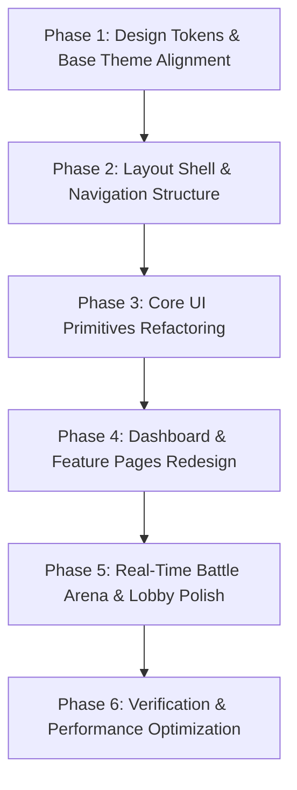

# CodeArena Frontend Redesign — Phase 0: UI Audit Report

**Date:** October 3, 2026  
**Target Codebase:** `client/`  
**Objective:** Comprehensive UI/UX and architectural audit of the CodeArena frontend to prepare for a complete redesign into a minimal, professional, black-and-white real-time 1v1 MCQ battle platform.

---

## 1. Current Frontend Architecture

The frontend is built using Next.js (App Router) with domain-driven feature separation and real-time state synchronization.

### Tech Stack & Dependencies ([`client/package.json`](file:///h:/Project/code-arena/client/package.json))
- **Framework:** Next.js 16.2.10 (App Router), React 19.2.4
- **Styling:** Tailwind CSS v4 (`@tailwindcss/postcss`, `@import "tailwindcss"`) with CSS variables in HSL format.
- **Authentication:** Clerk (`@clerk/nextjs` v7.6.3, `@clerk/themes` v2.4.57)
- **Data Fetching:** TanStack React Query v5.101.4
- **State Management:** Zustand v5.0.14 (`battleStore.ts`, `uiStore.ts`)
- **Real-time Engine:** Socket.IO Client v4.8.3
- **Icons:** Lucide React v1.28.0
- **Unused Animation Library:** `framer-motion` v12.43.0 is installed in `package.json` but currently has zero active imports across application files.

### Directory Breakdown
```
client/
├── app/                      # Next.js App Router routes & layouts
│   ├── (match)/              # Real-time match results sub-layout & routes
│   ├── (protected)/          # Auth-shielded application routes
│   ├── (public)/             # Public landing, login, and registration routes
│   ├── globals.css           # Global Tailwind tokens, layer base styles, HSL variables
│   └── layout.tsx            # Root layout wrapping ClerkProvider & AppProviders
├── components/               # Cross-cutting UI primitives and shared components
│   ├── shared/               # Shared UI (Navbar, AuthLoadingState, AuthErrorState)
│   └── ui/                   # Primitive design system (button, card, input)
├── features/                 # Domain-driven feature modules
│   ├── auth/                 # Clerk theme customization & auth hooks
│   ├── battle/               # Real-time battle arena, lobby, form, and question cards
│   ├── dashboard/            # Overview widgets, quick actions, stats, recent battles
│   ├── history/              # Match history tables and pagination
│   ├── leaderboard/          # Global player rankings table
│   └── profile/              # User profile stats and public player view
├── hooks/                    # Application hooks
├── lib/                      # API client, Socket instance setup, utilities
├── providers/                # React context providers (AuthSync, Query, Socket)
├── store/                    # Zustand stores (battleStore, uiStore)
└── types/                    # TypeScript interfaces & domain models
```

---

## 2. Page & Route Audit

| Route Path | Associated File Path | UI Responsibilities & Current State |
| :--- | :--- | :--- |
| `/` | [`client/app/(public)/page.tsx`](file:///h:/Project/code-arena/client/app/%28public%29/page.tsx) | Landing page featuring a hero section, gradient text titles, version badge, decorative SVG clip-path glow blobs, CTA buttons, and a 4-card feature grid. |
| `/login` | [`client/app/(public)/login/[[...login]]/page.tsx`](file:///h:/Project/code-arena/client/app/%28public%29/login/%5B%5B...login%5D%5D/page.tsx) | Renders Clerk's `<SignIn />` modal centered on screen with dark theme overrides. |
| `/register` | [`client/app/(public)/register/[[...register]]/page.tsx`](file:///h:/Project/code-arena/client/app/%28public%29/register/%5B%5B...register%5D%5D/page.tsx) | Renders Clerk's `<SignUp />` modal centered on screen with dark theme overrides. |
| `/dashboard` | [`client/app/(protected)/dashboard/page.tsx`](file:///h:/Project/code-arena/client/app/%28protected%29/dashboard/page.tsx) | Main hub displaying `WelcomeHeader`, 4 key performance metrics (`StatsOverview`), 3 quick action cards (`QuickActions`), and recent match history (`RecentBattles`). |
| `/battle/new` | [`client/app/(protected)/battle/new/page.tsx`](file:///h:/Project/code-arena/client/app/%28protected%29/battle/new/page.tsx) | Dedicated room creation page rendering back navigation link, header with orange gradient border top, and `BattleForm`. |
| `/lobby/[roomCode]` | [`client/app/(protected)/lobby/[roomCode]/page.tsx`](file:///h:/Project/code-arena/client/app/%28protected%29/lobby/%5BroomCode%5D/page.tsx) | Real-time battle lobby supporting socket state sync, starting overlay animation, disconnect alerts, readiness toggles, host start triggers, invite card, and settings adjustments. |
| `/battle/[roomCode]` | [`client/app/(protected)/battle/[roomCode]/page.tsx`](file:///h:/Project/code-arena/client/app/%28protected%29/battle/%5BroomCode%5D/page.tsx) | Synchronized live 1v1 battle arena. Features countdown timer (`BattleHeader`), live opponent score tracking (`BattleScoreBoard`), timed MCQ card (`QuestionCard`), and victory/defeat modal (`BattleResultsModal`). |
| `/history` | [`client/app/(protected)/history/page.tsx`](file:///h:/Project/code-arena/client/app/%28protected%29/history/page.tsx) | Battle history log wrapping `MatchHistoryTable` with pagination and match result details. |
| `/leaderboard` | [`client/app/(protected)/leaderboard/page.tsx`](file:///h:/Project/code-arena/client/app/%28protected%29/leaderboard/page.tsx) | Global rankings page wrapping `LeaderboardTable` with rank badges, win rates, and current user rank highlight. |
| `/profile` | [`client/app/(protected)/profile/page.tsx`](file:///h:/Project/code-arena/client/app/%28protected%29/profile/page.tsx) | Personal account page wrapping `ProfileStats` for updating display names and viewing detailed match statistics. |
| `/profile/[username]` | [`client/app/(protected)/profile/[username]/page.tsx`](file:///h:/Project/code-arena/client/app/%28protected%29/profile/%5Busername%5D/page.tsx) | Public profile page rendering `PublicProfileView` for inspecting opponent stats and rank. |
| `/results/[matchId]` | [`client/app/(match)/results/[matchId]/page.tsx`](file:///h:/Project/code-arena/client/app/%28match%29/results/%5BmatchId%5D/page.tsx) | Post-match analysis report rendering `BattleResultsView` with duel breakdown, overall score, and question-by-question review cards. |

---

## 3. Shared & Primitive Component Inventory

### Shared Components ([`client/components/shared/`](file:///h:/Project/code-arena/client/components/shared/))
- **`Navbar.tsx`** ([`client/components/shared/Navbar.tsx`](file:///h:/Project/code-arena/client/components/shared/Navbar.tsx)): Top navigation bar containing logo with orange icon container, text gradient, route links (`/dashboard`, `/leaderboard`, `/history`, `/profile`), real-time Socket connection status indicator with pulsating dot, and Clerk `UserButton`.
- **`AuthLoadingState.tsx`** ([`client/components/shared/AuthLoadingState.tsx`](file:///h:/Project/code-arena/client/components/shared/AuthLoadingState.tsx)): Centered loading spinner used during authentication resolution.
- **`AuthErrorState.tsx`** ([`client/components/shared/AuthErrorState.tsx`](file:///h:/Project/code-arena/client/components/shared/AuthErrorState.tsx)): Error banner displayed when user session sync fails.

### UI Primitives ([`client/components/ui/`](file:///h:/Project/code-arena/client/components/ui/))
- **`button.tsx`** ([`client/components/ui/button.tsx`](file:///h:/Project/code-arena/client/components/ui/button.tsx)): Class-variance-authority button with variants (`primary`, `secondary`, `ghost`, `danger`, `outline`) and `active:scale-95` animation.
- **`card.tsx`** ([`client/components/ui/card.tsx`](file:///h:/Project/code-arena/client/components/ui/card.tsx)): Card compound component (`Card`, `CardHeader`, `CardTitle`, `CardDescription`, `CardContent`, `CardFooter`) with default `shadow-sm` and `border-border`.
- **`input.tsx`** ([`client/components/ui/input.tsx`](file:///h:/Project/code-arena/client/components/ui/input.tsx)): Standard styled HTML input with focus ring and border styling.

---

## 4. Current Design System & Styling Audit

### Color Palette & Design Tokens ([`client/app/globals.css`](file:///h:/Project/code-arena/client/app/globals.css))
- **Primary Color:** Competitive Orange (`hsl(24 95% 53%)` / `#f97316`).
- **Backgrounds:** `--background` (`hsl(240 10% 3.9%)`), `--card` (`hsl(240 10% 5.9%)`), with inline overrides using `bg-zinc-950` in `results/[matchId]/page.tsx:27`.
- **Accents & Text Colors:** Extensive use of multi-color status accents including purple (`text-purple-500`), emerald (`text-emerald-500`), amber (`text-amber-500`), rose (`text-rose-500`), and orange (`text-orange-500`).
- **Gradients:**
  - Gradient headings (`bg-gradient-to-r from-primary to-orange-400 bg-clip-text text-transparent`) in `Navbar.tsx:34`, `LandingPage.tsx:41`, `WelcomeHeader.tsx:32`, `history/page.tsx:10`, `leaderboard/page.tsx:10`, `profile/page.tsx:10`.
  - Decorative top accent borders (`bg-gradient-to-r from-primary to-orange-400`) in `CreateBattlePage.tsx:34`, `LobbyPage.tsx:191`, `BattleHeader.tsx:49`.
  - Polygon clip-path background glow shapes (`bg-gradient-to-tr from-primary to-orange-600 opacity-20`) in `LandingPage.tsx:21`, `137`.

### Typography
- **Font Families:** `Geist Sans` (`--font-geist-sans`), `Geist Mono` (`--font-geist-mono`), `JetBrains Mono` (`--font-jetbrains-mono`).
- **Inconsistencies:** `font-mono` is applied arbitrarily across room codes, dates, numbers, stats labels, status pills, table cells, and button texts, creating visual clutter rather than intentional hierarchy.

### Spacing & Borders
- **Border Radii:** Mixed usage ranging from `rounded-md` (buttons/inputs), `rounded-lg` (cards), `rounded-xl` (stat cards/options), `rounded-2xl` (containers/headers), to `rounded-3xl` (error containers).
- **Shadows:** Frequent placement of heavy drop shadows (`shadow-xl`, `shadow-2xl`, `shadow-lg`, `shadow-md`) on dark background cards.

---

## 5. Animation Inventory

| Animation Type | Implementation | Locations Used | Redesign Status |
| :--- | :--- | :--- | :--- |
| **Pulse** | `animate-pulse` | `Navbar.tsx:71`, `Navbar.tsx:75` (Socket status), `LobbyPage.tsx:119`, `141` (Lobby overlays), `BattleHeader.tsx:78` (Timer low), `QuestionCard.tsx:103` (Submitting), `BattleScoreBoard.tsx:105` (Reconnecting), skeleton loaders. | **Remove from static badges & icons.** Keep only subtle feedback for active background tasks. |
| **Spin** | `animate-spin` | `button.tsx:46` (Button loading), `BattleHeader.tsx:85` (Timer warning), `LobbyPage.tsx:133` (Starting room), `LiveBattlePage.tsx:39`. | **Retain only for functional spinners.** |
| **Hover Scale** | `group-hover:scale-110`, `group-hover:scale-125` | `QuickActions.tsx:22`, `46`, `70`, `StatsOverview.tsx:71`. | **Remove.** Replace with subtle 1px border color transitions (`border-foreground/20`). |
| **Click Scale** | `active:scale-95` | `button.tsx:7`, `clerkTheme.ts:20`. | **Remove.** Maintain crisp, instant state changes. |
| **Entry Transitions** | `animate-in fade-in slide-in-from-bottom-3` | `LobbyPage.tsx:79`, `117`, `LiveBattlePage.tsx:55`. | **Simplify.** Replace with standard CSS fade transitions (`transition-opacity duration-150`). |

---

## 6. Major UI Inconsistencies & Issues

### 1. Excessive Decorative Styling & Glow Effects
- **Problem:** Cards and containers rely heavily on ambient blurred background circles (`blur-3xl pointer-events-none`), clip-path polygons, and gradient borders top.
- **Files Affected:**
  - [`client/app/(public)/page.tsx#L17-L28`](file:///h:/Project/code-arena/client/app/%28public%29/page.tsx#L17-L28)
  - [`client/features/dashboard/components/WelcomeHeader.tsx#L23`](file:///h:/Project/code-arena/client/features/dashboard/components/WelcomeHeader.tsx#L23)
  - [`client/features/dashboard/components/StatsOverview.tsx#L71`](file:///h:/Project/code-arena/client/features/dashboard/components/StatsOverview.tsx#L71)
  - [`client/features/dashboard/components/QuickActions.tsx#L20`](file:///h:/Project/code-arena/client/features/dashboard/components/QuickActions.tsx#L20)
  - [`client/features/battle/components/QuestionCard.tsx#L31`](file:///h:/Project/code-arena/client/features/battle/components/QuestionCard.tsx#L31)

### 2. Glassmorphism Blur Overuse
- **Problem:** Arbitrary `backdrop-blur-md` and `backdrop-blur-sm` styles are scattered across headers, containers, and modals, degrading scrolling performance and obscuring contrast.
- **Files Affected:**
  - [`client/components/shared/Navbar.tsx#L26`](file:///h:/Project/code-arena/client/components/shared/Navbar.tsx#L26)
  - [`client/features/dashboard/components/WelcomeHeader.tsx#L40`](file:///h:/Project/code-arena/client/features/dashboard/components/WelcomeHeader.tsx#L40)
  - [`client/app/(protected)/lobby/[roomCode]/page.tsx#L117`](file:///h:/Project/code-arena/client/app/%28protected%29/lobby/%5BroomCode%5D/page.tsx#L117)
  - [`client/features/auth/clerkTheme.ts#L16`](file:///h:/Project/code-arena/client/features/auth/clerkTheme.ts#L16)

### 3. Background Palette Drift
- **Problem:** The app mixes different background shade tokens (`bg-background`, `bg-zinc-950`, `bg-card/60`, `bg-card/40`, `bg-card/50`).
- **Files Affected:**
  - [`client/app/(match)/results/[matchId]/page.tsx#L27`](file:///h:/Project/code-arena/client/app/%28match%29/results/%5BmatchId%5D/page.tsx#L27)
  - [`client/features/history/components/MatchHistoryTable.tsx#L68`](file:///h:/Project/code-arena/client/features/history/components/MatchHistoryTable.tsx#L68)
  - [`client/features/profile/components/ProfileStats.tsx#L46`](file:///h:/Project/code-arena/client/features/profile/components/ProfileStats.tsx#L46)

### 4. Page Header & Navigation Inconsistency
- **Problem:** Page title headers are implemented differently across pages (some use gradient text with subheadings, others use custom welcome boxes, and others lack clear breadcrumbs).
- **Files Affected:**
  - [`client/app/(protected)/history/page.tsx#L10-L16`](file:///h:/Project/code-arena/client/app/%28protected%29/history/page.tsx#L10-L16)
  - [`client/app/(protected)/leaderboard/page.tsx#L10-L16`](file:///h:/Project/code-arena/client/app/%28protected%29/leaderboard/page.tsx#L10-L16)
  - [`client/app/(protected)/profile/page.tsx#L10-L16`](file:///h:/Project/code-arena/client/app/%28protected%29/profile/page.tsx#L10-L16)
  - [`client/app/(protected)/battle/new/page.tsx#L21-L29`](file:///h:/Project/code-arena/client/app/%28protected%29/battle/new/page.tsx#L21-L29)

---

## 7. Performance & Re-render Considerations

1. **Unnecessary Repaints from Timers & Animations:**
   - In [`client/features/battle/components/BattleHeader.tsx`](file:///h:/Project/code-arena/client/features/battle/components/BattleHeader.tsx), timer updates occur every second, triggering re-renders of progress bars and parent wrappers with animated CSS classes.
2. **Heavy GPU Blur Layers:**
   - Backdrop blurs and multiple high-radius blurs (`blur-3xl`) cause continuous GPU layout composition on lower-end screens during high-frequency live battle timer updates.
3. **Unused Dependencies:**
   - `framer-motion` in `package.json` adds unnecessary package weight if left uncleaned during build bundling.

---

## 8. Component Consolidation Plan

To achieve visual discipline and clean architecture, the following component consolidations are recommended:

1. **Unified Page Header (`PageHeader.tsx`):**
   - Combine header blocks from `history/page.tsx`, `leaderboard/page.tsx`, `profile/page.tsx`, and `battle/new/page.tsx` into a single, standardized component supporting clean title, subtitle, optional status badge, and action slots.
2. **Unified Data Table (`DataTable.tsx`):**
   - Standardize table structures between [`MatchHistoryTable.tsx`](file:///h:/Project/code-arena/client/features/history/components/MatchHistoryTable.tsx) and [`LeaderboardTable.tsx`](file:///h:/Project/code-arena/client/features/leaderboard/components/LeaderboardTable.tsx) with uniform border separators, typography, pagination controls, and empty/loading state blocks.
3. **Unified Metric Card (`MetricCard.tsx`):**
   - Consolidate stat displays across [`StatsOverview.tsx`](file:///h:/Project/code-arena/client/features/dashboard/components/StatsOverview.tsx) and [`ProfileStats.tsx`](file:///h:/Project/code-arena/client/features/profile/components/ProfileStats.tsx) into a minimal black-and-white numeric card.
4. **Modal Layout Container (`ModalShell.tsx`):**
   - Unify modal dialog styling for `CreateBattleModal`, `JoinBattleModal`, and `BattleResultsModal` with clean 1px borders, uniform header titles, and sharp close triggers.

---

## 9. Recommended Implementation Roadmap

Inspired by the structural discipline and visual simplicity of clean dark interfaces (such as the reference Instagram layout with a dedicated sidebar, structured container frames, sharp high-contrast typography, and strict 1px border partitioning), the redesign should proceed in the following order:



### Order of Execution:
1. **Phase 1: Design Tokens & Base Theme Alignment**
   - Update `client/app/globals.css`: replace orange primary theme with monochrome high-contrast tokens (`#ffffff`, `#000000`, `#18181b`, `#27272a`), clean crisp border tokens, and standardized font scale. Eliminate ambient blurs and color gradient definitions.
2. **Phase 2: Layout Shell & Navigation Structure**
   - Refactor `Navbar.tsx` and layout wrappers into a disciplined layout system featuring a clean vertical sidebar/top bar with high-contrast active route indicators, razor-sharp 1px border dividers, and zero glassmorphism blurs.
3. **Phase 3: Core UI Primitives Refactoring**
   - Update `button.tsx`, `card.tsx`, and `input.tsx` to remove drop shadows, excessive rounded corners, active scale jumps, and decorative glows. Build sharp badge primitives.
4. **Phase 4: Dashboard & Feature Pages Redesign**
   - Redesign `/dashboard`, `/history`, `/leaderboard`, `/profile`, and `/profile/[username]` with clean grid cards, sharp tables, monochrome typography, and unified page headers.
5. **Phase 5: Real-Time Battle Arena & Lobby Polish**
   - Redesign `/lobby/[roomCode]`, `/battle/[roomCode]`, and `/results/[matchId]`. Ensure high-readability MCQ cards, high-contrast timer indicators, clean 1v1 duel scoreboards, and zero distracting animations during live gameplay.
6. **Phase 6: Verification & Performance Optimization**
   - Conduct responsive layout testing across mobile, tablet, and desktop breakpoints. Remove unused CSS utilities and verify real-time Socket synchronization performance.
